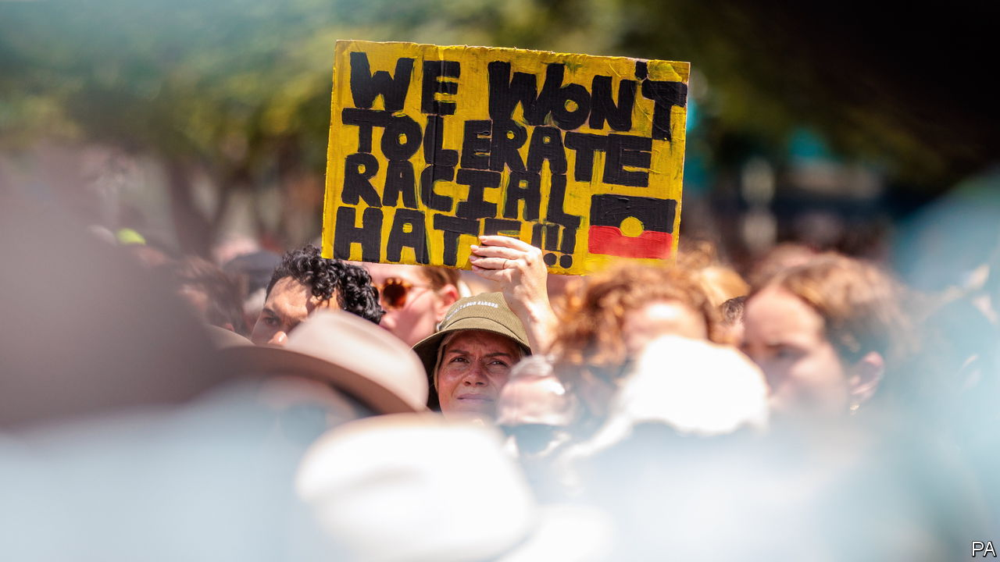

###### Voiceless

# The murder of a boy in Australia horrifies Aboriginals 

##### The country has another reckoning with racism 

 

> Nov 10th 2022 

THE LAST picture of Cassius Turvey, a 15-year-old Aboriginal boy of Western Australia’s Noongar and Yamatji nations, showed him lying unconscious on a hospital bed, attached to a ventilator. His head, shaved by medics, was marked with a heavy gash. He was “an innocent victim of a violent attack”, the state’s police said. 

Cassius was walking home from school with friends in Perth, Western Australia’s capital, on October 13th, when a car pulled up next to them, the boys allege, and passengers jumped out and assaulted them, yelling racial slurs. Cassius was allegedly battered with a metal pole. His injuries were so severe that he died ten days later. 

The attack has horrified Aboriginals and many other Australians, too. Police have charged Jack Brearley, a white 21-year-old, with the murder and with assaulting a 13-year-old boy who survived. They say Mr Brearley’s car had been damaged a day before—though there is no evidence that the boys were responsible. On November 5th footage emerged of another assault on a young Aboriginal in Western Australia. He was ambushed by two men who falsely accused him of robbery. Hannah McGlade, a Noongar human-rights lawyer at Curtin University in Perth, points to a record of “vigilante” attacks against indigenous boys accused of committing crimes.

The problem of racism  is hardly hidden from sight in Australia. Aboriginal sports stars have been jeered by white fans. Abuse is hurled at indigenous celebrities. Australia’s national broadcaster recently referred to the police an email sent to an Aboriginal presenter, Tony Armstrong. He tweeted a picture of the message, which called him “abbo scum” and an “uneducated dog”. 

It was not just the murder that upset Aboriginals but also the response. Police warned against “unfounded speculation” about whether the killing was racially motivated. Australia has strict laws around discussing live court cases, aimed at preventing trial by media. Yet asking people to refrain from talking about racism after a violent crime can seem tin-eared and inflame passions further.

Australia has had similar debates after other murders over the past 30 years. Aboriginals are over-represented as both victims and perpetrators of murder in Australia. They suffer high rates of family breakdown and imprisonment, for which some blame generations of discrimination and an assimilation policy which until the 1970s removed Aboriginal children from their parents. Though they are less than 4% of the population, they fill 30% of prison beds. Aboriginal teenage boys are now more likely to go to jail than to university.

Successive Australian governments have pledged to break the  by “closing the gap” between indigenous Australians and everyone else. The prime minister, Anthony Albanese, hopes his Labor government can make some progress. In part that comes down to striking the right tone. Aboriginals took heart when he declared that Cassius’s murder was “clearly racially motivated”.

Mr Albanese’s plan is to show that the government is listening. Given Aboriginals’ tiny share of the national population, they feel their votes do not count for much and that they have little say on policies aimed at them. The prime minister supports creating a “”, a consultative body, to advise the federal government on matters related to indigenous affairs. He says it would be a step forward in “our nation’s journey of healing”. 

To achieve this, Mr Albanese, who was elected in May, has promised to hold a referendum on the “voice” before his government’s three-year term is up. Its passage requires a “yes” vote from a national majority as well as a majority of states. Polling suggests that Australians are confused by the idea. One recent survey found that less than half support the concept of a voice and even fewer understand what it is. Critics have dismissed the “voice” as symbolic. But symbolism, as with the official reaction to Cassius’s killing, can either help or hinder race relations. ■

