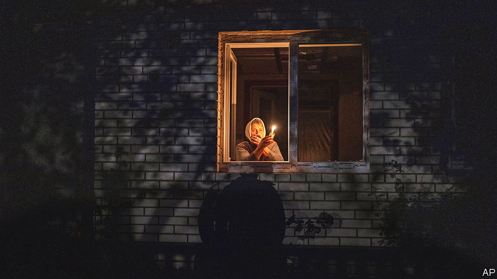
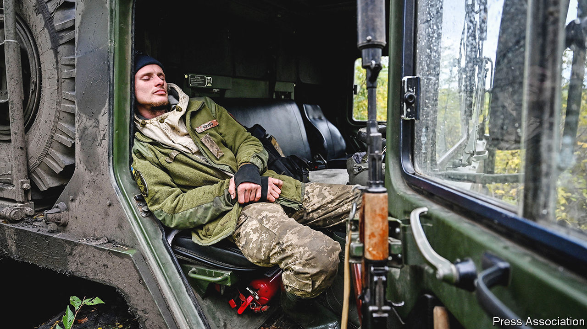
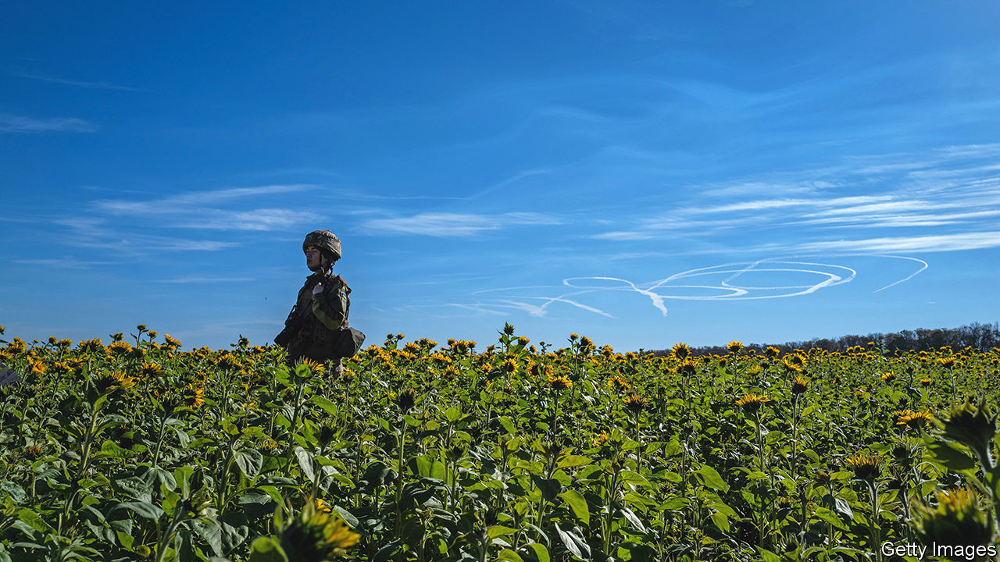

###### Finding an ending

# On what terms could the war in Ukraine stop? 

##### Pressure for peace talks is growing, even as Russia retreats from Kherson 

 

> Nov 10th 2022 

RUSSIA’S lightning attack on Ukraine’s capital, Kyiv, was a failure. Its creeping artillery war to seize the eastern region of Donbas has ground to a bloody halt. It has lost a chunk of stolen territory south of the city of Kharkiv, and this week announced a retreat from Kherson, the only provincial capital it had captured since its invasion in February. With each setback, Vladimir Putin, Russia’s president, has sought new ways to torment Ukraine. The latest is a relentless bombardment that seeks to wreck Ukraine’s infrastructure. Residents of the capital have been told they may have to evacuate if the power grid collapses, halting water and sewage services.

Power cuts have not sapped Ukraine’s will to fight. But they are a reminder that, eight months after his unprovoked invasion, Mr Putin keeps looking for ways to raise the stakes. Some worry he might blow up a dam on the Dnieper river, as Stalin did in 1941, to slow his adversaries’ advance. 

The ever-evolving Russian assault also raises an awkward question: how long will America and Europe keep providing Ukraine with the billions of dollars’ worth of military and economic aid it needs every month to fend Russia off? “For as long as it takes,” say Western leaders. But many of their citizens reject the idea of bankrolling an indefinite conflict with Russia. Tens of thousands of people took to the streets of Rome on November 5th, calling for an end to the fighting. “We don’t want war. No weapons, no sanctions. Where is diplomacy?” read one placard. 

Wary Washington

In America, too, questions have been raised. Hard-left Democrats recently issued a call, swiftly retracted, for negotiations. Gains by America-first Republicans in the midterm elections on November 8th, although smaller than expected, are a reminder that American politics might change dramatically after the next presidential election, in two years’ time, and with it policy on Ukraine. 

Jake Sullivan, Mr Biden’s national-security adviser, made an unannounced trip to Kyiv on November 4th to promise “unwavering” support. But he also urged Ukraine to think about future peace terms. It has since emerged that he has been in touch with his Russian counterparts, to warn them not to use nuclear weapons. On November 9th Mr Biden said Russia and Ukraine would “lick their wounds” after the battle for Kherson, and might then be ready for compromise. He insisted he would not tell Ukraine what to do. 

In private, Western and Ukrainian officials are starting to ponder what a stable outcome might look like. Will Ukraine become a new Finland, forced to cede land to its invaders and to remain neutral for decades? Or another West Germany, with its national territory partitioned by war and its democratic half absorbed into NATO? A much-discussed template is Israel, a country under constant threat that has been able to defend itself without formal alliances but with extensive military help from America.

The precise terms of any negotiated settlement depend on what happens on the battlefield. There is likely to be a lot more fighting before either side is ready to end the war. Russia and Ukraine have each lost, by one estimate, roughly 100,000 soldiers, killed and wounded, but both still hope to manoeuvre to a more favourable position.

The  is a humiliation for Mr Putin. But it will give Russian forces a more easily defended line along the Dnieper river. Mr Putin shows no sign of throwing in the towel. He has mobilised hundreds of thousands more recruits. Some have been rushed into battle with little training or equipment to hold the line; the rest may be used for a renewed push next year. 

Ukraine, for its part, hopes to maintain its momentum. Its army is getting reinforcements this winter, in the form of thousands of recruits trained by Britain and other Western countries. Western arms continue to arrive. On November 4th the Pentagon announced another arms package, worth $400m, including 45 refurbished T-72B tanks and 1,100 drones. The first new NASAMS anti-aircraft batteries were deployed this week.

The West’s stocks of weapons are not unlimited. European armies have eaten deep into theirs; even mighty America worries about eroding its own ability to fight future wars. It is Russia, however, that seems to face the most immediate shortages. It has used up most of its precision bombs and missiles, and is struggling to replace them because of sanctions. It is obtaining fresh weapons from the likes of Iran and perhaps North Korea. (China has so far heeded American warnings to stay out of the war.)

Cold calculation

Mr Putin is hoping his campaign to destroy Ukraine’s electricity grid will freeze the country into submission, or at least turn it into a weak, failing state. But the evidence of past conflicts is that aerial bombing of civilians, in the absence of an effective ground campaign, rarely secures victory. Nearly 90% of Ukrainians want the country to keep fighting. 

In Russia, according to the Levada Centre, a pollster, only 36% want to press on with the war, whereas 57% favour peace talks. At the same time, support for Mr Putin remains at 79%. Russians, it seems, would like the war to end but, starved of impartial news, do not blame Mr Putin for it. Still, the more he tries to dragoon them into fighting, the more he risks losing popular support.

Ukraine’s more avid Western supporters think that, with time, Ukraine will become stronger, and Russia weaker. But Mr Putin is hoping that “General Winter” will somehow revive his fortunes, if not by weakening Ukraine’s will to fight then by gnawing at the West’s readiness to support it, as the heating bills balloon in Europe.

Mr Putin claims that he is ready to negotiate (from the starting point that the West should recognise his theft of Ukrainian territory) but that Ukraine’s Western “masters” have prevented it from talking. The two sides held lengthy talks after Russia seized the Crimean peninsula and part of Donbas in 2014. They talked again in the spring, as Russia besieged Kyiv. But Ukraine set its face against further negotiations after Russia’s retreat from Kyiv in April revealed widespread atrocities against civilians. Volodymyr Zelensky, Ukraine’s president, suggested this week that talks could be revived, but only if Russia was willing to give back Ukrainian land, pay compensation and accept responsibility for war crimes.

The West is vague about its own aims. Mr Biden has at times mused about wanting to see Mr Putin ousted from power; at others he has talked about finding “off-ramps” for the Russian leader. He defined his goals most clearly in a guest article in the  in May: “a democratic, independent, sovereign and prosperous Ukraine with the means to deter and defend itself against further aggression”. Notably, that left out the question of Ukraine’s borders. Western leaders say this is for Ukraine to decide; their aim is to strengthen its negotiating hand.

More recently, though, Ukraine’s backers have sounded more specific. In a statement on October 11th, leaders of the G7 group of industrialised countries offered their “full support to Ukraine’s independence, territorial integrity and sovereignty in its internationally recognised borders”. They demanded that Russia “completely and unconditionally withdraw” from all seized lands. Among other things, they pledged to find ways of using seized Russian assets to help fund . 

 


“The G7 statement is basically a demand for total Russian surrender, which is not a plausible diplomatic outcome. Diplomacy by definition involves give and take. The expectation should not be another Treaty of Versailles,” says Samuel Charap of the RAND Corporation, an American think-tank, referring to the punitive terms imposed on Germany at the end of the first world war. The West, Ukraine and Russia, he argues, should start talking, if only to set the groundwork for more substantive negotiations in future: “Fighting and talking at the same time should be the norm.”

Many disagree. “Keep up the pressure. Don’t be in a hurry to draw lines on a map. It would be bureaucratic suicide. Somebody will put it up on Twitter alongside the Molotov-Ribbentrop pact,” retorts Dan Fried of the Atlantic Council, another American think-tank, alluding to Nazi Germany’s and the Soviet Union’s carve-up of Poland in 1939.

Few Western leaders question Ukraine’s ambition to recapture the territory lost since Russia invaded in February. Many would support efforts to reclaim the parts of Donbas seized in 2014. But opinion is more divided when it comes to reconquering Crimea. Many worry that the prospect of losing the peninsula might prompt a dangerous escalation from Mr Putin. 

To some in the Biden administration, the war is a matter of principle: territory should never be seized by force, so all Russian gains must be reversed. Others, doubting Ukraine’s ability to reconquer much more, think the time for diplomacy is soon. Either way, America is in no rush to spell out diplomatic positions that might cause rifts in the pro-Ukraine camp.

Another pressing concern is the nature of future Western security guarantees for Ukraine. They will need to be robust given that Russia will probably remain a threat to Ukraine for as long as Mr Putin is in power, if not longer. Several central and eastern European countries favour Ukraine’s rapid admission to NATO, on the grounds that the alliance’s commitment to mutual defence would firmly deter Russia. For all its nuclear menaces, it has so far refrained from overtly striking NATO territory.

The Biden administration, though, is wary of having to extend its nuclear umbrella to a country in a state of latent or actual conflict with Russia. Throughout, Mr Biden has been careful to minimise the risk of a direct NATO-Russia conflict for fear that it would lead to “World War III”. Several nato members in western Europe are similarly sceptical.

So attention has turned to interim, or alternative, arrangements. In September Anders Fogh Rasmussen, a former secretary-general of NATO, and Andriy Yermak, Mr Zelensky’s chief of staff, proposed a “Kyiv Security Compact” which would offer security assistance short of a mutual-defence pact. Some in Ukraine considered it a betrayal. Modelled on Western support for Israel, about which Mr Zelensky has spoken, the compact would strengthen Ukraine’s armed forces—in effect turning the current ad hoc support into a systematic, long-term commitment. 

Ukraine’s partners would promise “multi-decade” investments in the country’s defence industry, massive weapons transfers, training, joint exercises and intelligence support. The compact would require neither Russia’s assent nor Ukraine’s neutrality. It would not preclude NATO membership. In some circumstances, there could be military intervention to help Ukraine. If it were attacked, the signatories would “use all elements of their national and collective power and take appropriate measures—which may include diplomatic, economic and military means.” A wider group of countries, including Asian allies, would reinforce such military assistance with sanctions on Russia, including provisions to “snap back” any of the current penalties that may be lifted as part of a deal. 

Even this may be too ambitious for Team Biden. Some ask, for instance, what commitments Ukraine would take on, by way of reforms to strengthen democracy, say, or to fight corruption. The parallel with Israel is imperfect. Among other things, Israel is a nuclear power and occupies Arab land. For Mykola Bielieskov of the National Institute for Strategic Studies, a think-tank in Kyiv, the Israeli model “is not only about mobilising our partners externally; it’s also about explaining to people what it means to live next door to a crazy neighbour, to existential threats.”

The sky must be the limit

Whatever the diplomatic template, Russia’s blitz has proved that the West will need to help Ukraine create a properly integrated and layered air-defence system, mixing fighter aircraft, surface-to-air batteries and shoulder-launched weapons. At the moment weapons are arriving piecemeal and often cannot exchange data. There are also worries about Ukraine running out of certain types of air-defence munitions. If that were to happen Russia could then deploy much more air power in support of ground troops. 

 


Ukraine’s mix-and-match weapons—a “Mr Potato Head” arsenal, as some call it—cause problems elsewhere. For instance, it has no fewer than 14 different types of artillery pieces, with an average brigade operating four different sorts. “This is a logistical nightmare for them, especially when we talk about ammunition,” says Nick Reynolds of RUSI, a British think-tank. Some of the weapons are wearing out badly, and Europe’s defence industry, sapped by decades of low spending, is poorly placed to produce spare parts. “Red lights are flashing in terms of that support being available,” adds Mr Reynolds.

How long the war goes on depends mainly on Mr Putin. He is in a bind, both in Ukraine and at home. Moderate technocrats are worried about the strains on the economy; “national patriots” such as Yevgeny Prigozhin, who commands the Wagner mercenary group, have called for purges of supposedly treacherous generals. 

A pause to play at diplomacy may suit Mr Putin for a time—particularly if it allows him to consolidate some territorial gains. That may explain his recent toning down of nuclear rhetoric and his sudden casting of Ukrainians as victims of Western aggression. “The West is throwing Ukrainians into a furnace”; Russia, in contrast, “has always treated Ukrainian people with respect,” Mr Putin declared on November 4th. (His propagandists and officials, though, still talk of “de-Satanising” Ukraine.) The shift fits another of Mr Putin’s guises, as the champion of a global movement to cast off Western dominance. 

In all this Mr Putin is seeking to woo waverers, especially in the global South. He also wants to reassure friends such as China and India, which have made plain their disapproval of his nuclear recklessness. Above all Mr Putin is interested in reaching one rich-world listener: Donald Trump, whose allies in Congress question American aid to Ukraine and who may soon announce another run for president. 

For all his setbacks, Mr Putin is not yet out of options to persecute Ukraine and try to divide the West. Militarily, he could commit more of his air force and mobilise more troops. In the covert “grey zone” he could sabotage undersea gas pipelines and internet connections to the West, conduct bigger cyber-attacks, interfere with communications satellites and step up disinformation campaigns. He could also sink ships carrying grain from Ukraine. Ultimately, he could use tactical nuclear weapons. All this, though, would come at heavy cost: it would make Russia even more of a pariah, weaken him at home and might provoke harsh retaliation. 

The stakes are higher for Mr Putin than for the West. But they are highest for Ukrainians, many of whom mistrust the very idea of talks with Russia and see military victory as their only option—even if it takes years to achieve. The more land it can regain, Ukraine reckons, the greater the chance of getting rid of Mr Putin. Yet that same prospect alarms many in the West: a rout of the Russian army might be what pushes Mr Putin to go nuclear. That is one reason why Team Biden long ago stopped talking about helping Ukraine “win”. 

As it has often done with Israel, America may at some point try to limit Ukraine’s ambitions. It need not do so overtly; it can simply withhold the arms Ukraine needs, as it already does to an extent. It declines to provide Western aircraft, Patriot air-defence missiles and longer-range ATACMS strike missiles for fear that they might goad Russia to use nuclear weapons.

All this explains why some Ukrainians have been circulating a bittersweet message issued to Finnish troops in 1940 at the end of the “Winter War” with the Soviet Union by their commander, Carl Gustaf Mannerheim. The vastly outnumbered Finns had inflicted heavy losses on Soviet forces but nonetheless had to cede territory because help from their friends had dried up, Mannerheim wrote, signing off with the words, “We are proudly conscious of the historic duty which we shall continue to fulfil; the defence of that Western civilisation which has been our heritage for centuries, but we know also that we have paid to the very last penny any debt we may have owed the West.”

Ukraine’s fate depends not just on the valour of its soldiers or resilience of its people, but also on external factors it cannot control: the inscrutable calculations of Russia’s despotic ruler and the fortitude of its friends. The benefits to the West of the war are already clear. Russia has been enormously weakened, making Europe’s flank much easier to defend. For Ukraine, which has suffered horrific losses, the outcome looks much less certain. ■


