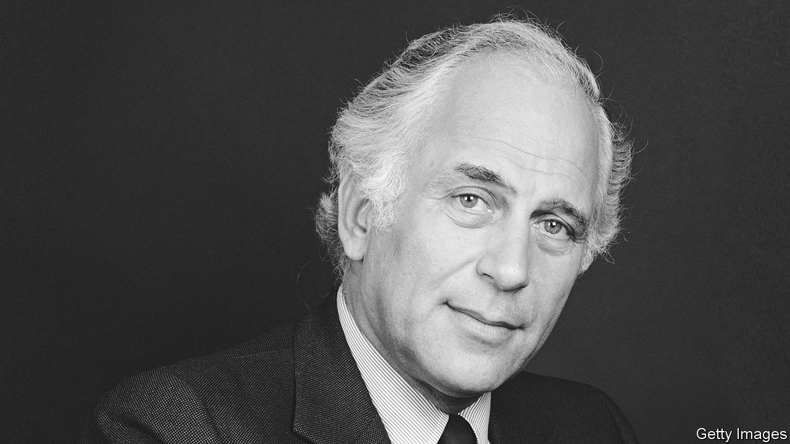

###### Upholder of legacies

# Remembering Evelyn de Rothschild, chairman of The Economist for 17 years 

##### The banker, philanthropist and bon viveur died on November 7th, aged 91. A former editor remembers him 

 

> Nov 10th 2022 

It was an 11-minute walk down Ebury Street from Santini’s restaurant in Belgravia to William Curley’s chocolate shop, then in Pimlico. At Santini’s, Evelyn de Rothschild plus guest would be greeted as heroes: because all staff knew you would eat heroically. But at Curley’s you were greeted as owners—because Evelyn was the backer and prime owner of the business. Along with flat racing, chocolate was his passion. 

Also his was Sotheran’s, the rarest of London’s rare-books shops, where, if you could afford it, you just might find a set of Audubon’s volumes. Unbroken.

Evelyn was no aesthete, nor an intellectual. But he believed in intellect, for a reason: a mighty Rothschild from the previous generation, Anthony de Rothschild, was his father. Both men went through Harrow and Trinity, Cambridge. But “Tony” de Rothschild had taken a double first, whereas Evelyn never tried to mimic that. He determined, instead, to uphold magnificently his father’s legacy. 

Uphold it he did at Ascott, near Tring, with its rare library and its plutocratic collection of pictures. Uphold it he did at , where Tony had joined Walter Layton and Brendan Bracken in 1928 to build the shareholding structure which entrenches the editor’s freedom to this day. Evelyn became the paper’s chairman for 17 years from 1972, supporting without stint three editors through the era when its modern success was set.

And uphold it he did, above all, at “NMR”—N.M. Rothschild, where Evelyn secured, through turmoil, the future of his father’s merchant bank. He kept it small. Most years, too, he kept it highly profitable—an elite “accepting house”, and thus close to the Bank of England; core of the gold-dealing heart of the City; adviser to the queen; immune from the big-time-investment-banking model copied from New York. Evelyn finally bolstered his bank by merging with his French cousins.

Outsiders wondered how this voluble but inarticulate man, often impatient with detail, could achieve so much. He could badger subordinates beyond limit. Yet few people of talent ever left him. Whether driving his generous charity, Eranda, or as the boostering deputy chairman of the charter “new town”, Milton Keynes, Evelyn would skate over the tiresome numbers to go for the big picture.

To get there, he would recruit executives and editors often more dynamic than himself. At Sotheran’s this method half-failed before the jungle of Amazon. But it did not fail at NMR, where his consigliere Michael Richardson became Margaret Thatcher’s favourite banker, the triumphant privatiser of national industries—sell-offs all but monopolised by NMR. 

It did not fail, either, at , where Evelyn compelled the management to “get out of printing” years before his friend Rupert Murdoch’s Wapping revolution. With help from John Sainsbury, he also massively increased the paper’s puny circulation in America.

Interference was part of Evelyn’s technique. At the NMR sanctum, at general-election time, the entire staff would receive a memo suggesting they vote Tory.

This slant was to change, however. In 2000 he married Lynn Forester, who became his third wife. She refreshed his energy. Brave ventures followed, notably in India. And she opened him to social democracy. He plunged into this new world with gusto. In her native America, Lynn brought him into the Clinton entourage: she fiercely backing Hillary for president, he preparing to lose at golf to Bill. 

There was one area where Evelyn never interfered. He never once pressed his trenchant views on the paper. In September 1980 he and his cousin Jacob parted in acrimony, the most notorious bank-family split in City of London history. This newspaper did not disguise its view that “Mr Jacob”, not “Mr Evelyn”, had the correct vision of the City’s future. For Cousin Jacob was prophetically ahead of the Big Bang. 

When Evelyn paid me his weekly visits he never once mentioned these articles, so hurtful to him as they were. Nor did he comment on any other article, even those where he was in the know. For he knew that his father would not have done so either. 

■


