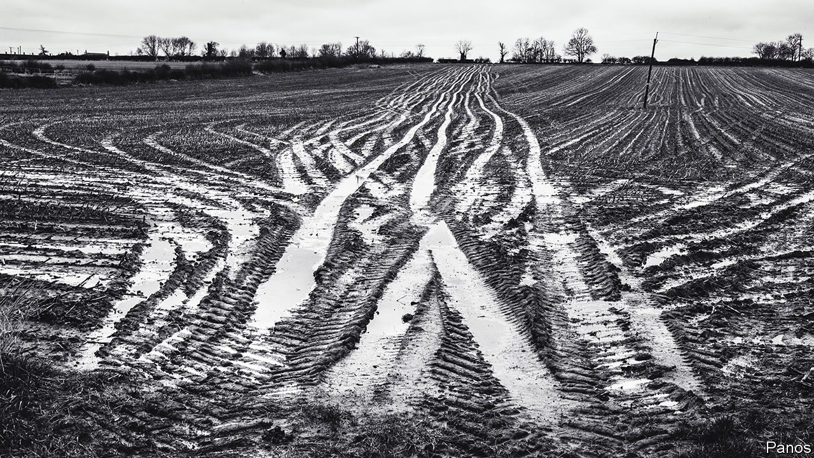

###### For peat’s sake

# Some of Britain’s best farmland is also its most carbon-emitting 

##### Forget rewilding. To reduce agriculture’s carbon footprint, rewetting may be needed 

 

> Nov 8th 2022 

James brown thought he was running a climate-friendly farm, growing organic veg and powering his property with a wind turbine and solar panels. That was until scientists at the UK Centre for Ecology &amp; Hydrology, a research institute, found that he was emitting about 25 tonnes of carbon-dioxide equivalent per hectare each year, in the form of CO itself and other greenhouse gases, like nitrous oxide. 

Mr Brown’s farm of 2,000 hectares (about 5,000 acres) in Lincolnshire, eastern England, is on drained peatland. In their natural state peatlands are filled with water, which stops plants and animal remains from decomposing and spewing carbon. Peatlands in Britain that are in this condition store more than 3bn tonnes of carbon—as much as in  in Britain, Germany and France combined.

Just 22% of Britain’s peatlands are still in this state. That’s because peat is moist, springy and nutrient-rich, which makes it ideal cropland. Landowners drained what is now the breadbasket of England—Lincolnshire and Cambridgeshire—about 400 years ago. These former peatlands provide a third of the vegetables on England’s supermarket shelves each year, among other things. But when farmers expose new plant matter by tilling and harvesting their fields, the peatlands emit greenhouse gases. Peatland used for agriculture emits about 12m tonnes of CO-equivalent.

The Climate Change Committee, a government watchdog, reckons that agriculture could be Britain’s highest-emitting sector by 2040, and says that peat is part of the problem. The only way to turn peatland from a net emitter to a net sink is to turn it back into wetlands. The committee recommends restoring 80% of the country’s peatland to its former state as part of Britain’s plan to reach  by 2050. 

That is easier for bits of peatland in northern England and Scotland, which often have poorer- quality soil and are used for sport or sheep-grazing. A mature market for carbon and biodiversity credits could eventually make restoring peatland the best way to make money off such less productive land. 

The economics of rewetting are trickier when the soil is used for high-value crops like fruit and vegetables. Farmers are still paying a premium for this kind of land, according to Strutt and Parker, a consultancy. Change in land use would also prompt Britain to import more food, which means outsourcing agricultural emissions to other countries rather than reducing them. 

Some farmers are trying to find ways to cut down on their emissions. Luke Palmer, who farms about 1,600 hectares in Cambridgeshire, raised the water table under one of his wheatfields by a metre to see if the slightly wetter peat would emit less carbon without killing his crop. Early results were promising, says Chris Evans of the UK Centre for Ecology &amp; Hydrology, which measured the emissions. But there are complications. Mr Palmer shares access to water with other farmers, for example. One of them cut short the experiment when he drained the excess water out of Mr Palmer’s wheatfield for his own use during the drought this summer. 

Mr Brown plans to rewet his property entirely, turning it into a carbon sink. He intends to grow willows and reeds, which can survive in swampy peatland, and use them as biofuels to heat greenhouses. He plans to grow vegetables inside, rather than in fields, and not just because of the environment. In recent months he has been hit by a drought and a flood, he says. Growing veg outside is going to get too costly, whatever the soil. ■


