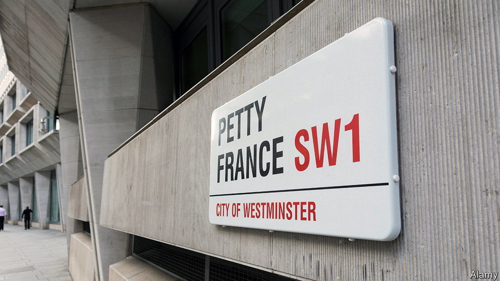

###### The nerds are in charge

# The OBR will be the arbiter of Britain’s autumn budget 

##### That gives it too much power, say critics 

 

> Nov 10th 2022 

Has a fiscal watchdog ever had more bite? The Office for Budget Responsibility (OBR) was sidelined by Kwasi Kwarteng, a former chancellor, who rejected the body’s offer of an official forecast to accompany his infamous tax-cutting budget in September. The result was panicky investors, soaring gilt yields and financial turmoil. Now, with its own reputation for fiscal competence shot, the government has to borrow credibility from the OBR.

So when Jeremy Hunt, the current chancellor, delivers his autumn statement on November 17th, the view of around 40 nerds in an office on Petty France, in central London, will be crucial. Their job is to forecast the health of the economy over the next five years, given everything from likely levels of immigration to the effect of war in Ukraine. The wonks must then translate these predictions into a fiscal forecast, and decide whether the government is meeting its stated fiscal rules.

Mr Hunt is expected to pledge that debt will be falling as a share of GDP in five years’ time. He needs the OBR to agree that this will happen. Before, there might have been room to quibble with the OBR’s views. That seems almost impossible now.

This unusual clout raises three concerns. First, that the OBR is spuriously precise: Julian Jessop of the Institute for Economic Affairs, a right-wing think-tank, warns against making too much of a single forecast given the amount of uncertainty involved. Second, that it will bounce the government into over-tight fiscal policy. And third, that it is too cautious about the effect of supply-side reforms. 

Start with worries about its accuracy. The OBR, which was formed in 2010, is definitely not the perfect oracle. Its autumn forecasts have been wrong about that year’s amount of public borrowing by 0.4% of GDP, on average; at the end of its five-year forecast horizon, its forecasts are out by an average of 2.3% of GDP. Mr Hunt’s debt goal will rest on the OBR’s judgment of nominal growth between the fourth and fifth year of the forecast horizon; the OBR has on average been off by two percentage points on this figure. 

The fairer question is whether the OBR’s predictions are worse than anyone else’s. Its errors are on average smaller than those made in the 2000s, when the government was responsible for forecasts and often presented excessively rosy pictures of the public finances. And it does try to quantify the uncertainty surrounding its judgments. In March, for example, its central forecast was that the government would meet each of its fiscal rules at the time, but it said there was a 54% probability that at least one of them would be missed.

What of fears that the OBR has a harmful fiscal conservatism baked into it? In the early 2010s it may well have been too pessimistic about the potential for looser fiscal policy to boost GDP. But the OBR’s assumption, that over five years a fiscal expansion would be undone by tighter monetary policy, is harder to criticise in these more inflationary times. What is more, a five-year time-frame gives the government scope to phase in changes that might capsize the economy if they were introduced quickly. 

The OBR may be too cautious about the effect that reforms can have on growth. Take plans to spur investment: one former government adviser grumbles about its assumption that £1 spent on research and development has the same effect on the economy as £1 spent on building a prison. But its defenders say that growth-enhancing proposals—to accelerate planning, say—don’t always come to pass; and that the benefits of reforms in areas such as skills can take longer than five years to show up.

The OBR could improve. Hiring fewer Treasury staff would reduce the risk of groupthink; handing it more resources to do its own research could promote better policymaking. But the big problem is that there ought to be some room for the government to challenge the OBR’s judgments. That privilege has to be earned back. ■


