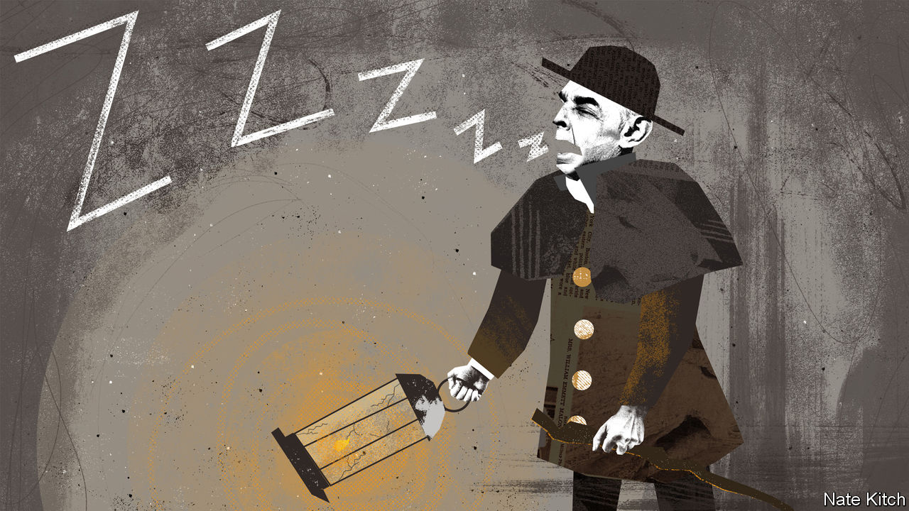

###### Bagehot

# The night-watchman welfare state 

##### How Britain ended up with the worst of all worlds 

 

> Nov 10th 2022 

Although forever associated with the term, William Beveridge never liked the phrase “welfare state”. The man who 80 years ago this month published the blueprint for Britain’s post-war welfare state thought it conjured up an image of a “brave new world”, rather than the culmination of 50 years of reform by Conservative, Liberal and, eventually, Labour politicians. Newspaper cartoonists ignored his objections. One turned a besuited Beveridge into a steaming mug being toasted by a British soldier in 1942: “Here’s to the brave new world!”

A plan to combat the five giants of want, ignorance, squalor, idleness and disease was the defining political quest of the first half of the 20th century. It replaced a rather 19th-century idea of a “night-watchman state”, where the government saw its role as offering physical security and not much more. Skip forward eight decades and Britain has ended up with the worst of both worlds. Britain is a libertarian’s nightmare, with the state expanding to 45% of gdp; the tax burden is likely to creep towards levels not seen since Clement Attlee, the Labour prime minister who put Beveridge’s plan into practice. Yet it also manages to be a social democrat horror show, achieving little . 

Increasingly the Conservative government provides a welfare state in name, but a bare bones night-watchman state in practice. The police will probably find your killer but they will make no effort to find your stolen bicycle. If you’re hit by a car, the nhs is likely to save your life. But if you require a hernia operation, you may wait a year or two (or give up and go private). A 19th-century concept of the state has collided with a 20th-century vision to create an intolerable 21st-century chimera.

The promise of a cradle-to-grave system has been replaced by a cradle-and-grave one, with the middle largely forgotten. Working-age benefits are terrible. Unemployment benefit is set slightly above destitution levels, at barely £80 ($91) per week, says the Resolution Foundation, a think-tank. That equates to 14% of average earnings or roughly half the level it was in the 1970s. In the Netherlands, this payment starts at 75% of someone’s last payslip. 

In theory, the night-watchman state does little but is, at least, cheap. A welfare state may cost a lot but it provides a lot. The current British state falls between these two stools. Britain still has a comparatively low tax take compared with other rich European countries. But some people within the system are hammered, suffering Scandinavian-level marginal tax rates for South Carolinian services. A recent graduate earning £30,000 faces an almost Scandi marginal tax rate of just over 41% once national insurance and student-loan deductions (which behave like a tax) are included.

This situation will get worse. Einstein is said to have joked that compound interest was the most powerful force in the universe. He might have added: the second-most-powerful force is fiscal drag. If the government freezes the threshold for the higher tax rate of 40% at £50,000, a senior teacher will end up in a tax bracket designed for well-paid solicitors. As an added blow, once-universal perks, such as child benefit, are whittled when incomes hit £50,000. If nominal wage growth remains healthy, come 2027 a Londoner on an average salary (currently £42,000) would begin to lose their child benefit. Beveridge pushed his reforms with the slogan: “Bread for all…before cake for anyone”. Now the mantra is bread for some and cake is off the menu. 

Taxes are high enough to create big expectations, but too low for them to be met. The contributory system, which allows people who pay in more to take out more, has enabled many northern European countries to remain generous. In Britain that principle is dead. National insurance is a bog-standard tax, even if people like to pretend it is a pot of money with their name on it. Pensioners are aggrieved that the state pension is lower than in, say, Ireland, even if it is much more generous than it was. Younger voters are fed up that the state provides so little yet takes so much, largely to hand money to older generations. There is little optimism that they will benefit in turn. 

Even the literal night-watchman part of the state is asleep on the job. The proportion of crimes that lead to a charge has fallen from 16% in 2016 to 5.6% today. Petrol theft is in effect legal—at least according to a flow-chart that dictates whether an officer from the Metropolitan Police bothers to investigate the crime. Unless the number plate of the driver has been captured in the same situation before, the police will close the case. People can show the cops a live gps tracker of their missing laptop and be told that there is nothing that can be done. A stolen car is written off with an apologetic automated email from the police. The long arm of the law is rather short. 

A broken light 

Spared the worst of austerity, the National Health Service (nhs) is the only adequately funded part of the British state, . At times the nhs seems itself to be a pale imitation of the welfare state. Doctors will prescribe food vouchers for people to claim at a food bank, since in-work benefits are too low. One hospital trust has set up its own supported-living unit because the council is too broke to fund theirs. Elsewhere, a charitable wing of a hospital pays for local low-traffic neighbourhoods rather than the council that is actually responsible for roads. The nhs is burdened with such tasks while waiting lists are at historic highs of 7m. It has become the state of last resort. 

Britain has always attempted to provide a welfare state on the cheap. An ageing population, forcing ever greater demands on a struggling state, means that this approach has run out of road. A part-watchman, part-welfare state does not work very well. In 1942, as the second world war raged, Beveridge wrote that “a revolutionary moment in the world’s history is a time for revolutions, not for patching”. Once again, the time for patching is over. ■


