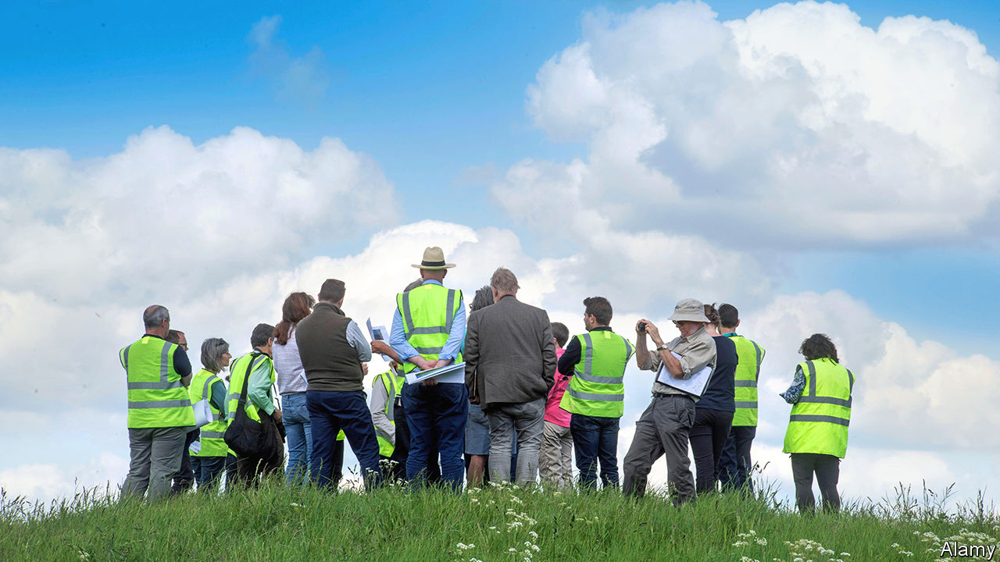
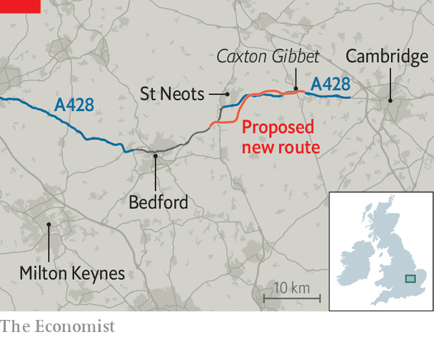

###### Infrastructure planning

# The real reason it takes so long to build infrastructure in Britain 

##### Politics, politics, politics 

 

> Nov 7th 2022 

Anybody driving from Milton Keynes to Cambridge in eastern England is likely to take the a428. The road is mostly fine. But for 15km between St Neots and Caxton Gibbet (a place reputedly named for the grisly practice of hanging dying and dead criminals in cages) it narrows to a single carriageway—one lane in each direction. Traffic jams and accidents are common. The local mp, Jonathan Djanogly, calls the A428 “a very nasty road”. 

In 2003 a regional transport study proposed upgrading the road to a dual carriageway. Eleven years later the transport secretary, Patrick McLoughlin, announced that the government would pay, as part of a road-building programme that would put “the motorist centre-stage”. The years ticked by. Construction is now expected to begin next year, although that will depend on the outcome of a legal challenge. All being well, it will open in 2026. 

This is mighty slow progress, although not especially so by the standards of . A third runway at Heathrow Airport, backed by the government in 2003, is even . A road tunnel near Stonehenge was proposed in 1995; it remains far off. Knowing that infrastructure investment boosts economic growth, successive governments have tried to accelerate matters with initiatives such as “Project Speed”. But the reverse is happening. The process is slowing down, and churn at the heart of government is itself largely to blame. 

Local authorities tend to handle small infrastructure projects such as roundabouts. But almost anything deemed “nationally significant”—which, in highly centralised Britain, includes a 15km-stretch of dual carriageway in eastern England—goes through a special process introduced in 2008. Designs are created; consultations are held; reports are solicited from environmental and heritage groups. The Planning Inspectorate, a government agency, must then issue a recommendation within six months. Government ministers have the final say, issuing “development consent orders” that allow construction to go ahead. 

 


For a few years the system worked splendidly, says Ian Fletcher of Jacobs, an engineering and professional-services firm. A large sewer under the Thames known as the Tideway Tunnel was approved quickly, as was a new nuclear power station at Hinkley Point. Then things began to slow. “You could see the slip starting to happen” about five years ago, says Robbie Owen of Pinsent Masons, a legal firm.

The planning inspectors continue to hit their six-month deadlines. But the process of designing, consulting on and refining infrastructure projects is taking longer. Then, after the inspectors give their opinions, government departments are dithering over whether to proceed. Even when they give the go-ahead, a growing number of schemes end up in court. 

People living near the a428 have been consulted three times. National Highways, a government-owned company, solicited their opinions about four slightly different routes in 2017, asked them about the preferred route in 2019, and then, after making minor changes, asked again in 2020. Public consultations tend to last less than eight weeks. But each one takes months to prepare and months to digest. And they are not supposed to run over Christmas or the August holiday season. 

In this case they all found the same thing. “The vast majority of people who were consulted were happy, as am I,” says Mr Djanogly. St Neots is a car-oriented corner of England and, in truth, not a beautiful one. The land is flattish and intensively cultivated, with only some barbastelle bats to worry about. Further riches lie below ground—archaeologists scouring the land before the engineers move in have discovered Neolithic arrowheads, the remains of Iron Age roundhouses and a Roman kiln—but road-building is not nearly as controversial as it is near Stonehenge. 

Not everybody wants the road, though. Soon after the government gave its formal consent to the project in August, an environmental group called Transport Action Network applied to the High Court for a judicial review of the decision. The group argues, among other things, that the Department for Transport did not properly consider local targets for carbon emissions. If a review goes ahead, the bulldozers will sit idle for many more months. 

Judicial reviews are becoming more common—and more obstructive. Mustafa Latif-Aramesh of bdb Pitmans, a law firm, says that, between 2010 and 2020, ten of the development consent orders signed by ministers were reviewed. None was quashed. Since then, however, four judicial reviews (for an airport in Kent, road junctions near Derby, the tunnel near Stonehenge and a wind farm off the coast of Norfolk) have succeeded. Inspectors are growing more critical, too. Mr Latif-Aramesh counts two occasions between 2010 and 2019 when they recommended refusal, and ten since. Ministers can and do approve projects anyway, but the examiners’ reluctance emboldens opponents. 

Many of these hitches have a common cause. The system for assessing large infrastructure projects rests on a pile of documents known as “national policy statements”, which set out the government’s approach in specific areas such as roads and railways, electricity networks and water resources. Planning inspectors use them to assess projects. The national policy statements are supposed to be refreshed about once every five years, but this has not been happening. As they grow yellow, planning grows fraught. 

“The world moves on,” says Sir John Armitt, chairman of the National Infrastructure Commission, an advisory agency. Since the national policy statement for roads was created in 2015, the government has enacted a law obliging it to reach net zero greenhouse-gas emissions by 2050. Last year a transport strategy proclaimed that “we will use our cars differently and less often”. Local governments have created emissions targets of their own. Meanwhile, the covid-19 pandemic has transformed people’s travel habits. 

As a result, it is easier for groups such as Transport Action Network to argue that a road project like the a428 is unnecessary, and that laws are not being followed properly. Judicial reviews are more likely to succeed. And the growing fear of judicial reviews in turn makes everybody more cautious and finicky about consulting the public and interested groups, gumming up the entire planning process. 

National policy statements are hefty documents, which bind the government to courses of action. It is not surprising that they are neglected when policies and prime ministers change as frequently as they have recently. In July 2021 Grant Shapps, then the transport secretary, announced a review of the road and railways document, but this has not been completed, and Mr Shapps has changed jobs. A new national policy statement for water resources, which might encourage the construction of more reservoirs, was promised for 2019. It has still not been finished. 

“Every government wants project speed,” says Sir John. And some aspects of the planning and building process could probably be accelerated. National Highways currently hopes to get another road, the a66, upgraded quickly by compressing environmental reviews and asking the contractors to work differently. But a critical reason for the slowness in building infrastructure is not the planning system. It is the fact that British ministers have been unable to specify what they want, or to explain how their longing for infrastructure should be reconciled with their desire to protect the environment. Their confusion is the problem. Politician, heal thyself. ■


