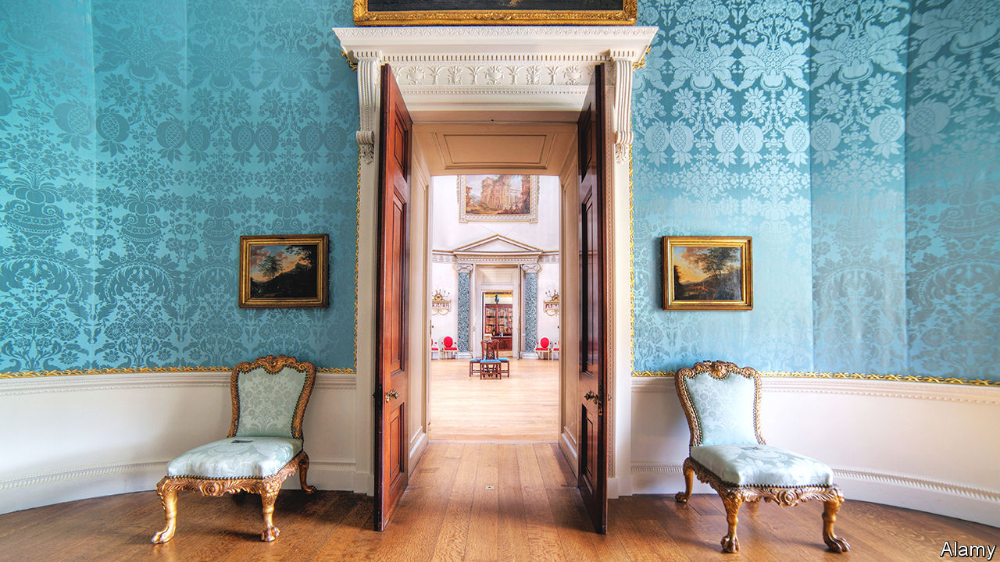

###### Trust issues

# Why is everyone so cross about the National Trust? 

##### What is at stake is not merely old houses but the telling of history 

 

> Nov 10th 2022 

The National Trust’s Twitter feed is telling. “Have you ever noticed how fascinating tree bark can be?” asks one less-than-Trumpish tweet. “Happy birthday William Wordsworth!” reads another. Some, it is true, strike a darker tone. “As Bonfire Night approaches,” warns one, “remember to check for hibernating hedgehogs.” But on the whole the tone typifies an entity known for specialising in fresh scones, old people and older stones—an organisation that is, as Alan Bennett put it, “so decent, so worthy, so…dull”. 

It is easy to underestimate the National Trust. Its members, a sheepish middle-class Masonry, tend not to talk about their membership much: for most, a small oak-leaf sticker in the corner of a windscreen is the only outward sign of belonging. And yet it matters. Partly because it is vast. The largest conservation charity in Europe, it is  and has two-thirds of the world’s population of Herdwick sheep. Its 5.7m members number almost 10% of the British population; Norway has fewer people. 

It matters in political debate, too. One of (many) signs that Liz Truss’s premiership was in trouble was when the National Trust, along with the Royal Society for the Protection of Birds, tweeted their opposition to her proposed planning reforms. Tweets from a bird charity and an organisation that preserves old buildings might not sound that terrifying, until you realise that the combined membership of the two organisations is almost 7m people—40 times greater than that of the Conservative Party that elected her. Ms Truss is history; the reforms have dropped from sight.

The Trust is also involved in cultural flashpoints. A dispute in 2017 over whether Trust volunteers should wear rainbow lanyards during Pride month has been followed by debates on dumbing down, colonialism, slavery and diversity. “We used to call it the National Front…it was so white,” says Sathnam Sanghera, author of “Empireland”, a book about how imperialism shaped Britain. That was, he adds, a joke; he loves the Trust. But ethnic minorities can “feel quite stared at” in its properties.

These squabbles may explain the fractious mood when Trust members gathered in Bath on November 5th for their annual general meeting. Outside, protesters banged drums; inside, members, tweedy and terse, criticised the Trust for its renovations, its farming and for taking part in Pride (an “aggressive promotion of homosexuality”, according to one member). The past few years have “certainly been interesting”, says Hilary McGrady, the Trust’s director-general. 

The Trust’s origins were virtuously anodyne. It was founded in 1895 by Octavia Hill, a philanthropist, who believed that London’s poor needed not just “food and drains”, but also “free air, green grass” and beauty in order to be happy. Although the Trust would come to be known for its posh houses, Hill’s main interest was in preserving common land for common people; in snatching green and pleasant fields from the spreading dark satanic mills. Soon, it was buying properties in the Lake District. 

Then, in 1937, the Trust launched its “Country Houses Scheme”, through which toffs who had fallen on hard times could escape death duties if they donated their houses to the Trust and let the masses in. It started to epitomise a certain kind of Englishness—of country houses and cream teas, of lemon curd and lovely lawns. One critic dismissively called it “an ethereal kind of holding company for the dead spirit of the nation”; Brideshead, bottled. 

The spirit-of-the-nation line may explain why recent arguments have been so grouchy. It is not the Trust that is being debated, says Neil MacGregor, a former head of the British Museum, but history. “How you describe your past is always…how you describe what you want to be.” 

One of the bitterest moments came in 2020, when the Trust published a historical report. Its publications usually have such titles as “The National Trust Book of Scones” (subtitle: “50 delicious recipes and some curious crumbs of history”) or “A Treasury of British Folklore: Maypoles, Mandrakes and Mistletoe“. This report was titled the “Interim Report on the Connections between Colonialism and Properties now in the Care of the National Trust, Including Links with Historic Slavery”. It wasn’t stocking-filler territory.

The rumpus was startling; one academic who worked on it received death threats. Many felt that the Trust was overstepping: it should offer nice days out, not lectures. As Charles Moore, a conservative writer told the : “Why should I pay a hundred quid a year, or whatever, to be told what a shit I am?” To others, that argument is odd. “If you want scones…just go to the café,” says Mr Sanghera. To say that the Trust offers too much history “is like going to a shopping centre and saying…‘Can we have less of this capitalism, please?’”

Some Trust members might want to ignore the echoes of empire. Demography may not let them. Consider, says Mr MacGregor, the Trust’s Kedleston Hall. Once owned by a viceroy of India, it sits near Leicester—soon to become Britain’s first city with a majority population from the subcontinent. “Today, Kedleston is bound to mean something completely different.” 

For all the furore, there remains something National Trustish about these debates. Speak to anyone involved, ask if they are members, and all brighten. “Of course I am,” says one protester standing by the drummers in Bath. Their lemon curd, she says, “is really lovely”. For Mr Sanghera: “Something about having that sticker in your windscreen…speaks to your middle-aged psyche”. And so the Trust, so decent, so worthy—a little less dull—continues. ■


