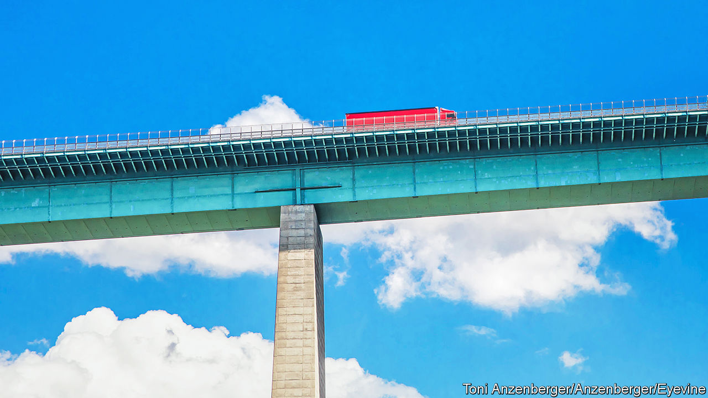

###### Feeling the AdBlues

# A series of shortages threatens EU supply chains 

##### Lorries cannot run without AdBlue. Or without drivers 

 

> Nov 10th 2022 

“Lorries are vital for the transport of almost everything in Europe,” says Raluca Marian of the International Road Transport Union (IRU) in Brussels. Three-quarters of all goods in the EU travel by lorry. If half the bloc’s 6.2m heavy-duty vehicles (HDVs) cannot function, supermarket shelves will be empty within days and essential services reliant on ambulances and fire engines will break down. That could happen if stocks of AdBlue, a mix of urea and deionised water that neutralises nitric-oxide emissions from diesel engines, are depleted. As many as 4m European lorries are programmed to stop after a few kilometres without AdBlue. 

In August SKW Stickstoffwerke Piesteritz, a chemicals company in eastern Germany that makes about 40% of the country’s supply of AdBlue, stopped production because of exorbitant gas prices. The firm said it was losing €100m ($100m) a month. In September SKW restarted 45% of its production after gas prices came down a bit. But the damage was done. 

Constrained supply and higher costs for the two remaining big producers, basf of Germany and Yara of Norway, pushed the price of a litre of AdBlue to €1.20, up from just 17 cents in August 2021. In an open letter to Robert Habeck, Germany’s economy minister, and Volker Wissing, the transport minister, the chairman of Netzwerk Logistik Mitteldeutschland, a logistics group, lamented that for a haulage firm with a few hundred lorries this translates to extra annual costs of €500,000.

The shortage of AdBlue is the latest blow to German trucking, which is already suffering from high fuel prices and a dearth of truckers. “We are short of 100,000 lorry drivers in Germany,” worries Dirk Engelhardt, head of the BGL, a haulage-industry association. Across Europe 10% of vacancies are unfilled, says the IRU, equivalent to 425,000 people. Most of the tens of thousands of European truckers who retire every year are not replaced. Off-putting working conditions and the difficulty of combining the job with stable family life is discouraging youngsters and women (who make up just 3% of lorry drivers in Europe) from taking the wheel. 

Ms Marian wants the European Commission to recognise AdBlue as an “essential product without which logistics chains would stop”. Such a designation could require the chemical’s EU-wide availability to be monitored. She also suggests creating official AdBlue reserves. This seems like a long shot. But even if Ms Marian does not get her way, the shortage of AdBlue may ease once gas-price brakes and other government schemes to mitigate the energy crisis enter into force around the eu. The shortage of drivers will be harder to solve. A first step would be to make becoming a driver easier and cheaper: getting an HDV licence in Germany takes three years and costs up to €13,000, a big hurdle for most jobseekers. The exam is not available in Ukrainian or Turkish, languages spoken by immigrants who might otherwise be tempted by the profession’s decent pay. ■


