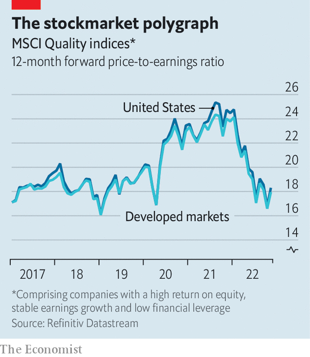

###### Cooking the books

# A sleuth’s guide to the coming wave of corporate fraud 

##### Mischief is cyclical—it is bred in good times and uncovered in bad times 

 

> Nov 7th 2022 

The bad news just keeps coming. Ten months after America’s stockmarket peaked, its  have suffered another rout. Hopes that the Federal Reserve might change course have been dashed; interest rates are set to rise by more than previously thought. The  is screaming recession. Could things get any worse? The answer is yes. Stockmarket booms of the sort that crested in January tend to engender fraud. Bad times like those that lie ahead reveal it. 

“There is an inverse relationship between interest rates and dishonesty,” says Carson Block, a short-seller. Quite so. A decade of ultra-low borrowing costs has encouraged companies to load up on cheap debt. And debt can hide a lot of misdeeds. They are uncovered when credit dries up. The global financial crisis of 2007-09 exposed fraud and negligence in mortgage lending. The stockmarket bust of the early 2000s unmasked the deceptions of the dotcom bonanza and the book-cooking at Enron, WorldCom and Global Crossing. Those with longer memories in Britain will recall the Polly Peck and Maxwell scandals at the end of the go-go 1980s. 

The next downturn seems likely to uncover a similar wave of corporate fraud. Fraud-busters concede that exactly where is hard to know in advance. Everyone has a favourite hunch. The rush to comply with the demands of environmental, social and governance (ESG) investing seems ripe for more imbroglios; in May German police raided the offices of dws, an asset manager, over claims of greenwashing. The various government schemes to shore up businesses in the pandemic are another candidate. They were designed to be tapped quickly, so checks were by necessity lax. Evidence of fraud is already emerging. 

The archetypal sin revealed by recession is accounting fraud. The big scandals play out like tragic dramas: when the plot twist arrives, it seems both surprising and inevitable. No simple formula exists to sort the number-fiddlers from the rest. But the field can be narrowed by searching within the “fraud triangle” of financial pressure, opportunity and rationalisation.

Start with pressure. This can be self-imposed. If you make the cover of , in Mr Block’s words, “the guy on the cover becomes your identity, the ceo of a high-flying firm.” Fessing up that it isn’t flying high becomes unthinkable. Often it is the result of external expectations, says Andi McNeal of the Association of Certified Fraud Examiners, a 90,000-strong professional body based in Texas. 

The expectations to be met, or gamed, can be regulatory: think of how bankers pulled the wool over the eyes of their watchdogs before the financial crisis; or how Volkswagen deceived environmental agencies about the pollution from its cars in the “diesel-gate” scandal. For bosses of listed firms, the external eyes to please are often those of portfolio managers, analysts and traders—and the thing doing the pleasing is accounting earnings. The stockmarket uses profits as a rough guide to how well a firm is doing and at what price its shares should change hands. Earnings “misses” can be punished brutally. The shares of , owner of Facebook, lost 25% of their value after disappointing quarterly earnings last month. A lot of ceo pay is tied to share prices, creating the incentive to meet earnings forecasts. 

 


That bosses feel pressure to deliver predictable profits is well documented. Almost all the 400 managers surveyed in the mid-2000s by John Graham, Campbell Harvey and Shiva Rajgopal, a trio of academics, confessed to a strong preference for smooth earnings. Most admitted they would delay big spending line items to meet a quarterly earnings target. More than a third said they would book revenues this quarter rather than the next, or incentivise customers to buy more earlier. The rewards for smoothing earnings have since grown. Investors attach rich valuations to the shares of dependable earners. Such “quality stocks” have sagged already (see chart). Some bosses will resort to fraud to avoid plummeting further. 

Motive is not enough. The circumstances have to be right, too (or rather, wrong). Opportunity varies by jurisdiction. Where the rule of law is weak, scope to falsify accounts with impunity is wider. You should expect to find more book-cooking in emerging markets than in rich ones. Some short-sellers, such as Mr Block, examine Chinese firms listed abroad, whose accounts are hard for foreigners to verify. They landed a big target in 2020, when Luckin Coffee agreed to pay $180m to settle accounting-fraud charges in America. India is another font of scandal. 

In rich countries, opportunity beckons in the latitude of accounting practices. Earnings are a slippery concept. In a simple business, like a lemonade stand, profit is the difference between the cash coming in from sales and cash going out to buy lemons. Bigger businesses must account for non-cash items, or “accruals”, such as sales that have been booked but not yet paid for. Accruals also include costs that will eventually be a drain on cash, but aren’t yet: wear and tear (depreciation) of assets, pension payments, bad debts and so on. Accruals rely on a forecast or best guess of how things will turn out. “Accountancy is full of such estimates,” says Steve Cooper, former board member of the International Accounting Standards Board, who now writes the Footnotes Analyst, a blog. 

Accruals estimates can change for defensible reasons. Amazon Web Services, the e-emporium’s cloud-computing division, said in February that it would extend the working life of its servers by a year, thus lowering its depreciation costs. This is perfectly legitimate. No one knows for sure the useful life of fixed assets, such as servers (or aircraft or office buildings). Some less scrupulous firms, however, can time accruals changes to give earnings a bump, by bringing forward revenue to the present or deferring costs to the future. 

Eventually, earnings must tally with cashflow. Firms that do not generate a lot of cash tend to pile on debt to disguise the fact. Corporate sleuths know this, which is one reason fraudsters go to great lengths to conceal their true debt burden. Another reason, powerful during recessions, is to avoid a downgrade from rating agencies, which would raise borrowing costs. 

The side that completes the fraud triangle is rationalisation. Though some fraudsters are, as Mr Block points out, sociopaths who don’t feel the need to justify themselves to anyone, fraud is likelier to occur if ceos feel they can justify it to themselves. “Everybody does it” is something you might hear from the earnings-smoothers at the white-lie end of the accounts-fiddling spectrum. Some fraudsters tell themselves they are altruists, doing it to save jobs or investors. “This is just temporary” is another common rationalisation, says Ms McNeal. 

Chef executives

Book-cooking can feel acceptable in a slump, in cases where the boss sincerely believes the business has good long-term prospects. This is what happened at one company. It was a classic story, says the executive who was brought in to clean up the mess. Business was good. The management believed they had found a recipe for success. They repeated this formula until long after it had stopped working. The pressure rose after recession struck. Costs were slashed in an effort to sustain profits. The cuts served only to hurt the business. Somehow reality had to be kept at bay. So the company began to fiddle its accounts.

How many such cases are thrown up by the next recession depends on its severity. It is easier to keep a fraudulent show on the road in a short downturn. In a prolonged one, a few sorts of corporate sinners are likely to be unmasked. The least guilty type are firms that were run with a view to meeting accounting goals, but to the long-term detriment of the business. This group includes firms so obsessed with managing earnings that they skimped on investment in capacity, new products or brands, and firms that were so intent on managing costs that they destroyed valuable relationships with suppliers or employees. 

A firm that pays too much attention to accounting measures of success is not committing fraud. But such a focus may be a gateway to dodgier practices. Some high-flyers that suddenly lose altitude may decide to fiddle the numbers in the hope that the good times return. A loss of revenue is the likeliest trigger for fraud of this kind. The peculiar circumstances of the post-pandemic economy have now given rise to others, such as excess inventories or problems with suppliers going bust. The share prices of Walmart and Target fell sharply in May, after the two retailers revealed they had misjudged demand for some goods. Less honest firms may cover up mistakes of this kind rather than own up.

Then there are firms with no real business or not much of one. , a much-feted German “fintech” firm that imploded in 2020, fits this category. So does , a startup with plans to make battery-powered lorries, whose founder, Trevor Milton, was found guilty last month by a federal court in New York of defrauding investors. By the cold light of recession, similar such examples will come to light. A lot of venture capital (vc), much of it undiscerning, has poured into untested enterprises in recent years. The valuations they were assigned in the boom years already look like fantasy; many of their business models will prove similarly fanciful. 

Their vc backers may try to conceal such souring bets. Their fees are based on the value of their portfolio firms, whose equity is not frequently traded. That gives the vc fund managers wide discretion over the value (or “marks”) they place on them. The same is true of private equity. Both vc firms and private-equity firms, which focus on mature businesses, are notoriously slow in writing down these values in bad times. When a fund matures, its sponsor must usually sell companies, at which point the market value ought to be clear. But these days a lot of private-asset “exits” are sales to other private funds, including some run by the same asset manager. Clubby arrangements of this kind invite abuse. 

The slow-growth, low-rate 2010s were a favourable climate for fraud to breed. Financial pressure, opportunity and rationalisation no doubt became aligned in at least a few instances. Everybody does it? Maybe. But even the “smoothing” that seems acceptable in a boom will be judged harshly in a bust. ■


