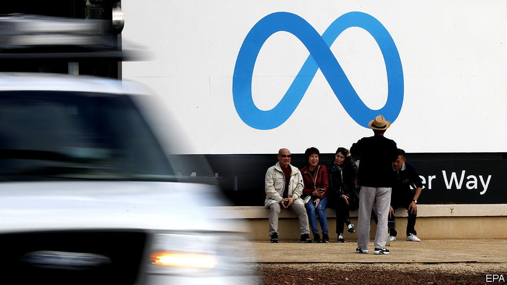
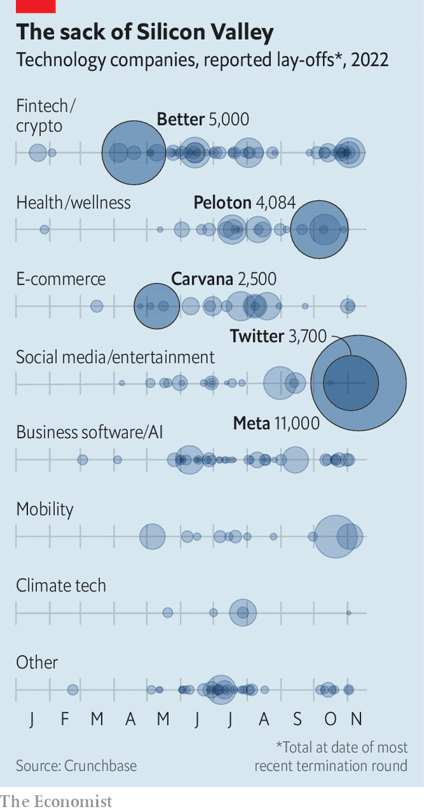

###### Rebooting the system

# As tech lay-offs spread, Meta sacks 11,000 workers 

##### Job cuts come to Silicon Valley 

 

> Nov 10th 2022 

 


On November 9th Meta said it would fire 11,000 people, or 13% of its workforce. It is not the only tech firm to give its workers the boot, as the sector goes through a harsh downturn. A week earlier Stripe, a fintech firm, announced it would cut 14% of its staff; Twitter’s new owner, Elon Musk, fired half its personnel. According to Crunchbase, a data provider, more than 60,000 American techies have been shown the door this year.


