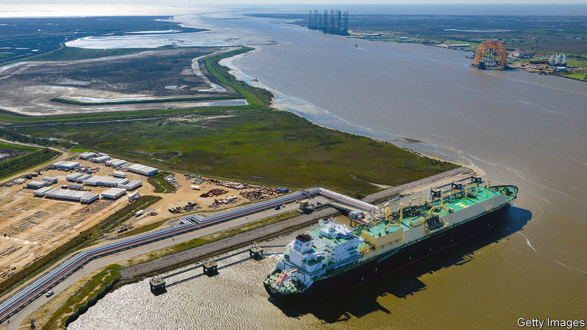
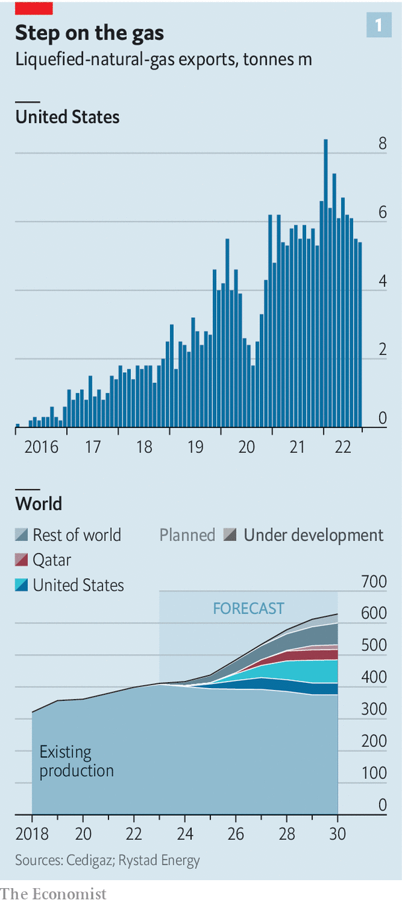
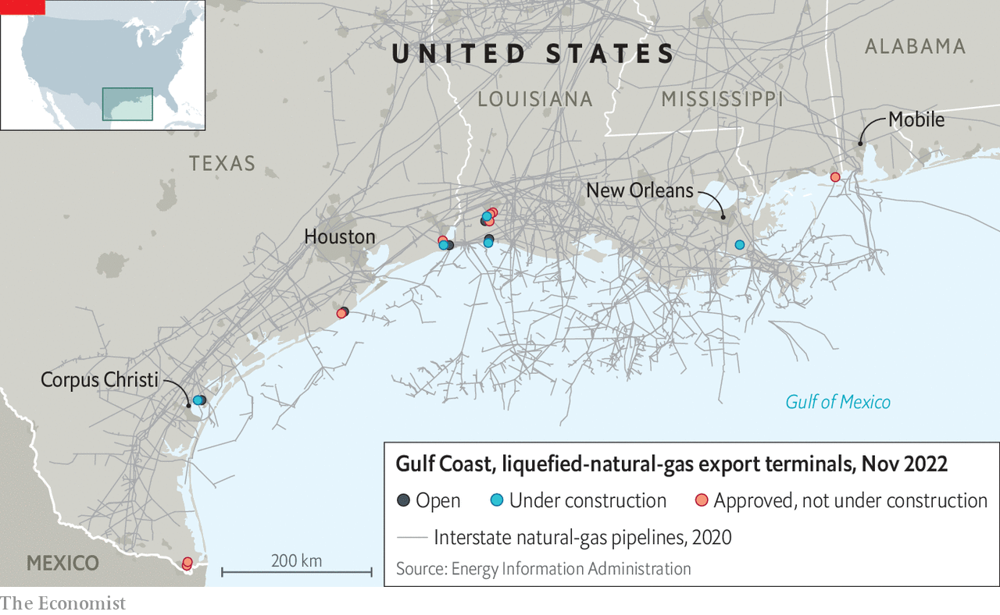
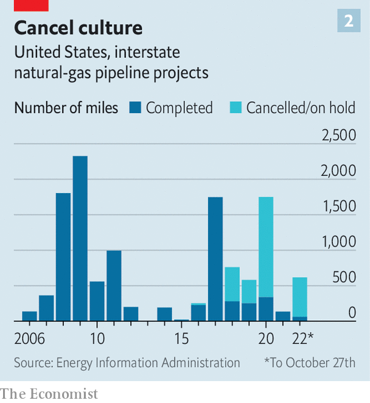

###### Freedom lighters

# Can American liquefied natural gas rescue Europe? 

##### Eventually, yes. But first a few obstacles must be overcome 

 

> Nov 10th 2022 

“ONE CARGO of LNG heats 1m people in Europe for a month,” beams an employee of Cheniere, America’s biggest exporter of liquefied natural gas, pointing to a specialised vessel docked at its huge export terminal in Corpus Christi, Texas. The firm has poured $17bn into the facility and in October held a groundbreaking ceremony to mark an additional $8bn expansion. More lng sets sail from Cheniere’s even bigger plant in Louisiana.

When Donald Trump’s administration vowed in 2019 to spread “freedom gas throughout the world”, it sounded like overwrought rhetoric. Now, especially to European ears, it sounds mellifluous. Russia has choked off supply in response to Western sanctions imposed after its invasion of Ukraine. Although current prices have come down from their peaks, thanks in part to mild weather, European countries are seeking ways to replace Russian fuel. Freedom gas looks just the ticket. 

America’s Energy Information Administration (EIA) calculates that the volume of American LNG exports rose by 12% in the first half of 2022, year on year, to the equivalent of 57bn cubic metres (bcm) when regasified. Nearly two-thirds went to Europe, up from roughly a third of the total in all of 2021. America has shot past Australia and Qatar to become the world’s largest LNG exporter. A deal agreed to in March by America and the EU calls for an extra 50bcm per year of American LNG to flow to Europe this decade. On November 7th the , a British newspaper, reported that Britain and America were about to announce a big LNG deal after the UN climate summit taking place in Egypt.

If American LNG boosters have their way, that is just the start. Toby Rice, boss of EQT, America’s biggest producer of natural gas, wants his country to quadruple its LNG export capacity by 2030, to 1.6bcm per day. He argues this would not only ease the energy crisis but even, if that gas is used to displace dirtier coal plants in the developing world, combat climate change. Turning America into a lasting LNG superpower will be harder to pull off than this year’s one-off surge. Can it happen? 

 


America has lots of gas. By the EIA’s reckoning, known reserves that are recoverable using existing methods will last another century at current rates of production. A lot sits in shale beneath Appalachia, home to two of the world’s biggest gasfields. One of them, the Marcellus, is bigger than the ten largest conventional gasfields combined. American lng firms also have lots of ambition, dwarfing even Qatar’s $50bn plan to increase its export capacity by nearly two-thirds in the next five years. Roughly half of the world’s LNG projects under construction or proposed to be built by 2030 are in America (see chart 1). 

The industry is also, by its risk-averse standards, innovating furiously. One firm, Venture Global, has pioneered the use of modular liquefaction equipment that is made in a factory and shipped to the site of the project. At a shipyard not far from Cheniere’s terminal in Corpus Christi, a startup called New Fortress Energy is building “fast LNG” liquefier units that can be installed on old ships or rigs. That helps cut the necessary capital spending from billions to $700m-800m apiece. 

Rod Christie of Baker Hughes, an energy-services firm, explains that the modular approach can shave up to two years off on-site construction, which can take five years or more. Venture Global is completing its first facility in record time. In May it secured some $13bn in fresh money to build a giant new one in Louisiana; it should be ready to ship gas by 2024. New Fortress’s boss, Wes Edens, says his firm can get smaller LNG terminals up and running “in roughly half the time at roughly two-thirds the cost” of the conventional approach.

In order for America’s potent mix of natural riches, powerful incumbents and plucky entrepreneurs to translate into lng superpowerdom, the industry must still overcome three obstacles. The first is Wall Street standing in the way of getting more gas out of the ground. Investors are traumatised by the decade-long boom-and-bust cycle in which shale-drillers burned through more than $150bn in cumulative free cashflow from 2011 to 2020. They have been urging energy bosses to return record profits to investors rather than build new capacity. And the bosses have listened. Pioneer Natural Resources, a big shale producer, offers a dividend yield of 12.4%, up from 1.4% last year. Another, Chesapeake Energy, has doubled its share-buyback scheme. The shalemen have also paid back $26bn in debt. They are showing no signs of relaxing this newfound capital discipline. 

 


If gas prices stay high the incentive to drill, baby, drill may one day become irresistible. Yet even then, the LNG firms must get the gas from the wellhead to the liquefiers. Matt Palmer of S&amp;P Global, a research firm, thinks America could double its LNG exports by the late 2020s using its existing pipelines and relying on gas from fields, such as those in the Permian basin in Texas, that are close to the Gulf coast’s terminals (see map). A bigger expansion would require more fuel to flow south from landlocked Appalachia. Since 2016 several pipeline projects have been scotched because of permit hassles and opposition from anti-pipeline activists (see chart 2). 

 


The last obstacle arises from, of all places, Europe. Because LNG projects are risky and capital-intensive, creditors will not lend billions to finance them unless the borrowers can show long-term contracts that guarantee cashflows from which the debt can be serviced. Buyers in Japan and South Korea are happily signing such agreements, thanks in part to regulations that promise to compensate them if gas prices crater. But demand from Asia alone is not enough to justify large expenditures on new lng capacity in America. 

Despite the EU’s scramble to replace lost Russian gas, only four power companies in Europe have signed long-term gas deals with American exporters this year, reckons Leslie Palti-Guzman of GasVista, a research firm. Many others worry that the EU’s ambitious climate policies portend an eventual crackdown on the use of gas, which though cleaner than other fossil fuels still emits carbon when burned. 

“Nobody knows what the EU’s gas demand will be after 2030,” says David Goldwyn, an energy expert. And in contrast to Asia, liberalised European energy markets expose the buyers to price swings. Amid such uncertainty it is hard to blame Europe’s utilities for feeling skittish about signing 20-year contracts. American LNG can ride to Europe’s rescue. But in order for more Chenieres, New Fortresses and Venture Globals to step up, more Europeans need to sign on the dotted line. ■


