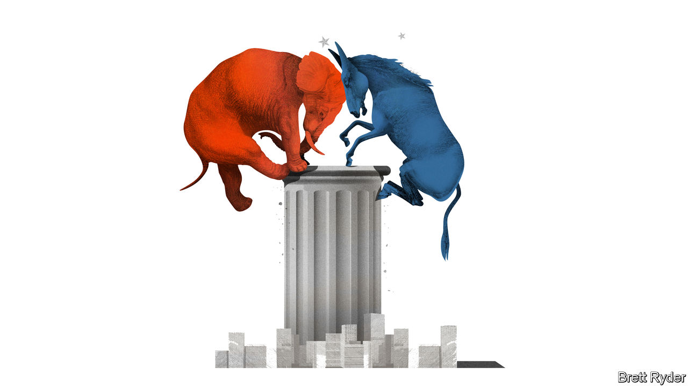

###### Schumpeter

# Even with political gridlock, America Inc should still fear the bossy state 

##### Beware the power of one-party state governments 

 

> Nov 9th 2022 

In 1922 Vladimir Lenin, criticised by Communist militants for tolerating a minuscule role for the private sector in Bolshevik Russia, insisted that it was a reasonable trade-off because the state would still control “the commanding heights” of the economy. For much of the rest of the 20th century that phrase came to stand for state meddling—not a complete clampdown on private markets, but preference for a dominant economic role played by the mandarins of the public sector. 

In the 1980s that changed. For most of the period since then it was market forces, rather than the state, that have been in the ascendancy across the West, even when centre-left governments have been in power. But Daniel Yergin, who co-authored a book called “Commanding Heights” in 2002, argues that the concept is back. President Joe Biden’s spending bills on infrastructure, semiconductors and the climate seek to use industrial policy to strengthen investment in America and counter geopolitical competition from China. His government has a left-wing regulatory zeal not seen in generations. “The hand of the regulatory state has become stronger,” asserts Mr Yergin, who is also vice-chairman of S&amp;P Global, a research firm.

For such reasons, the prospect of gridlock after Republicans appear on track to narrowly regain the House of Representatives in midterm elections on November 8th will probably be salutary for business, even if the Grand Old Party fails to make the sweeping gains in the Senate that some had predicted. If nothing else, it will prevent yet more big-spending “Bidenomics”, potentially reducing upward pressure on inflation and interest rates.

Yet the election results are not an unalloyed win for America Inc. Although political paralysis in Washington may constrain the more progressive wing of the Democratic Party and the globophobe populists among the Republicans, there is little that centrists can do in the short run to stem the regulatory tide. Moreover, results in state races portray a country split into conflicting ideological camps. Whether in red states like Florida and Texas or blue ones like California, governments are increasingly keen to boss businesses about. Corporations struggle to straddle the chasm. 

Even before the final vote counts roll in, the post-electoral picture for corporate America is already clearest on taxes. Republican control of the house would take two immediate concerns off the table. The first is the White House’s ambition to push through corporate-tax increases, windfall taxes on oil firms, or both. The second allayed concern is that of a new fiscal splurge. Granted, many consumer-facing firms benefited from the fillip to households that came from Mr Biden’s $1.9trn American Rescue Plan in March 2021. Others, such as construction-equipment firms, logistics operators, chipmakers and clean-energy companies, are likely to benefit from the $1.7trn trio of spending bills pushed through by the Biden administration in the past year. With annual inflation running at 8%, however, further spending, if debt-financed, would be dangerous. It would push up wages and other costs.

Matters are blurrier when it comes to the regulatory state. Even if the right wins control of both chambers, Mr Biden would veto any attempts to arrest his sharp shift to the left on matters like competition policy; the Federal Trade Commission is gearing up for some high-profile cases, including an antitrust trial against Meta, Facebook’s corporate parent, expected to begin in December 2023. With control of at least one chamber, the Republicans can make mischief, summoning regulators to Capitol Hill, or turning down agencies’ requests for more money. They are cross about some issues that many big businesses also seethe about, such as the attempts by the Securities and Exchange Commission, the market regulator, to demand finicky emissions disclosures.

In other important ways, though, the party that used to treat corporate America as a bedfellow has started to disown it. Like Democrats, though for different reasons, Republicans want to cut big tech down to size. Just as Donald Trump courted blue-collar voters, some of his most notable acolytes have espoused causes that are anathema to big business, such as higher wages and workers’ councils, while turning against laissez-faire favourites like globalisation and immigration. In the end it may be the courts, not the Republicans, that prove to be the last bulwark against overweening regulators.

Business may have the most difficulty keeping interventionism at bay in the states. With Washington gridlocked, states are turning into strongholds of ideological unity and taking matters into their own hands. In the run-up to the elections, only 12 of the 50 states had divided governments, notes Neil Bradley of the US Chamber of Commerce, America Inc’s main lobby group. That emboldens them to interfere in what used to be considered internal corporate affairs, from the “wokery” of CEOs to investments, lending policies and the size of share buy-backs. That leaves companies in the tricky position of trying to appease both deep-red and deep-blue states at the same time. As Mr Bradley puts it, companies are seeing “Texas telling them they have to do one thing and California telling them they have to do the opposite”. 

Taking the Mickey 

One way for businesses to cope with this is to keep their heads down and their noses out of politics. The consequences of misreading local political moods can be severe. Just ask Disney, whose run-in with Ron DeSantis, Florida’s governor, may be all the costlier after his thumping re-election win puts him in pole position to challenge Mr Trump for the Republican nomination in the 2024 presidential race. Alternatively, companies could also lobby the federal government for a single set of rules in areas such as greenery or data privacy, even if these are not all to businesses’ liking. That would help clear the state-by-state minefield. It is also fanciful in an era of gridlock. From the commanding heights of Bolshevik heaven, Lenin must be laughing. ■


