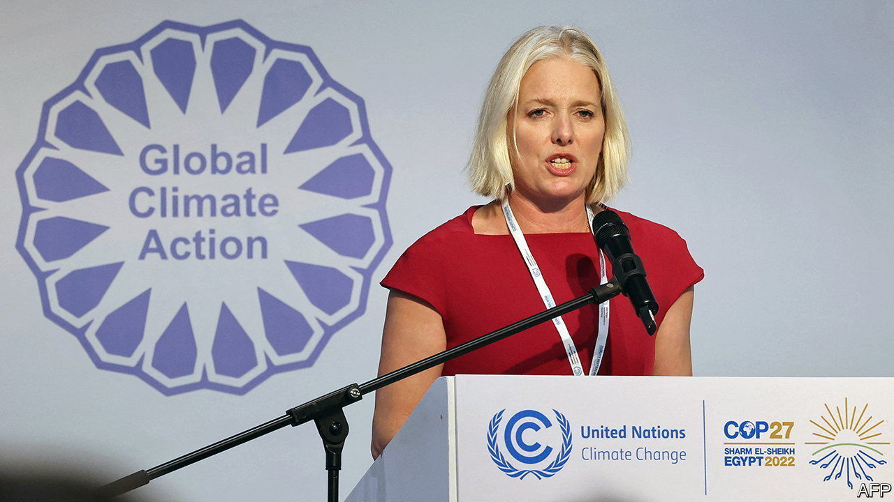

###### Wake up, boss!

# The UN takes on corporate greenwashing 

##### Will companies—and governments—listen? 

 

> Nov 10th 2022 

Readers looking for thrills rarely turn to official reports written by groups of worthies. At first glance, one from a body soporifically named the UN High-Level Expert Group on the Net-Zero Emissions Commitments of Non-State Entities might be expected to cure insomnia. The team of experts, led by Catherine McKenna, a former Canadian minister, has spent the past seven months poring over the proliferating climate commitments of banks and big businesses, as well as cities and regions. 

Yawn? Not a bit of it. The group’s conclusions, presented to the un Secretary General on November 8th at the annual climate summit taking place in Egypt, made both ceos and activists sit up. In her opening letter, the refreshingly direct Ms McKenna set the tone: “It’s time to draw a red line around greenwashing.”

Many companies are making bold promises to reduce their emissions of greenhouse gases to zero. According to Accenture, a consultancy, around one-third of the world’s 2,000 biggest firms by revenue now have publicly stated net-zero goals. Of those, however, 93% have no chance of achieving their targets without doing much more than they are at the moment. Few businesses lay out credible investment plans or specify milestones against which progress can be judged. 

In order to curb such “dishonest climate accounting”, the report urges companies to make public disclosures of their progress towards decarbonisation using verified and comparable data. It implores regulators to make these disclosures mandatory. In addition, the authors say, firms should not claim to be net-zero while investing in new fossil-fuel supplies (which puts many investment funds in a bind) nor rely on reporting the intensity of emissions (per unit of output) rather than their absolute volume. And organisations making green claims must not simultaneously lobby against climate policies. 

All very bracing, and perfectly sensible. Will business take it to heart? The UN has no authority to enforce any of the recommendations. The idea that increased scrutiny will inevitably lead to better behaviour remains untested. It is all too easy to imagine that it might instead lead to what you might call green-hushing. A survey of some 1,200 big firms in 12 countries by South Pole, a climate consultancy, found that a quarter have set themselves stringent emission-reduction targets but do not intend to publicise them. Some companies are staying quiet to avoid attracting the ire of conservative politicians in places such as Texas, who decry “woke” corporations. Others, particularly in progressive redoubts like Europe, fear activist ire for not meeting targets quickly enough. 

Many state entities are not helping—and not only because they shy away from policies with bite, such as carbon taxes. The day after Ms McKenna set out her red lines, the American government launched a new scheme to spur large companies in rich countries to purchase carbon credits from developing countries that expand their renewable-power-generation capacity. In theory, this could bring much-needed capital to the urgent task of scaling up clean energy in emerging markets. In practice, worries Chris Cote of MSCI, a research firm, it will be hard to tell if a given project would have been financed even without inducements from deep-pocketed multinationals. Without proper oversight, that could mean more greenwash, not less. ■


