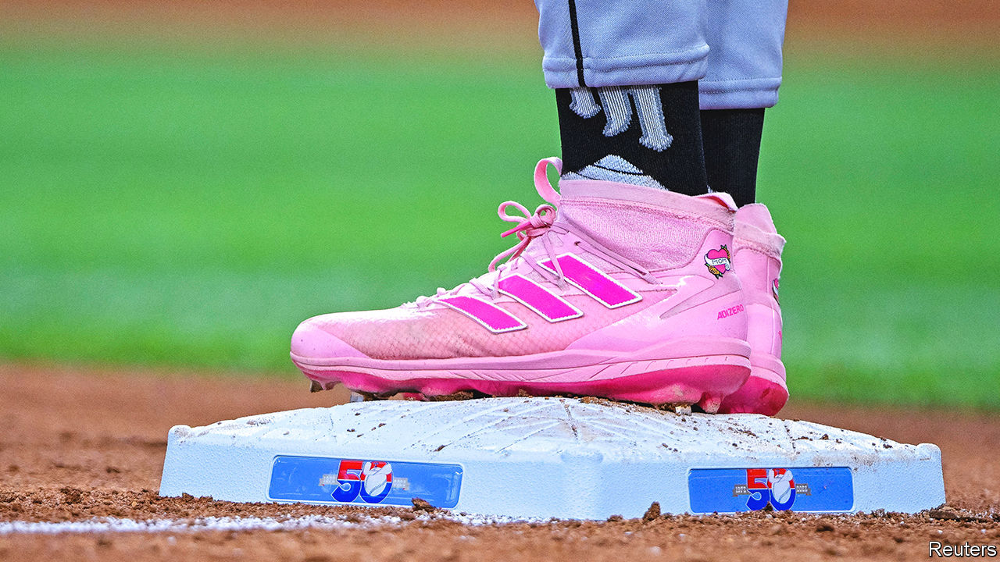

###### Trainer trouble

# The sportswear giants are running into hurdles 

##### Misbehaving rappers are not the only problem 

 

> Nov 10th 2022 

Following a series of anti-Semitic outbursts in October, Kanye West, a rapper and fashion entrepreneur (who insists on being called Ye), bragged that Adidas would never get rid of him. Within days, the German sportswear giant proved him wrong, ending a lucrative seven-year relship. Mr West’s line of Yeezy sneakers added €1.5bn ($1.5bn) to Adidas’s revenues in 2021, or 12% of its entire shoe business. After the announcement, the company’s share price fell to lows unseen since 2016. On November 9th Adidas cut its profit forecast for the fourth time this year. The previous day it had named a new chief executive, Bjorn Gulden, to clean up the mess.

Mr Gulden, who had helped turn round Adidas’s German arch-rival, Puma, will have to deal with more than just misbehaving pop stars. Much like the rest of the global sportswear industry, which earns revenues of $300bn a year, Adidas is battling post-pandemic supply-chain glitches, inflation-fuelled cost increases and an economic slowdown in its biggest markets. Even the football World Cup, which kicks off on November 20th in Qatar, is unlikely to offer the usual sales boost, as many shoppers pinch pennies.

Sportswear firms’ most immediate problem concerns their inventories. As quarantined consumers snapped up hoodies and tracksuit bottoms, the companies ramped up production of athleisure wear. In June last year Nike, the industry’s American heavyweight, confidently forecast annual revenue growth of 10% or so until 2025 and sales that year of $50bn. Instead, the firm is slashing prices to dump unsold stock. It now expects revenues to grow by 5% or so a year.

A longer-term problem is managing the move away from sports and towards fashion. Besides making the companies vulnerable to the whims of mercurial pop stars, this has exposed them to competition at both the fashionable end of the market, where , and at the sporting end, where rookie firms offer innovative products that appeal to buyers’ evolving sensibilities about both athletic performance and matters like the environment. On Running, a Swiss brand in which Roger Federer, a tennis legend, owns a stake, makes its footwear from beans and has launched a subscription service to replace and recycle well-worn kicks. In March Lululemon Athletica, an athleisure label, launched its first footwear collection. HOKA claims to have reinvented the running shoe with its signature chunky cushioning.

Still, the contest in the fashion market looks like more of a struggle for companies that made their names on the field rather than on the catwalk, notes John Kernan of Cowen, an investment bank. Some are already returning to their sporting roots. Puma’s success under Mr Gulden, a former professional footballer in his native Norway, has a lot to do with focusing on kit for underserved sports, such as cricket and motor racing. Adidas will be hoping for similarly fancy footwork. ■


