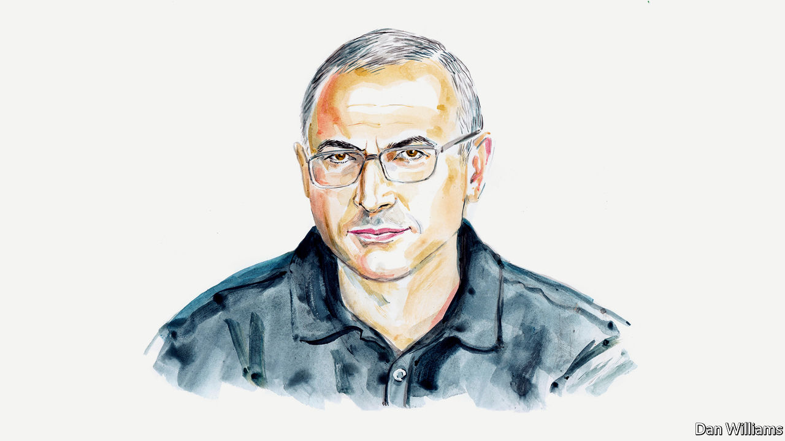

###### Russia and Ukraine

# Mikhail Khodorkovsky says now is no time to push for peace talks in Ukraine 

##### The former oil mogul explains that the war will not end while Vladimir Putin remains in power 

 

> Nov 10th 2022 

THE COMING of cold and wet weather on the Russian-Ukrainian front hinders the advancing side and helps the defending one, so the chances of large-scale movements look increasingly slim over the coming months. This static confrontation has rekindled the idea that talks with Vladimir Putin would be desirable. Not only has the eccentric Elon Musk spoken on the subject, but also the famous economist Jeffrey Sachs. The latter went furthest, saying that it was a mistake not to go along with Mr Putin’s conditions in March. Back then those conditions included demands that Ukraine recognise occupied territories as Russian, maintain a neutral status and demilitarise.

Since the tragedy of Bucha, a town outside Kyiv where the bodies of murdered civilians were found in April, Western support for Ukraine and effective counter-offensives have harmed Mr Putin. A supposed Russian retreat from Kherson was announced on November 9th. And Mr Putin had to badly undermine his own credibility in Russia in September by declaring “partial” mobilisation. The announcement was the first of its kind in almost 80 years.

Mr Putin is politically wounded but he still believes he can win. He is deliberately striking civilian targets, depriving Ukraine’s population of water, light and heat on the brink of winter in order to force the country’s leadership to accept his terms. His terror elicits the response he expects—a respected businessman and economist publicly offering to meet the terrorist’s demands in return for peace.

Those urging talks are probably doing so for quite humane and pragmatic reasons: in their view Ukraine cannot win, so they consider it reasonable not to waste lives and money on confrontation. Instead they want capitulation, although not of an unconditional nature. For Ukraine this would involve the secession of some territories, relinquishing potential military alliances (in particular, with NATO) and accepting limits on its own forces. Perhaps people have in their minds the example of Finland, which bought off Joseph Stalin by conceding Karelia in 1940 and becoming a satellite of the Soviet Union for many years.

Unfortunately, this good advice does little but pave the road to hell. Mr Putin is now fighting a fourth war, which, like his previous ones in Chechnya, Georgia and Syria, he started when his ratings in Russia fluctuated. In the absence of the rule of law—a situation created by Mr Putin himself—ratings and violence are the two pillars of his regime. Without both, it’s all over.

When I say Mr Putin got into this war in vain, I mean that it is impossible to come away with any kind of victory, because even capturing Ukraine is not the end. His other demands are for NATO to return to its 1997 borders and a division of spheres of influence. And ending the war isn’t going to do anything for Russia’s grim economic situation: captured territory is a liability, not an asset. This means that a new conflict is inevitable, especially as the forces of national chauvinism awakened by the invasion of Ukraine will not be satisfied by the terms of any peace treaty.

It is important to understand that Mr Putin and his inner circle have lived their entire lives under mafia codes whereby laws do not exist, and which are antithetical to the rule of law. In his mind, there is only power. If the opponent retreats and asks to negotiate, it means he has lost and can and should be squeezed for all he’s got. In this case, that could mean seizing all or at least two-thirds of Ukraine, imposing an ultimatum on NATO and blackmailing Moldova and the Baltic states. We aren’t there yet. 

What Mr Putin really needs is a breather. His mobilisation plans have been disastrous; worse is the flow of “letters of condolence” to the families of dead Russian soldiers. If there’s another partial mobilisation, it will lead to a high risk of the collapse of the regime. He needs time to call the inhabitants of the occupied territories to arms, as was the case in the Donetsk People’s Republic and the Luhansk People’s Republic. A year’s pause would also allow Russia’s defence industry to fill empty arms depots once more, in spite of the emigration of thousands of talented Russian workers. 

If things carry on the way they are going without a break, soon Mr Putin will simply not be able to fight. So urgent questions loom. Is he prepared to use nuclear weapons? What would he achieve? A sky closed to Russian aircraft, a destroyed Black Sea fleet, defunct supply lines and an army fleeing from NATO? I doubt Mr Putin will risk going nuclear. 

Any negotiations would harm the high morale of the Ukrainian army. And in a peace deal what would guarantee that within a year there wouldn’t be another attack? Mr Putin’s word? Don’t make me laugh! Ukraine’s NATO membership? It’s not possible! American peacekeepers on the line of separation of forces? No, America is not ready for this! Massive arms deliveries, so that the growth of the Ukrainian army’s fighting ability outstrips the rebuilding of Mr Putin’s forces? It is unlikely that this is going to happen!

So what could stem from negotiations? A hint of victory for Mr Putin, perhaps, or a respite during which the Kremlin will try to rebuild its army and weapons. High gas and oil prices (as Mr Putin now knows that he can produce less to earn high revenues). And NATO countries needing to spend vast sums to guard against increasingly predictable aggression from the “winner of the Ukraine campaign”. Negotiations would also send a powerful message to autocracies, from China and North Korea to Iran, that the West is weak, unable to hold ground and incapable of protecting its friends. There are many more conflict hotspots on the world map that could be affected as a result. 

The West should show clearly and loudly that thuggery needs redress, and make an example of the goon running Russia. It could demonstrate that such behaviour can and will be punished. This does not mean the impossibility of negotiations as such—the war must end in peace, and peace, as long as it is not bought by overstepping Ukraine’s internationally recognised borders, will involve some kind of agreement. Agreements and allowing an aggressor to benefit from aggression, however, are not the same thing.

As long as Mr Putin is in the Kremlin there will be no peace. So the choice at present is simple: Russia should return seized territories and Ukraine might then be able to adopt a neutral status; or Ukraine, for its own reasons, agrees or finds an acceptable ceasefire. (This second option would necessitate a direct military alliance between Ukraine and its backers, including Britain and America.) Either choice should come with an understanding that such exchanges do not constitute peace, but a short respite before the inevitable continuation of the conflict. The end of the war will only be possible after a change of regime in the Kremlin.■

_______________

—

