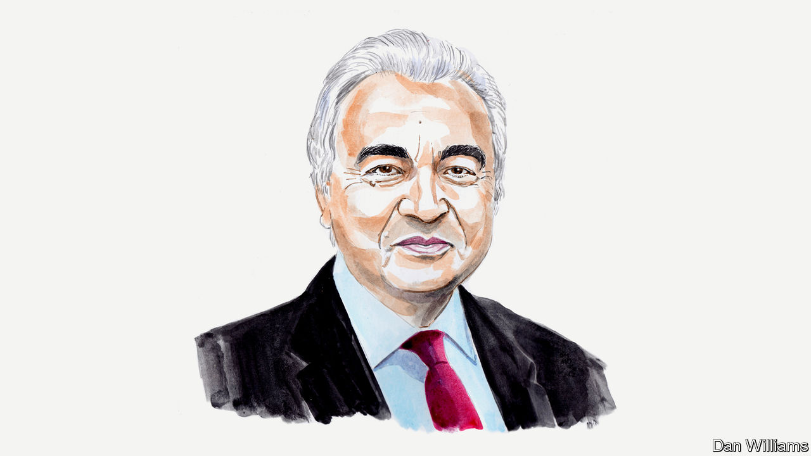

###### COP27

# The global energy crisis may be accelerating decarbonisation efforts, says Fatih Birol 

##### The executive director of the IEA believes Russia’s war in Ukraine has created new incentives to go green 

 

> Nov 5th 2022 

RUSSIA’S INVASION of Ukraine has changed energy markets and policies around the world, not just for the time being, but for decades to come. The energy crisis set off by Moscow’s war is giving a short-term lift to fossil fuels in some cases. More coal has been burned in Europe, for example, because natural-gas prices have been extremely high. But I think this lift is likely to be temporary. The crisis is also driving powerful structural changes that are set to accelerate the transition to clean energy. These promise to be positive for our climate and for our energy systems in the long run.

Our data at the International Energy Agency (IEA), where I am executive director, suggest that many governments are responding to the economically damaging spikes in fossil-fuel prices by doubling down on clean-energy technologies. America’s Inflation Reduction Act, the EU’s Fit for 55 package and REPowerEU plan, Japan’s Green Transformation programme and ambitious clean-energy targets in China and India are all helping. Consider America’s legislation. It should drive a decline in carbon-dioxide emissions from the country’s electricity sector this decade by using tax credits to boost the deployment of solar and wind power. At the same time it is supporting research and development into batteries and extending the lives of nuclear plants.

The latest analysis from the IEA shows that governments’ policies are now strong enough to deliver a distinct peak in fossil-fuel use within ten years. Fossil fuels have made up 80% of the global energy mix for decades. We see their share falling to 60% by 2050. Given that fossil-fuel use has grown alongside global GDP since the start of the Industrial Revolution in the 18th century, reversing this rise will be a pivotal moment in energy history. Yet the expected decline in fossil fuels brought about by current policies, and in associated greenhouse-gas emissions, will come too slowly to avoid severe impacts from climate change.

I am confident that governments will continue to strengthen their clean-energy policies, however, because they are no longer driven primarily by environmental concerns. The economic arguments in favour of affordable clean technologies are increasingly compelling. Solar and wind are the cheapest options for new power facilities in most parts of the world, even without taking into account the exceptionally high prices seen in 2022 for coal and gas. And countries also need to ensure their domestic clean-energy industries can compete internationally.

Security concerns are also increasingly driving the transition to clean energy. Russia’s invasion of Ukraine and subsequent use of its gas supplies to pressure Europe show the risks of relying heavily on fossil-fuel imports. Clean and energy-efficient technologies such as wind, solar, electric vehicles and heat pumps enable countries to produce more energy domestically and reduce the need for fuel imports. And we’re seeing governments, notably in Europe, acting to accelerate their adoption. New energy-security risks are emerging alongside. Countries need ample, diverse supplies of critical minerals and of manufacturing supply-chains for technologies such as solar panels and electric-vehicle batteries. 

Despite my overall optimism about the direction in which we are headed, there is one area that causes me significant concern. Amid the current geopolitical upheaval, I see a real risk of fractures emerging around energy and climate between some advanced and developing economies, which could lead to damaging dividing lines globally. 

Take infrastructure. Emerging and developing economies often face much higher financing costs for clean-energy projects than developed economies do. For example, the cost of capital for a solar power plant in 2021 in key emerging economies, such as in Brazil or Indonesia, was between two and three times higher than in advanced economies. And this gap is in danger of increasing as central banks around the world tighten interest rates, increasing the cost of borrowing. 

To prevent these divisions from becoming entrenched, the world’s leading economies need to work hard to tackle their causes. First, they need to ensure that Russia’s role in triggering today’s energy crisis is well understood by everyone. There is a false narrative circulating that clean energy and climate policies are to blame for it. But IEA analysis finds scant evidence for this misleading claim, which only serves to draw attention away from Russia’s responsibility.

Second, the rich world needs to do much more to enable emerging and developing economies, particularly those in Africa, to massively scale up clean-energy technologies. We need to take an empathetic and morally coherent view on transforming energy systems and boosting economic growth in the places that need it most. Just Energy Transition Partnerships, such as the one currently being negotiated between the rich democracies of the G7 and Indonesia, are a way forward. They offer a chance for co-operation on both policy and investment. 

Third, rich countries should immediately fulfil the promises made to poorer ones on climate finance. At the COP15 conference in Copenhagen in 2009, they pledged to raise $100bn a year by 2020 to help developing ones adapt to climate change. It is shocking that this promise has still not been met. But we also need to go well beyond that level now to fill the huge clean-energy investment gap between the haves and the have-nots. 

The COP27 UN climate conference in Egypt is an important opportunity. But if leading economies do not build bridges with developing economies, or if they take an overly prescriptive approach, they run the risk of widening divisions. Countries everywhere are facing brutal shocks from the energy crisis. The last thing we should do is turn away from supporting each other. Advanced economies have the means and the moral duty to act.■

_______________


