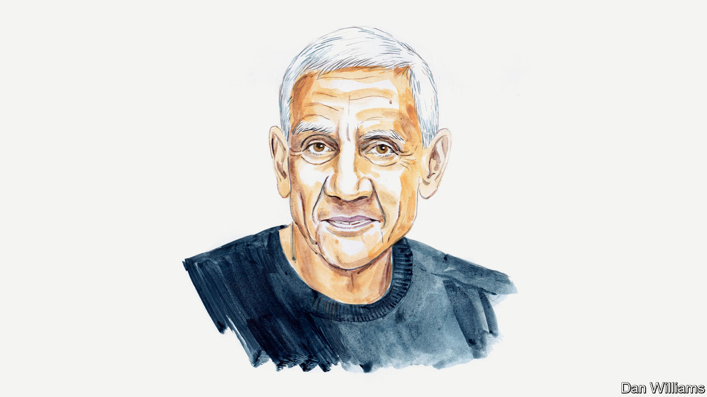

###### COP27

# Vinod Khosla says rushing to meet carbon-reduction targets by 2030 may hinder what can be achieved by 2050 

##### The venture capitalist wants new technologies to compete without subsidies 

 

> Nov 8th 2022 

OUR PLANET’S climate crisis is accelerating. From Greenpeace to the UN, many are insisting on an urgent effort to maximise carbon reductions by 2030. Others fret over the economic effects of any sudden transition. I question a tacit assumption that underlies those urging immediate action, which is that we already have the technologies for rapid, widespread decarbonisation. I think that old coal and natural-gas plants need to keep operating to meet the planet’s climate, social and economic needs while development of alternatives continues. 

Is it more important to maximise reductions by 2030 or by 2050? Although we do not know when exactly certain climatic tipping points may be reached, I believe it is extremely important that net emissions zero out by 2050. But as an investor in many technologies, both developed and nascent, I know that hoping to deploy today’s innovations globally is unrealistic. Doing so could actually impede efforts to reach net zero by 2050, or lead to a backlash against climate action because of the expense involved. In a rush to cut emissions quickly, humanity might choose to do the wrong things and back the wrong initiatives.

Solar and wind work when the wind is blowing or the sun is shining but might fall short when, for example, we actually want to watch our television during a football game. Solar and wind are scaling well and should continue to be deployed, but given our finite resources, subsidies to them should stop as they can only be a minority share of our electric-power generation. That is because they are not reliable enough to comprise so-called “baseload power”. And short- and long-duration storage implemented today would mean hefty bills for decades because of the high cost of grid-scale, long-duration energy storage.

Power grids are often touted as the answer to unreliable solar and wind-power generation but they take decades to build. High-temperature superconductor-based grid technologies have recently become available, but how to incorporate them into the grid is still being worked out by companies such as Veir. Waiting to revamp grid systems may pay off as building them in a few years may be easier, faster and cheaper. Current rights of way and transmission towers can be upgraded to many times more capacity, reducing the need for new rights of way. That may also avoid fights with NIMBYs.

Solutions for cost-effective power generation that can be readily dispatched are in our grasp. New technologies in development include nuclear-fusion based electric power, new nuclear reactors and superhot rock geothermal power. There are at least six credible nuclear-fusion powered startups in the West, run by firms who promise commercial plants by the early 2030s. Only one has to succeed to solve our problems.

Other alternatives to fusion-power generation are coming along, but we need further investment in these high-risk endeavours. For instance, if we develop the capability to drill cost-effectively to depths of 10-20km in temperatures of 500°C, we can expand the number of sites suitable for geothermal power by over a hundredfold globally. One terawatt of geothermal power (roughly equivalent to all the solar that has been installed globally to date) would require about 30,000 wells. That is about half the number of wells the oil industry drills every year (albeit to shallower depths and with different technology). 

Nascent technologies merit subsidies, but not once they have even a small share of the market—as electric vehicles (EVs) do today. (Charging infrastructure still needs support.) Solar and wind are competitive today because of this early subsidy strategy. But our transition-subsidy dollars are now best used to encourage newer technologies to grow. Early demand creation through mandates or voluntary commitments by corporations can help, too.

Pundits often discuss the trillions required to transition to net zero by 2050 with alarm. But costs could be lowered if we repurpose existing infrastructure. We must upgrade cement plants, not replace them with brand new ones, where possible, and develop sustainable aviation fuels, as many companies are doing, that don’t require us to scrap existing aeroplanes. There are 12 major areas to focus on in the coming decades: electricity, EVs, aviation, shipping, cement, steel, animal husbandry in agriculture, fertilisers, grid storage, high-temperature industrial heat from hydrogen or other technologies, water and “direct air capture” of carbon.

For any technology to scale globally requires risk-adjusted competitive returns for investors. Companies must produce technologies that can succeed without subsidies. They must be profitable at what I call the “Chindia price”. I define this as the price at which clean technology will be adopted in China, India and globally as it outcompetes fossil alternatives. We should not rush to meet targets unthinkingly, but instead invest in superior technologies that may take longer to mature. The reality is that China was the world’s largest investor in clean technologies last year while also increasing its coal consumption by a whopping 10%. India will burn coal in ever-greater quantities for years to come. Let’s plan pragmatically to maximise carbon-cutting by 2050. ■

_______________


