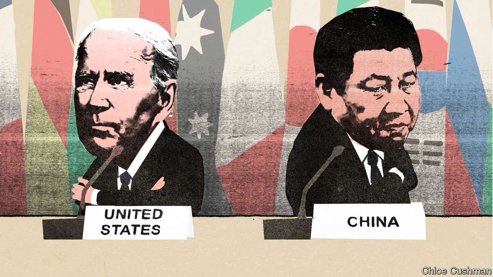

###### Dim hopes of detente

# Can Joe Biden and Xi Jinping stabilise Sino-American relations? 

##### Domestic politics on both sides will make it hard 

 

> Nov 10th 2022 


Prospects for a cold-war detente looked dim ahead of an impromptu meeting between Lyndon Johnson, America’s president, and Alexei Kosygin, the Soviet premier, in 1967. The superpowers’ leaders had not met since 1961, when a Kennedy-Khrushchev summit in Vienna ended in acrimony. Five days after Kosygin landed in New York to address the United Nations, Soviet and American officials were still wrangling over when and where he could meet Johnson privately. One White House adviser gave the get-together just a 20% chance of improving relations.

Those odds might seem generous if applied to an expected meeting between America’s current president, Joe Biden, and China’s leader, Xi Jinping, during a G20 summit in Bali on November 15th and 16th. As the two sides try to thrash out details of their leaders’ first face-to-face encounter since Mr Biden’s election, both are signalling that they want to halt a worsening of relations that increasingly echoes the cold war. Given the stakes, a meeting in Bali would be progress in itself. But domestic politics on both sides are limiting prospects for the kind of stabilising mechanisms that underpinned the Soviet-American detente in the 1970s. 

Mr Biden will probably enter the meeting, if it goes ahead, having lost control of the House of Representatives in midterm elections on November 8th (as  went to press, it was even less clear which party would control the Senate). That is not for want of a hard line against China—a rare issue of bipartisan consensus. Mr Biden has, in many ways, been tougher on China than his Republican predecessor, imposing tight restrictions on exports to China of American technology and repeatedly pledging to defend Taiwan, the self-governing island that China seeks to unify with the mainland. 

In fact, many American allies, business leaders and foreign-policy experts feel Mr Biden has gone too far and want him to try to stabilise ties. A paper published on November 3rd by the Brookings Institution, a think-tank in Washington, warned Mr Biden against trying to out-hawk Republicans on China and urged him to focus on areas of long-term mutual interest. “The purpose of strategy is to advance national objectives. America’s current approach towards its bilateral relationship with China is failing to meet this standard,” said the paper, two of whose authors worked on China policy in the Obama administration.

White House officials talk of “finding a floor” in the relationship. They are seeking new ways to avoid conflict and co-operate on issues like climate change and food security. But they balk at Chinese demands to ease export controls and provide new assurances on Taiwan. On November 9th Mr Biden said he wanted to discuss both sides’ “red lines” but was “not willing to make any fundamental concessions”. His reluctance derives less from electoral angst than concern about Mr Xi’s ambitions. Still, with a presidential poll looming, the midterm results could limit Mr Biden’s room for manoeuvre while convincing Mr Xi that he is dealing with a lame duck.

A Republican-led House could also trigger crises beyond Mr Biden’s control, especially if Kevin McCarthy, the probable new speaker of the House, visits Taiwan as he has suggested he would. After a trip there in August by the current speaker, Nancy Pelosi, China staged massive military drills around Taiwan and cut high-level dialogue with America. Chinese military ships and planes have since made repeated incursions across the median line of the Taiwan Strait. A visit by Mr McCarthy would be certain to provoke a further escalation in China’s coercive measures. 

Another twist is that local elections in Taiwan on November 26th could weaken the Kuomintang, a party favoured by Chinese leaders because it advocates closer ties with the mainland. That would increase the chances that an independence-leaning candidate wins Taiwan’s presidential election in 2024. 

“From the Chinese point of view, the political calendar between now and November 2024 is pretty dismal,” says Jude Blanchette of the Centre for Strategic and International Studies, another think-tank in Washington. He hopes it doesn’t take something close to a conflict before the two sides have an honest conversation about the relationship. At the moment, though, neither side seems interested in finding areas for substantial compromise.

Where Xi stands

Mr Xi, in contrast to his American counterpart, heads to Bali in a stronger political position than any Chinese leader since Mao Zedong. Not only did he secure a third term as chief at the Communist Party’s congress last month, he also stacked the new Politburo Standing Committee—the party’s top leadership body—with loyalists, none of whom is considered a potential successor. That sent a clear signal that he intends to dominate decision-making for at least another ten years. 

In theory, Mr Xi now has more space to compromise. Some Chinese experts suggest that he and his emissaries have signalled this in recent public statements. On October 26th Mr Xi sent a congratulatory message to a gala dinner of the National Committee on US-China Relations, a non-profit group in America, saying China was ready to “find the right way to get along”. Jing Quan, the third-ranking Chinese diplomat in Washington, told a conference on November 2nd that the Chinese leadership did not have a timetable for attacking Taiwan and wanted peaceful unification above all. China and America, he added, were “still friends”, bound by trade, who could co-operate in many areas.

Yet those signals have been eclipsed by the overwhelming message from Mr Xi’s report to the party congress, in which he warned of “dangerous storms” ahead, and called for faster military modernisation, citing “gross provocations” from other countries interfering over Taiwan. In private conversations with American counterparts, Chinese officials and academics have also continued to blame America for the downturn in relations, insisting that it must change course if the two sides are to co-operate in other areas. 

Mr Xi’s concentration of power and his “zero-covid” strategy have exacerbated a structural problem in relations, too, by further limiting channels of communication. Even retired leaders are no longer considered to have much influence on Mr Xi, while newer ones, chosen mostly for their loyalty, are unlikely to advocate a change of course. Mr Xi’s covid restrictions have also severely curtailed face-to-face meetings between academics, business leaders and lower-level officials on both sides.

Nor is there a Chinese equivalent of Anatoly Dobrynin, the Soviet ambassador in Washington from 1962 to 1986 who was a full member of the Soviet Central Committee from 1971 and a point man on detente. Qin Gang, China’s ambassador in Washington since mid-2021, has just joined the Central Committee. But he is expected to head home to be China’s next foreign minister. Nicholas Burns, America’s ambassador in Beijing, is empowered to represent Mr Biden but has little access to Mr Xi’s inner circle. The relationship thus depends increasingly on direct contact between Mr Xi and Mr Biden, which is hard to arrange.

There is still a chance that they could make more progress than expected in Bali. When Johnson and Kosygin finally met in Glassboro, New Jersey, they held ten hours of relatively amicable talks, expressing a common desire to shield their grandchildren from the horrors of war. There were no immediate breakthroughs, and relations suffered a setback in 1968, when the Soviet Union invaded Czechoslovakia. But the Glassboro meeting helped pave the way for the summits and security agreements that underpinned detente in the 1970s. 

American and Chinese officials have long rejected comparisons with the cold war, worrying that they could be self-fulfilling. China, unlike the Soviet Union, has deep commercial ties with America and does not seek global revolution. The two powers are not fighting proxy wars. Yet the parallels grow more striking as each locks in long-term plans to confront the other economically and militarily. And without alternatives, the cold war at least provides models for managing tensions, such as the Incidents at Sea agreement signed in 1972. 

Some hope that Mr Biden and Mr Xi will draw on the personal chemistry they tried to generate during a series of meetings when they were both vice-presidents in 2011 and 2012. The fear is that neither will be willing to compromise until a bigger crisis changes their strategic calculus. A more pessimistic analogy might be the Vienna summit in 1961, when Kennedy and Khrushchev butted heads on issues including Western access to Berlin. The following year the Cuban missile crisis brought them to the brink of nuclear war. ■


