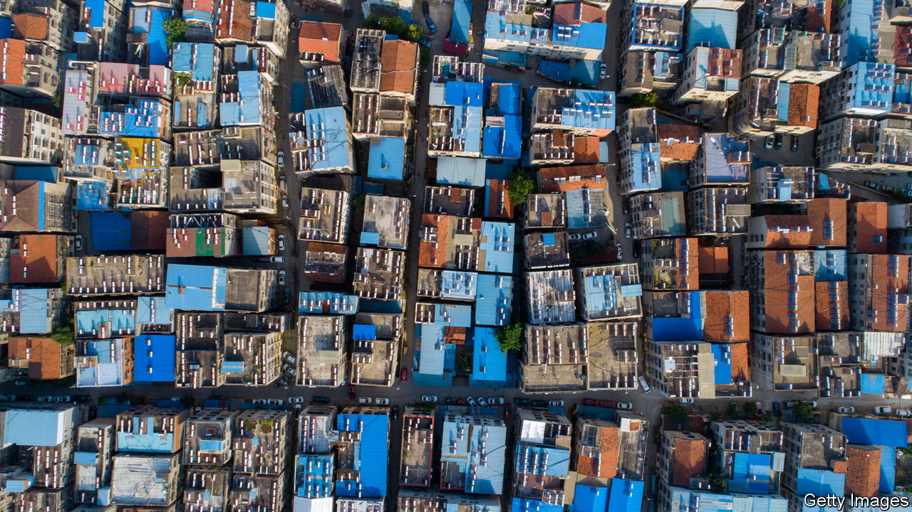

###### Neighbourhood watch

# How Xi Jinping is mobilising the masses to control themselves 

##### A low-tech arm of a high-tech police state 

 

> Nov 10th 2022 

In 1963 Mao Zedong launched a campaign known as the “Four Clean-ups”, an attempt to rid China’s politics, economy, organisations and ideology of reactionary elements. Ordinary people were encouraged to name and shame anyone they deemed ideologically suspicious. Mao seemed particularly pleased with the small town of Fengqiao in the east. Around 900 of its 65,000 residents were called out by their neighbours in public “denunciation rallies”. The “Fengqiao model” demonstrated how the party could enlist people to solve problems at the local level, Mao said. The larger campaign resulted in tens of thousands of deaths and was a precursor to the horrors of the Cultural Revolution.

China’s current ruler, Xi Jinping, seems to share Mao’s taste for mobilising the masses to police one another (if not for the chaos and mass murder of the earlier effort). Mr Xi praises the Fengqiao model, which he has redefined as a way of empowering people. He talks of , or “mass prevention and mass governance”. In reality he is using people to supplement the Communist Party’s other tools of control. It is a low-tech arm of a high-tech police state. Rwanda, a small African autocracy, has something similar.

One example of Mr Xi’s approach is the proliferation of volunteer patrols made up of ordinary citizens who watch their neighbours for suspicious activity. Another is the system of grid-style governance that divides neighbourhoods into small sections for closer monitoring. Lately a new “ten-household system” has emerged in several provinces, making those grid sections even more granular.

Under the new system households are organised in groups of ten and managed by a leader, such as a veteran or village cadre. The leader must be “politically reliable”, states an official report from the city of Neijiang in Sichuan province. They go door to door, passing down party orders and collecting information to feed back up the chain. In part of the province of Qinghai, for example, leaders are tasked with understanding “the ideological status and actions” of the region’s Tibetan nomads. They ensure that the party’s work “covers everything, with no blind spots”, says a local party official.

Chinese rulers have a long history of organising households into groups of ten in order to enhance their control. The law of  dates back to the Qin dynasty, which ruled from 221BC to around 207BC. It called for a ten-family unit to be punished for offences committed by any member of the group. The  system, created in the 11th century during the Song dynasty, organised Chinese families in groups of ten for mutual monitoring and defence. 

But the modern-day incarnation of the system is probably more informed by experiences in Xinjiang, where the government has spent years persecuting Uyghurs and other ethnic minorities. In 2017 officials introduced a ten-household “joint defence” system, compelling members of each unit to hold counter-terrorism drills with local police. Residents and shopkeepers had to buy batons, riot shields and alarm systems that could be activated by the authorities. When the alarm sounded, people would run outside with their kit and surround an imaginary “terrorist”. One former resident recalls having to shout, “Surround the bad guy, raise your sticks!”

Those who didn’t comply risked being fined or having their shops closed down. Worse, they might be thrown into “re-education” camps where hundreds of thousands of Xinjiang’s people were detained. Among the households were designated informants, says the resident, but no one knew who they were. “It destroyed the trust between people,” he says.

Elsewhere in China, the ten-household system may appear more benign. In some areas it was reportedly instituted as a way of monitoring public health early in the pandemic, then maintained owing to its effectiveness in applying the party’s policies. But state-media reports suggest security drills are now part of the system, too, in many places. Mr Xi may paint that as delivering yet more power to the people. His real aim is control. ■


