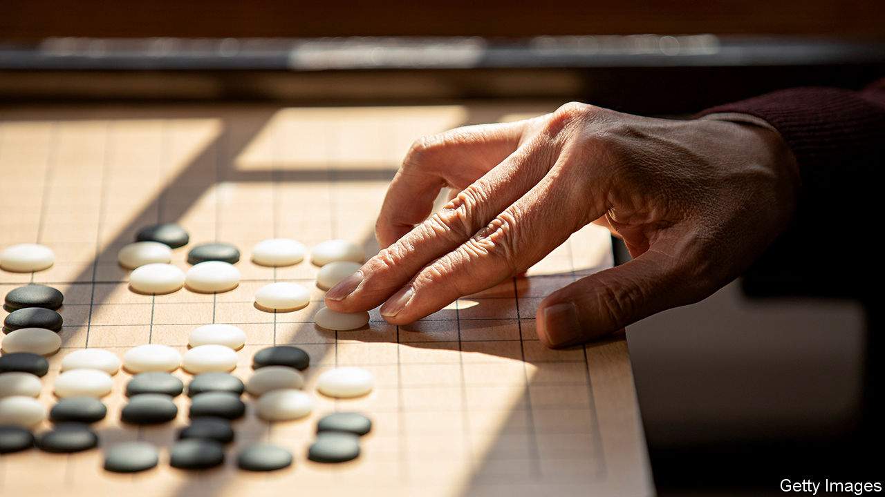

###### Going home early

# Why Chinese players of Go aren’t winning any more 

##### Another reason to dislike the zero-covid policy 

 

> Nov 10th 2022 

“When a nation’s fortunes rise or fall, so too do its fortunes in Go.” So said Marshal Chen Yi, a soldier in China’s civil war. He was a keen player of the ancient board game, where opponents capture territory by placing black and white stones on a 19-by-19 square grid. His observation rings true. In the second half of the 20th century, an economically vibrant Japan dominated international Go competitions. Over the past two decades, as China boomed, its Go players took home many of the most important trophies.

But in recent years Chinese players have been losing more than they have been winning. Things reached a new low this month, when, for the first time since 2000, not a single Chinese player made it to the semi-finals of the prestigious Samsung Fire Cup. Competitors from South Korea, another country passionate about the game, took all the top spots (Shin Jin-seo won on November 8th). Marshal Chen’s maxim has begun popping up in China’s online Go forums. “This year the nation just hasn’t been fortunate,” wrote one downcast fan. “You can see it in the GDP numbers, too.”

Some in China blame the lack of trophies on the attitude of players and coaches towards artificial intelligence (AI). In 2016 a computer program created by Google, called AlphaGo, beat Lee Sedol, a South Korean Go master. The next year it beat China’s Ke Jie, then the world’s best player. Since then many international players have used computers to help them train. But Chinese players have not embraced AI as much as the Koreans have, argues Stephen Hu, an instructor in Beijing whose company is developing a Go learning app. Mr Ke, who is still China’s best player, has complained about AI training techniques, saying they tarnish the game’s beauty.

Chinese players face an even bigger challenge in the government’s “zero-covid” policy, which relies on lockdowns and travel restrictions to prevent big outbreaks of covid-19. Before the pandemic elite Go players would travel most weeks to compete in domestic tournaments, where they gained valuable experience in performing under pressure. Over the past three years, though, many tournaments have been cancelled because of covid controls. Corporate sponsorships, which were always difficult to attract, have dried up as a result, mostly, of the sputtering economy. 

Covid-related limits on travel have also made it harder for the national team to meet up and analyse their opponents’ playing styles. “It has been very difficult for us to do intensive training,” said Yu Bin, the Chinese team’s coach, in September. China’s disappointing record in Go tournaments may not inspire the same level of frustration as invasive apps, overbearing pandemic workers and draconian restrictions. But for some people, it is yet another reason to be frustrated with the zero-covid policy.


