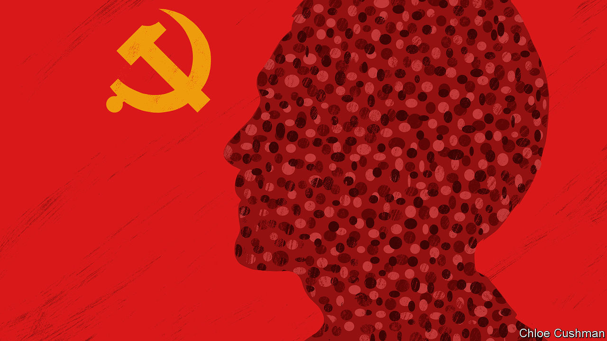

###### Chaguan

# Xi Jinping amends the Chinese Dream 

##### As the economy slows, the social contract between party and people changes 

 

> Nov 10th 2022 

For run-of-the-mill autocrats, it is enough to control the words and deeds of their subjects. Truly ambitious leaders want to guide their people’s dreams. 

China’s supreme leader, Xi Jinping, has displayed vast ambition since taking charge of the Communist Party a decade ago. He has, among other things, sought to inspire patriotic reveries. Days after becoming party chief Mr Xi promised his country a “Chinese Dream” of restored national greatness by mid-century. Over time, proposed elements of this “rejuvenation” have included building a moderately prosperous, strong and harmonious (meaning orderly) society, world-class armed forces, a cleaner environment and a return to the centre stage of global affairs. Mr Xi pledged to bring about this dream once more in his report to the 20th party congress last month, from which he emerged with a mandate to rule for another term (or, perhaps, for life). But Chinese business elites, reformist officials and liberal intellectuals have been plunged into gloom by the congress. Some noticed that Mr Xi’s vision of the future is changing in troubling ways, becoming more focused on collective goals and less tolerant of individual dreams.

In Mr Xi’s second decade, the task of making China great again sounds like a party-directed mass campaign. In this austere vision, Mr Xi talks of the need to struggle and pursue self-reliance in response to pressure from the outside world, above all from the American-led West. To be sure, the party has always crushed some dreams. It has never tolerated challenges to its political or ideological authority, or shied away from harsh enforcement of its policies. But for much of the past four decades, China’s economic rise and reopening to the world were powered by and left room for the personal ambitions of hundreds of millions of individuals. 

Those strivers and risk-takers included farmers leaving villages to become migrant workers and founders of private businesses, from small shops to billion-dollar technology giants. They were families buying apartments in half-built housing complexes to boost a son’s chances of marriage. Among their number were parents pouring money into after-school classes for a struggling child, or buying online English lessons from a tutor in the West for a daughter longing to study abroad. Young Chinese enjoyed personal freedoms that would have staggered parents or grandparents raised during the xenophobic frenzies of the Mao years. They watched foreign films and played online video games from America. Others turned to religion for spiritual solace.

For the party, such choices threatened its monopoly on hearts and minds. Some dreams widened already large inequalities and contributed to pressures felt by the urban middle classes, who talk of unbearable competition for the best universities, jobs and marriage partners, and who, perhaps in consequence, are marrying less and having fewer children. The party duly acted.

Starting in 2015 Mr Xi moved to bring religion under even stricter party control. Two years later, at the 19th party congress, he emphasised the dangers of “unbalanced and inadequate growth” and pledged to “adjust excessive incomes”. Since then he has stressed “common prosperity”, an egalitarian policy with a populist edge. In 2021 Mr Xi stunned students and educators with what amounts to a ban on for-profit tutoring of schoolchildren, including by online language teachers logging on from abroad. Officials called the ban a boon to stressed parents. Alarmed by speculation in housing (a real problem), Mr Xi has moved to deflate the sector, triggering a crisis in market confidence. Online video-game platforms must now limit young players to a few hours a week. Regulators have slashed the number of foreign films in cinemas.

Foreign analysts have at times struggled to label these trends. They talk of Mr Xi moving to the left economically but to the right when stoking nationalism. In elite Beijing circles, there is agonised debate about whether Mr Xi even approves of private business, or sees it as a necessary evil. At times the panic seems to be running ahead of official policies. Chaguan has heard several Chinese intellectuals raise, unprompted, recent praise in state media for a decades-old system of co-operative shops and food suppliers, and express fears that the planned economy is coming back.

A Great Leap Backward

One way to understand this moment is to see Mr Xi changing the social contract between the party and people. Individual aspirations are being downplayed in favour of the collective interest. Scholars talk of a return to the “mass line” of the Mao years: jargon for efforts to persuade the public to embrace goals set by the party, and to see them as reflections of their own wishes. 

The Chinese Dream is changing in response. In 2013 Mr Xi wrote to archaeology students that this grand project would require “integrating individual dreams to the national cause”. At the 19th party congress in 2017 he urged the party to help young people fulfil “youthful dreams”. At this year’s congress, Mr Xi scolded the young to heed the party, pursue realistic goals and show more grit.

Soon afterwards, Mr Xi visited Red Flag Canal, a vast irrigation project in the central province of Henan that saw armies of farmers and even a youth brigade dig through solid rock to divert a river in the early 1960s. He urged youngsters to learn from their forebears, including those who sacrificed their lives for the common good. Sounding quite the irascible patriarch, Mr Xi declared: “The younger generation should inherit and carry forward the spirit of hard work, self-reliance and strenuous toil, abandon arrogance and pampering, and engrave the blood of their youth on the monuments of history, just as our fathers did.”

For any ruler, amending a social contract involves risks. The party has long drawn legitimacy from rising material prosperity. Now it is giving greater emphasis to collective, national pride. By all appearances, that fits Mr Xi’s stern worldview. Then again, if the economy keeps slowing, he may not have much choice. ■


