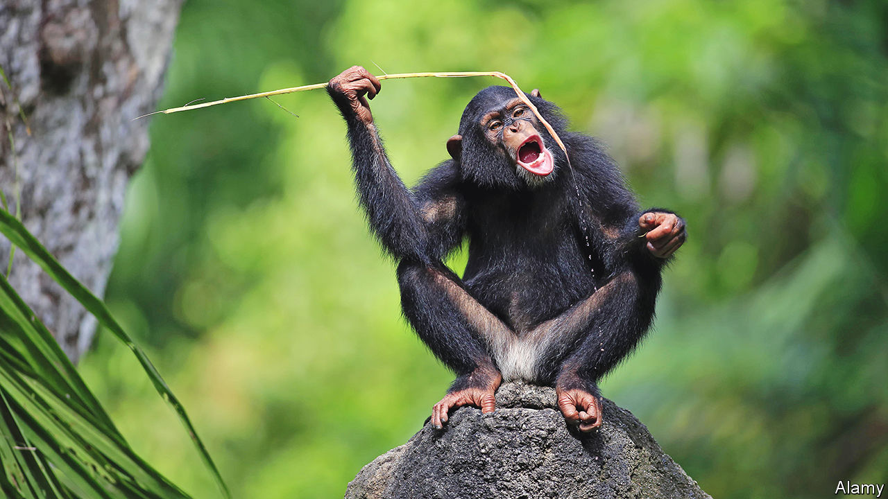

###### Primal instincts

# Many animals are surprisingly creative, a new book argues 

##### Anthropomorphism is not the scientific sin it once was, Carol Gigliotti says 

 

> Nov 9th 2022 

By Carol Gigliotti. 

In 1960 , a British primatologist, observed chimpanzees in Gombe National Park in Tanzania. At that point, it was thought only humans had the capacity to create and use tools, but the chimpanzees were using slim blades of grass to fish termites from their mounds (see picture). Louis Leakey, a palaeontologist and Ms Goodall’s mentor, mused: “Now we must redefine tool, redefine man, or accept chimpanzees as human.”

Since then the distinction between animals and humans has become increasingly nuanced. In addition to toolmaking, chimpanzees—and many other animals besides—display . Studies show that , rats have empathy and pigs form strong friendships. In “The Creative Life of Animals” Carol Gigliotti, a professor emerita at Emily Carr University of Art and Design in Vancouver, has compiled research that examines such behaviour through the lens of creativity. 

This requires a more inclusive, and generous, definition of creativity, for it is not a trait obviously exhibited by a prairie dog or caddis fly. Creativity, Ms Gigliotti contends, is not the exclusive domain of Jane Austen or Leonardo da Vinci. Nor is she referring to Pigcasso, the artistic pig rescued from an industrial pork facility outside Cape Town whose paintings have sold for thousands of dollars. Instead, Ms Gigliotti suggests discarding humankind’s “master of the universe” perspective to consider creativity from the animal’s point of view. “If animals in their own cultures can solve problems or create products of value to them, it seems accurate to consider these as creative,” she writes.

Beaver lodges and  are a case in point: there is no single template for their construction. Each river or lake has its unique features and beavers create a custom-made structure to adapt to the given habitat—so, in the author’s intriguing framework, dams deserve to be considered a creative enterprise. In the less practical, more aesthetic realm, consider Julie’s earring. Julie, a chimpanzee studied in the Chimfunshi Wildlife Orphanage Trust in Zambia, stuck a piece of long grass in her ear, adjusted and wore it. The behaviour (a fashion trend, perhaps?) was soon sported by eight of the 12 members of the group. 

Ms Gigliotti says it would be an error to assume that animal creativity has to match the human version, though some examples turn out to be inarguably appealing to the human eye. Take the elaborate creation of a bowerbird. Its bower—two parallel rows of slender branches that arc towards each other above a platform lined with bits of glass, shells, leaves, flowers and feathers—is a beautiful ruse by the male to attract a female for mating. 

Though ostensibly a book about creativity, the author frequently veers off to discuss animal emotion (crayfish have feelings too; they can exhibit signs of anxiety) and intelligence (“the pigeon should be the poster child par excellence for intelligence”). She argues that animal personality is not limited to primates, your faithful mutt or stand-offish cat. There are hundreds of thousands of studies on animals’ character and they include ants, fish and mice. Anthropomorphism—the ascribing of human feelings to animals—is not the scientific sin it once was. Ms Goodall has said she was “quite unpleasantly” disparaged for doing just that. Today, she has pointed out with a sense of vindication, you can get a PhD in animal personality. 

The book makes its strongest case when advocating a revision of how to think about, and act towards, animals. Ms Gigliotti points out that humans are only one of millions of species on Earth. She suggests a retreat from anthropocentrism in favour of recognition that animals are individuals with complicated, powerful, creative lives of their own. ■

