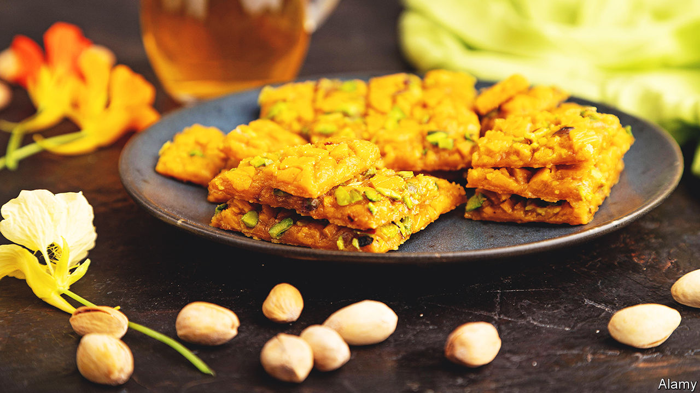

###### World in a dish

# Sohan gives a flavour of Iran’s complex contradictions 

##### The sweet treat reflects a history in which the current theocracy is but one chapter 

 

> Nov 10th 2022 

Most outsiders have only the haziest notion of Iranian cuisine. To much of the world, the Islamic Republic is still overwhelmingly a country only of religion and revolution, of  and political repression. By contrast, the foods of Iran’s Middle Eastern neighbours have spread—not always unscathed—throughout the world. Falafel wraps are familiar fare in sandwich chains. Pots of  appear on the shelves of British petrol-station refrigerators; pumpkin-spice and chocolate versions menace shoppers at Trader Joe’s. 

Yet how many Westerners are familiar with , a Persian stew made with a sauce of toasted walnuts and pomegranate molasses? Who would recognise , an omelette stuffed to verdancy with dill, coriander and parsley? And while syrupy layers of baklava are commonplace outside the Middle East, the sticky squares of , a nougat made in Isfahan, are not. Nor are the whorls of , a type of fritter drenched with syrup, or the golden discs or slabs of , a buttery, nutty brittle.

brings together two of Iran’s greatest crops. First, , which is thought to have originated in Iran and thrives in its dry summer climate. The dried orange threads give its sunny hue. Along with rosewater, the spice’s earthy, floral fragrance blooms through the copious quantities of butter and sugar which are the sweet’s central ingredients. 

Second, pistachios. A rubble of the yellow-green nuts tops each portion along with slivers of almonds. Iran was once the world’s greatest producer of pistachios. Today growers there are hobbled by the sanctions imposed on their country. They have been overtaken by American farmers, notably in California, cultivating nut trees brought from Iran almost a century ago. The first Iranian pistachio seeds were imported into America in 1930. It took years to find a variety that would thrive there. But America now dominates the global trade.

There are different forms of across Iran, fudgier in some iterations, flavoured with honey in others. Few people take the time to cook it themselves these days. Instead it is most famously made in Qom, the country’s holiest city and a centre of Shia scholarship, and sold in thin, round tins. The surface of the sweet brittle is cracked like the desert landscape in which Qom sits. 

That such an indulgent sweetmeat should be most closely associated with a place of profound piety seems both incongruous and yet oddly appropriate for the Islamic Republic. It is a place of contradictions. It may currently be  but they run a country steeped in the mysticism of the Sufis, where for centuries the poets wrote of wine and women and love. 

Restraint may be the order of the day—or at least the government—but the richness of its cuisine hints at a different way of life. Jalaluddin Rumi, a 13th-century Persian poet and one of Islam’s most celebrated mystics, cautioned that “the intelligent desire self-control; children want candy.” A tinful of  later and you might wonder whether he was right. ■

