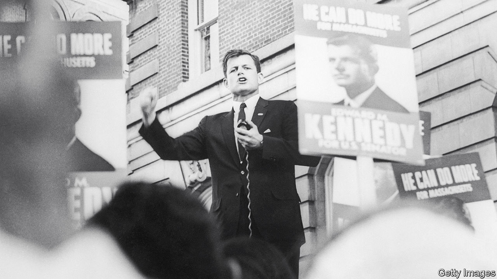

###### The Lion of the Senate

# Ted Kennedy was a champion of liberalism 

##### In new biographies, Neal Gabler and John Farrell rank him as one of America’s greatest senators 

 

> Nov 10th 2022 

 By John Farrell. 

By Neal Gabler. 

When he first ran for the Senate in 1962, Edward Moore Kennedy had just turned 30, the minimum age for entry into the upper chamber. His brother, , 15 years his elder, was president; another brother, , was attorney-general. The Kennedys were keen to keep the Massachusetts Senate seat in the family. Had his name been truncated to Edward Moore, his opponent chided, his candidacy would be a joke. Kennedy often recalled a notable campaign stop at a bakery in South Boston. “Hey Kennedy”, a baker called out to him, “they say you haven’t worked a day in your life.” Kennedy readied himself for the coming broadside. “Lemme tell you”, said the man, “you haven’t missed a thing.”

Ted Kennedy won the seat and remained a senator until his . And he did work, perhaps harder than any of his peers. For two decades speculation swirled about whether he would run for the White House. But he spurned Hubert Humphrey’s plea to join him on the ticket in 1968 (so soon after Bobby’s murder), turned George McGovern down in 1972 and eventually decided against a run in 1976, probably his best opportunity. Maybe he lacked the fire in the belly, or feared becoming the third Kennedy to be assassinated. Then there were the questions about his character: the womanising, the drinking and, above all, the stain of Chappaquiddick, where in 1969 a 28-year-old staffer, Mary Jo Kopechne, drowned after Kennedy drove his car off a bridge—and failed to report the accident for nine hours. 

When he did run, challenging Jimmy Carter for the Democratic nomination in 1980, he struggled to articulate why he wanted to be president. He suffered defeat and the Carter-Kennedy confrontation, John Farrell laments, “split their party, crippled the progressive cause for a generation, cost the Democrats their hold on Congress, and put Ronald Reagan in the Oval Office”. So it was in the Senate where Ted would make his mark. 

It was a mighty one; two hefty new biographies rate him a giant. “One of the greatest US senators, ever,” reckons Mr Farrell, who covered Kennedy for the , “preserving and advancing progressive ideals through decades of political peril”. Arguably “the most consequential public servant of the last 50 years and the one who did more to help his fellow men and women than any other,” concludes Neal Gabler of the State University of New York at Stony Brook. Mr Farrell’s is the pacier work, Mr Gabler’s the more detailed and analytical. Both hail a champion of liberalism (which in today’s fuzzy parlance might be called “progressivism”) at a time when .

The youngest of Joseph and Rose Kennedy’s nine children, Ted seemed the least talented of the brothers, stumbling over words and plagued by feelings of inadequacy. The family thought he would never amount to much. At Harvard, fearing he would fail a Spanish exam, he cheated and was expelled. His marriage to Joan Bennett, who struggled with alcoholism, was lonely and ended in divorce. 

Still, he could rely on the Kennedy brand and connections, plus a million-dollar trust fund from the age of 21. In the Senate he found his niche. He joined what Mr Farrell describes as “a sump of aged men with liver spots, claws and bourbon breath, who strode the chamber with reptilian gait and hailed one another with mellifluent courtesies”. Kennedy had the patience for the slow grind of legislation and he knew how to cope with a seniority system. He came to master the place and its special chemistry. He was gregarious and politically shrewd. He did not take disagreements personally, so could reach across the aisle to work with Republican opponents. He was also resilient, surviving family tragedies, a debilitating plane crash and personal scandal. 

Kennedy championed enlightened reforms. He helped expand voting rights and widened aid for the poor as well as access to health care for children. Indeed, he had a hand in just about every new social law: during his time in the Senate he sponsored 2,552 pieces of legislation and co-sponsored nearly 7,000 others. But as America entered a more conservative era, from 1976 he spent 30 years playing for the defence, fighting for the soul of America.

That is where Mr Gabler picks up the story in “Against the Wind” (Kennedy’s earlier years are the subject of “Catching the Wind”, published in 2020). The apt nautical title comes from a speech Kennedy gave in Memphis in 1978. “Sometimes a party must sail against the wind,” he said. “We cannot afford to drift or lie at anchor.” 

The scale of Mr Gabler’s biography invites comparison to Robert Caro’s volumes on Lyndon Johnson, another giant of the Senate. But whereas Johnson relied on arm-twisting to exercise power, Kennedy’s style and aims were different. His influence came through small gestures and endless effort. He was “the kindest and most thoughtful senator”—something no one would have said of Johnson—driven by a sense of “political morality” to act in the interests of the less fortunate. 

There would be fewer landmark legislative wins during those decades of defence, though there were some notable ones: he collaborated with George W. Bush to set higher standards for public education, for example, and steered successive rises in the minimum wage. The Lion of the Senate, as he came to be called, wielded outsize influence, not least on foreign policy, from the Soviet Union (pressing for arms control), to South Africa (for an end to apartheid) to Ireland (for peace). Yet the crowning victory on health care, Barack Obama’s Affordable Care Act in 2010, would come only after Kennedy’s death. 

More than once Kennedy’s wayward personal life threatened to sink him. A new marriage in 1992 proved stabilising. The tireless work continued, as did the conspicuous compassion. He phoned the families of all 187 Massachusetts victims of the attacks of September 11th 2001—long calls during which he shared his own losses. 

Being a Kennedy helped Ted get started. But eventually, Mr Gabler argues, he came into his own, escaping the self-possessed Kennedy stereotype of his father and brothers, with all the expectations that came with it, and the shadow of his siblings. “He had always been a Fitzgerald, like his grandfather, more a hardy, affable mess of a man”: a flawed but good person, in this sympathetic telling, who sought to make this a better world. ■

