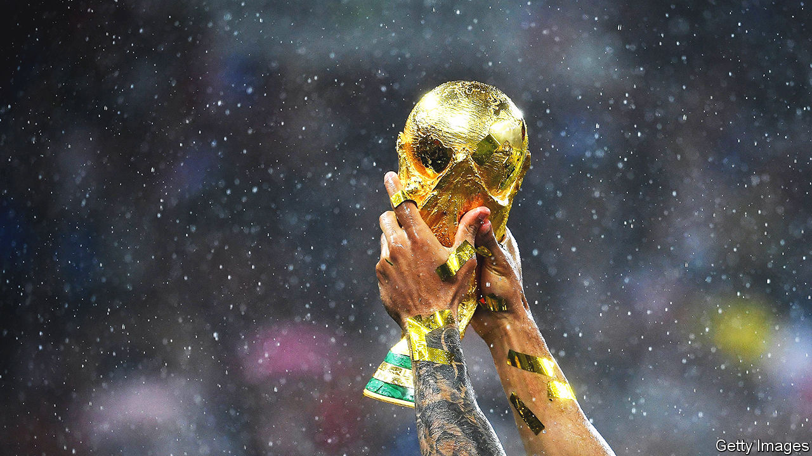

###### Back Story

# The World Cup is tarnished. Should fans enjoy it anyway? 

##### The tournaments punctuate and brighten millions of lives. But this one is a scandal 

 

> Nov 10th 2022 

It is, once again, July 4th 1990. You are watching the semi-final of the World Cup on a friend’s sofa. At half-time, the score is still nil-nil; Paul Gascoigne, known as Gazza, a peerless but troubled English footballer, is in his magical pomp. The deathly penalty shoot-out that West Germany is fated to win is a distant prospect. Everything is still possible: for Gazza, for England, and for you.

The World Cup is a time machine. Each tournament evokes memories of previous ones, old pals and past selves, including, for this columnist, that bittersweet teenage evening 32 years ago. And even as it carries fans backwards, it draws them together from around the world. Collectively they follow the eclectic match-ups—such as, in the contest beginning in Qatar on November 20th, Ghana v Uruguay—or the piquant clashes between geopolitical foes, as in America v Iran. From distant bars, town squares and time-zones, millions of strangers gawk in unison at a wondrous overhead kick, or the wing-footed tyro who dribbles his name into history. 

With its personal liturgies and worldwide communion, the World Cup can seem a kind of secular religion, or a benign global conspiracy for quadrennial fun. As Kafka might have put it had he been a football fan, there is plenty of hope, infinite hope, even, every four years, for England. It is a precious and unique event. This year, alas, it is also a scandal and a disgrace.

The authorities in Qatar, a tiny gas-rich Gulf kingdom, have always strongly denied that their bid to host the cup involved corruption of any kind. Yet cash seems to have sloshed around. An indictment in America alleged three decision-makers at FIFA, football’s governing body, took backhanders, but didn’t say from whom. Inquiries have unearthed possible conflicts of interest stretching from politics to private transactions, like the £2m ($3.2m) allegedly wired to a fifa bigwig’s child. A prominent Qatari spread largesse, apparently on his own account. Somehow, FIFA officials overlooked Qatar’s blistering summer heat, which meant kick-off was shunted to November.

The footballers have thus been spared the venue’s most punishing temperatures. The  who built the  and other infrastructure were not. Some have died (the toll is disputed). Many more were paid paltry wages and forced to stump up exploitative recruitment fees.

True, in the glare of attention before the tournament, labour conditions in Qatar , albeit not for everyone. Better, however, if respect for basic rights were a prerequisite for staging it, not a halting consequence. To dispel the fantasy that hosts become better global citizens, you need only recall another World Cup memory—of the one held in Russia in 2018. The images of Vladimir Putin palling around at the final with Emmanuel Macron were nauseating even then; now they are repulsive.

Meanwhile Qatar’s criminalisation of homosexuality may put gay supporters off going there. Some players plan to wear rainbow armbands in a stand against discrimination. Murky dealing, exploitation, prejudice: what ought to be a festival of harmony will instead be a showcase of international woes, not least the rise of petro-fuelled autocracy. 

Where does all that leave ordinary football fans—the middle-aged nostalgics with their reveries of Gazza, Pele or Maradona, the initiates poised to fill in their tournament wall-charts? They cannot switch the TV channel to an alternative World Cup, one less entangled in the 21st-century nexus of power and money. Much as many may wish it otherwise, it is this version or nothing; these new memories or none.

A few will tune out altogether. Others, this writer included, will be loth to give up the  (missing the Qatari self-promotion in the opening ceremony will be easier). Like long-haul travel in the era of climate change, though, enjoying this tarnished World Cup may require an offset for your conscience, a donation to a human-rights group, say, or an anti-corruption charity. An event that punctuates and brightens millions of lives is set to feel grubby and shameful.

A lot can happen in four years, to a football team, a family and the world. New faces can appear in your country’s midfield, or beside you on the sofa, while others recede, perhaps for ever. Pandemics can strike and wars erupt. And life can teach hard lessons, one of them being that fun is sometimes much less innocent than it had seemed.


