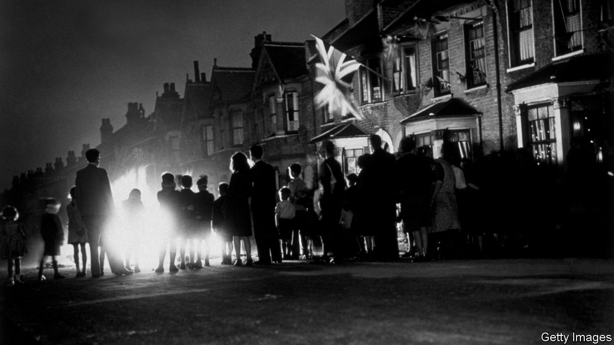

###### State-of-the-nation fiction

# “Bournville” is Jonathan Coe’s most ambitious novel yet 

##### Spanning 75 years, it is a chronicle of change both grand and intimate 

 

> Nov 10th 2022 

By Jonathan Coe. 

Over the course of his 35-year literary career, Jonathan Coe has produced two types of standout work. The British novelist has excelled at writing incisive, corrosive political satires, such as “What a Carve Up!”, the novel of 1994 which made his name. He has also created several big-hearted, multi-stranded family sagas, including the trilogy that began with “The Rotters’ Club” in 2001. What unites these books is the author’s unique sense of humour and  of the state of his nation.

Mr Coe’s latest novel is another family chronicle. Each book in his “Rotters” trilogy charted his characters’ progress over several years, but “Bournville” is a far more ambitious affair. The novel spans 75 years and follows four generations of the Lamb family; it is a rich account of important occasions, upheavals and transformations in both modern Britain and individual lives.

One of those lives dominates. Mary lives in Bournville, a model village built in Birmingham by the Cadbury family for employees of their chocolate factory. At the outset of the book, she is a young girl who witnesses a violent assault on a German man at a VE Day celebration. At the end, she is an 86-year-old woman living alone during the coronavirus lockdowns. 

Between these points in time, Mary becomes a wife and a widow, a mother, grandmother and great-grandmother. Mr Coe interweaves the stories of her relatives, too. During the World Cup final in 1966, Mary’s intolerant son Jack is taught a valuable lesson by a German relative. In 1981 Mary’s husband, Geoffrey, allows his own prejudice to rear its ugly head when he sets up his son, Martin, on a date with his secretary in an attempt to end his relationship with a black woman. And in 1997, as crowds in London publicly mourn the death of Princess Diana, Mary’s youngest son, Peter, wrestles with his private passion for another man.

Mr Coe’s characters observe , technological developments, cultural shifts and political turmoil. Some find themselves embroiled in Britain’s “Chocolate War” with the European Union, others have their plans derailed by covid-19 restrictions. Mr Coe skilfully traces fault lines that divide the country while depicting family rifts, and he offsets TV commentaries of royal events—weddings, funerals and the queen’s “ponderous, arcane” coronation—with his characters’ thoughts and opinions.

Parts of “Bournville” feel episodic, and the cast is so large that not every character can make an impression. However, these flaws are outweighed by the book’s many delights, particularly its involving storylines, comic set pieces and astute analysis. “What kind of a country,” wonders Peter during a time of national unrest and “royalist pomp and circumstance”, “could allow these two worlds to exist side by side?”

This is a novel about people and place. Entertaining and often poignant, it presents a captivating portrait of how Britons lived then and the way they live now. ■

