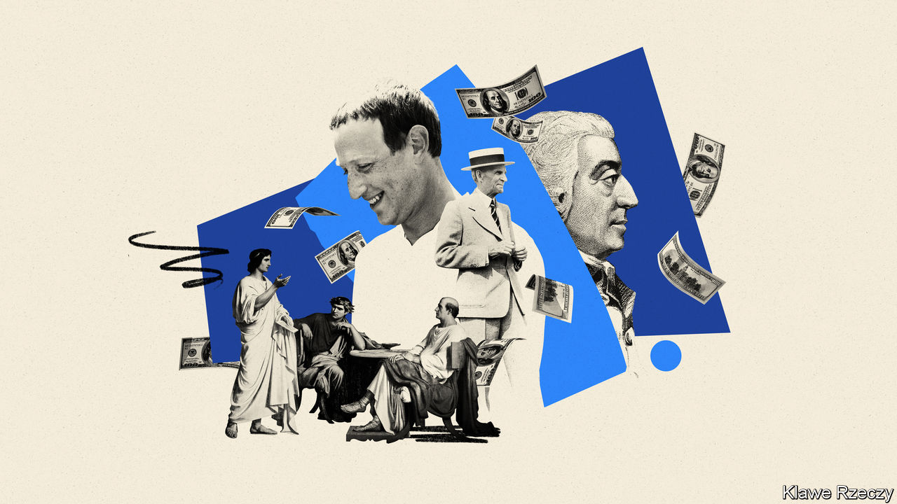

###### Fleshing out the invisible hand

# “For Profit” offers thrilling tales of commercial endeavour 

##### Corporations often start out with the public good in mind. It doesn’t last 

 

> Nov 10th 2022 

By William Magnuson. 

There is no mention of Elon Musk in William Magnuson’s magnificent history of corporations, which stretches from the  of ancient Rome, through Renaissance Florence, the Age of Discovery and the might of American industrial capitalism to . Yet reading it makes clear why the pioneer of electric cars, private rockets—and now, , controller of part of the public sphere—commands attention. For more than 2,000 years, corporations such as his have produced some of humankind’s greatest achievements. But usually the most dazzling overstep the mark, leaving a trail of debris and distrust behind them.

The contention of the book is that private enterprises often have public interest in mind. They are, as Mr Magnuson sees it, orchestrators of the invisible hand of ’s “The Wealth of Nations”. Selfish individuals, looking out solely for themselves, co-operate with each other to the benefit of society as a whole.

For much of corporate history, serving society was part of their charter. Rome’s , or publicans, were government contractors who built the republic’s roads, temples, aqueducts and the like, provided the empire’s supply chains—and milked its subjects for taxes. One chapter illustrates the almost insurmountable task facing the Union Pacific Railroad Company, under charter from Congress to bind America together after the civil war. It barely knew how to make railways, let alone pay for them. The terrain was unforgiving. The masterminds were at each other’s throats. When the Union Pacific, heading west, and the Central Pacific, heading east, met in Utah in 1869, setting off a frenzy of urbanisation and transcontinental commerce, poets including Walt Whitman were caught up in the national mood of celebration.

Over time, charters have gone, but corporations still bear the public good in mind—in some cases at least as much as profit. Henry Ford wanted to create low-priced cars made by highly paid workers. The Ford Motor Company was organised “to do as much good as we can, everywhere, for everybody concerned”, he once said, rather than to make ever more money. When Mark Zuckerberg launched Facebook, profit was low among his priorities, the book states. To start off with, he was far more focused on growth, in order to create network effects that made the site more enjoyable as more people used it. 

Yet inevitably the public spirit degenerates into excessive greed, egomania or the abuse of power—with dangerous political consequences. The Roman ended up repressing foreign peoples and fostering military conflict. The , from 1600 to 1874, became too big to fail. Monopolists used Union Pacific to strangle commerce. Ford’s cult of efficiency morphed into creepy control over his workers—parodied in Aldous Huxley’s “Brave New World”, in which dates are measured from the “Year of Our Ford”. At Facebook engagement has come at the cost of privacy. Sometimes rogues have used the social-media platform to meddle with elections and disrupt democracy.

Mr Magnuson can stretch the point about business altruism too far. In a chapter on private equity, it is hard to believe that KKR, a buy-out pioneer, is as much, as he likes to put it, Flash Gordon (“noble, self-sacrificing”) as Gordon Gekko (“greed is good”). But within eight well-researched corporate dramas, he provides useful business lessons, too. As a law professor, he eloquently explains how issues such as principal-agent problems, competition law and environmental and labour rights have cropped up throughout history. 

He draws sensible conclusions from this. Corporations cannot hope to put public interest above all else for long; what the public wants is far too complicated for them to fathom. When businesses wade into politics, they play an outsize role in shaping it. Yet the belief that the pursuit of profit will always benefit society as a whole is also sadly erroneous, the author says. ■

