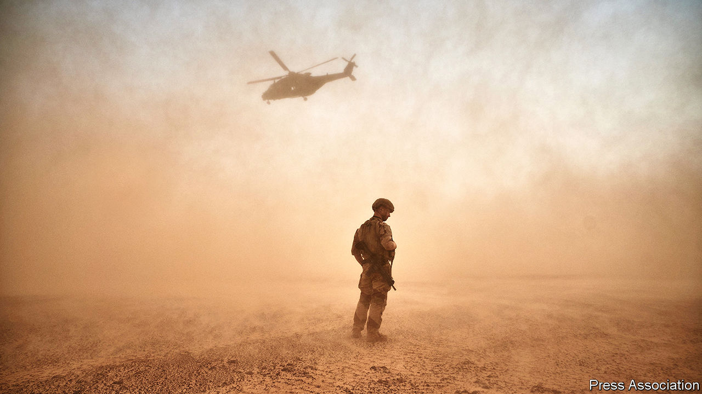

###### Back to Europe

# France is preparing for a new kind of war 

##### Russia’s invasion of Ukraine concentrates minds in Paris 

 

> Nov 10th 2022 

WINCHED out of a helicopter down to an attack submarine, Emmanuel Macron could have upstaged himself this week. But with no cameras to immortalise the stunt, all eyes instead were on the French president’s speech hours earlier. On November 9th, in the naval port of Toulon, Mr Macron unveiled France’s new national strategic review, drafted after Russia’s invasion of Ukraine. It contained important new thinking about France’s response to shifting threats. 

One arresting element of the document is its focus on Europe. In his speech Mr Macron announced the official end of , a French counter-terrorism mission first sent to beat back a jihadist insurgency in Mali in 2013. Although France pulled its troops out of Mali in August this year, 3,000 remain in the wider region. French soldiers, he said, would still deploy to the Sahel but only in support of local missions. For the French armed forces, traditionally organised around expeditionary and counter-terrorism missions in Africa, this marks quite a change. 

At the same time, with war raging on its doorstep, the review stresses the need for France to prepare its armed forces for “”, with an implicit emphasis on Europe. General Thierry Burkhard, chief of the French armed forces, has long argued—presciently, it turns out—for a remodelling of the military around readiness for this sort of war. The document does not say so, but analysts suggest France now aspires to have a full division ready for war in eastern Europe. “The pendulum is swinging back to Europe in ways that we French have not done since the cold war,” says Bruno Tertrais, of the Foundation for Strategic Research, adding that this may in fact be excessive.

The review contains no hint of Mr Macron’s  that Russia might be rehabilitated in a new European security order. Instead it echoes the tone of his speech to the UN in September, in which he condemned the Kremlin’s “return to the age of imperialism”. It warns of a confrontation unfolding “over a long period of time, in multiple regions and spaces”—a cold war in all but name.

There was plenty of continuity in Mr Macron’s speech, too. He invoked the notion of —the idea that Europe must be more self-sufficient—and repeated his long-standing vision of France as a “balancing power” in the world. But he offered strong assurances that France would be an “exemplary ally” to nATO, whose highest readiness force is currently led by France. “NATO remains today the foundation and essential framework for Europe’s collective security,” states the review. Mr Macron also reaffirmed the doctrine that French nuclear deterrence has a “European dimension”, an effort to row back on his recent comment that a nuclear attack on Ukraine “or in the region” would not affect French vital interests.

The good news for the armed forces is that they will have more resources to meet these aims. In September Mr Macron’s government announced that the defence budget for 2023 would grow by an inflation-beating 7.4% to €43.9bn ($44.1bn), a 36% leap from 2017. The bulk of that is to be spent on new equipment. Though the budget for 2024-30 has not been settled, it is likely to continue rising, and is not far short of NATO’s target of 2% of GDP. 

The bad news is that the holes in France’s military capability, though no worse than its are gaping. Yohann Michel of IISS, a think-tank, points to shortages of long-range firepower, airlift, ammunition and a decline in training hours for the air force. He notes that in order to send just a dozen or so tanks to Romania without disrupting training, France had to withdraw them from Estonia. On November 8th Pierre de Villiers, whom Mr Macron sacked as armed forces chief in 2017, offered a scathing judgment: “The French armed forces today do not have the means to fight a high-intensity war.”

Speaking from aboard a helicopter-carrier in Toulon, Mr Macron struck a sombre note. It would require a “Copernican revolution”, he said, to think through new forms of conflict: “The aggression against Ukraine risks foreshadowing greater geopolitical rivalries to come.” ■

