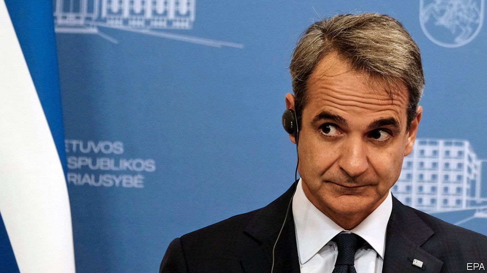

###### Who’s spying on whom?

# Fresh allegations in a Greek phone-hacking scandal 

##### The government’s reputation is being dented 

 

> Nov 10th 2022 

Greece’s government has tried for months to keep a lid on a simmering scandal over the wiretapping of a journalist and two left-of-centre politicians. But on November 5th , an investigative weekly, published a list of 33 prominent Greeks, among them several cabinet members and a former prime minister, whose mobile phones were reportedly targeted for hacking by Predator, a bit of Israeli-made spyware. 

Kyriakos Mitsotakis, the prime minister, denies that his government has ever bought Predator, which is similar to Pegasus, a better-known Israeli tool used by authoritarian regimes. He says he was unaware of the phone-hacking. But he has admitted that Greece’s intelligence service, EYP, routinely snoops on thousands of citizens for reasons of national security. 

The opposition Syriza party claims the government is covering up “Greece’s Watergate”. A judicial inquiry into the Predator affair is moving at a snail’s pace. Visiting Athens last week, members of the European Parliament’s PEGA committee, which investigates the illegal use of spyware in the EU, voiced frustration over the government’s unwillingness to co-operate. 

Sophie in’t Veld, PEGA’s rapporteur, says that, unlike Hungary, Greece is not a “deliberately autocratic” state. But she says the evidence suggests that “spyware is being used in a systematic way as part of a political strategy”. Nikos Androulakis, an mEP, was reportedly targeted last year while running for the leadership of the Pasok-Kinal socialist party. Another alleged Predator victim, Antonis Samaras, a former prime minister, heads a faction in New Democracy that could challenge Mr Mitsotakis’s grip on power. The government denies any involvement, and ’s list of victims has still to be verified. 

Ordinary Greeks understandably seem rather more concerned with big rises in fuel prices as winter approaches than with perceived threats to democracy and the state of the country’s security. Despite a strong rebound in tourism this year, double-digit inflation is eroding disposable incomes. With an election due by next July at the latest, New Democracy holds a shrinking but still comfortable lead in opinion polls. Yet even his supporters admit that “Predatorgate” is undermining Mr Mitsotakis’s hard-won credibility as a . ■

