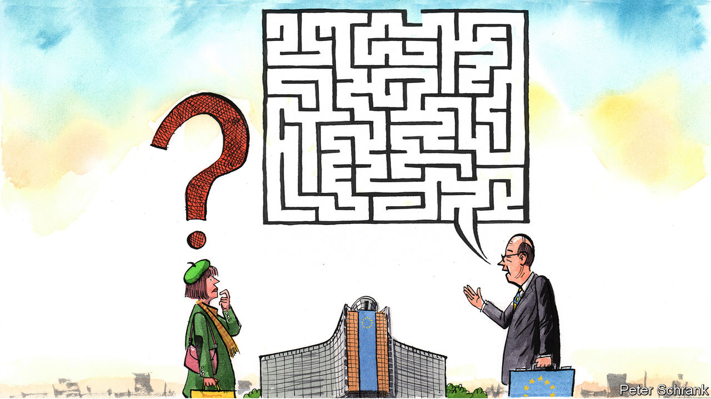

###### Charlemagne

# How Brussels sprouted its own unique dialect 

##### And why Euro-gibberish is useful 

 

> Nov 10th 2022 

In Brussels, according to a character in “Borgen”, a Danish political drama, “nobody can hear you scream.” Even if they could, they might not understand what was being said. Something about comitology, TLTROs and a holistic strategy on equitable rural development, whatever that might be? Most organisations, from the most gargantuan government to the tiniest start-up, develop their own jargon. The EU has created one so rich and acronym-filled that it surely counts as a dialect in its own right. Ministers who visit town are handed glossaries of Eurospeak; a local interpreter might soon be needed. Critics see this as evidence of officialdom run amok, of unaccountable Eurocrats so isolated in their ivory tower that they can barely communicate with mere citizens. Charlemagne, a near-fluent Eurospeaker, would like to defend his hometown patois. Not only is it an inevitable corollary of a multilingual union, it is a welcome one.

A recent study confirmed that denizens of the Brussels EU quarter speak a unique language. Christian Rauh of the WZB Berlin Social Science Centre analysed decades’ worth of press releases put out by the European Commission, the bloc’s executive arm. The 45,000 documents studied were written in undiluted officialese. Whereas bureaucrats in Ireland and Britain use roughly the same vocabulary as newspapers, Eurocrats communicate with words not used by anyone else, from “trilogues” to “co-legislators” (don’t ask). Their prose is as opaque as that in journals of political science. National governments write in a way that a typical high-school pupil can understand. Eurocrats befuddle anyone who lacks a university education. 

Crunching words through a machine to glean their linguistic complexity is an imperfect science. But the results of the study chime with experience: the language of Eurocracy lies somewhere between the clunky and the incomprehensible. Yet how could it be otherwise? The EU’s 450m citizens use two dozen official languages, and speak many more at home. An individual Eurocrat may master two or three, but seldom more and never all of them. In theory French and German share the status of English as joint of the eu. However, despite decades of French moaning, in practice most people use English (which is the language of the press releases analysed in the study). 

The  has been adapted for Brussels in two ways. First, Eurocrats often use English words in ways that native speakers struggle to grasp. They “assist” meetings instead of attending them. They “externalise” a task rather than merely outsourcing it. If they talk of an “actual” situation, they mean the current one. Much of this is due to officials seeing a word they recognise from their own language, and then assuming it must mean the same thing in English. Their interlocutors then pick up the baton and misuse the term in the same way: Brussels is a place where diplomats from far and wide perfect their English by speaking to people who do not speak it well either. While Britain was a member, Brits occasionally fussed at such linguistic inexactitude. Other Europeans shamed them into silence by pointing out that few Brits can speak foreign languages badly, let alone well. Not many native English speakers are now left. Massacring their tongue is considered fair retribution for Brexit, though obviously a milder punishment than British voters inflicted on themselves.

The bigger impediment to normal humans understanding Eurocrats is jargon. Countries that wish to join the EU need to adopt its  of existing legislation; newcomers to Brussels need to pick up what might be called the . A “Gymnich” means nothing beyond EU circles, but is known to be an informal meeting of the bloc’s foreign ministers (named after the castle where it first happened). Coreper, short for , sounds to outsiders like a car body shop, but is in fact the powerful forum where national governments thrash out deals behind closed doors. An entire caste of Brussels diplomatic aides is known as “Anticis” after a long-forgotten predecessor, Paolo Antici, who held the job for Italy in the 1970s. Words with no precise translation are simply imported from whatever language offers the best term. Can’t quite rustle up the English idiom for a politician wrangling legislation through parliament, or leading her party into elections? No worries, and  will do.

When jargon jars

Does this Euroblather alienate outsiders? “Technocratic communication...plays all too easily into the hands of those who want to construct the image of a Brussels elite that is detached from the European citizen,” finds Mr Rauh, the linguistic hawk. Whether this is really a problem depends largely on what role one sees for Brussels and its Eurospeakers. If one thinks of the EU as a sort of government-in-the-making, then having a vernacular spoken only in the corridors of power is indeed troubling. Voters need to understand their politicians to hold them accountable. As things stand, linguistic isolation betrays a remoteness from the people whom the union is supposed to serve.

But what of those who have more healthy aspirations for the EU? Brussels these days is not itself a seat of government, but a place where clever clogs from across the continent toil behind closed doors to offer compromises to national politicians on everything from fisheries regulation to arming Ukraine and cutting carbon emissions. This is thankless but necessary work, best done out of the public gaze. The city’s linguistic isolation in this context matters not one bit. Eurocrats are not communicating with the public, they are chattering among themselves. Making deals palatable to 27 national governments with their own electorates is a messy business. While it attempts to do this, the EU machine benefits from the obscurity provided by its vernacular. The obfuscation of Eurospeak is not a bug, it is a feature. ■


