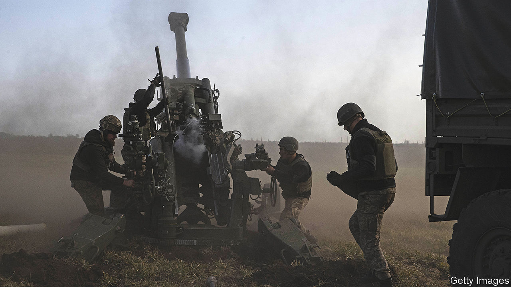
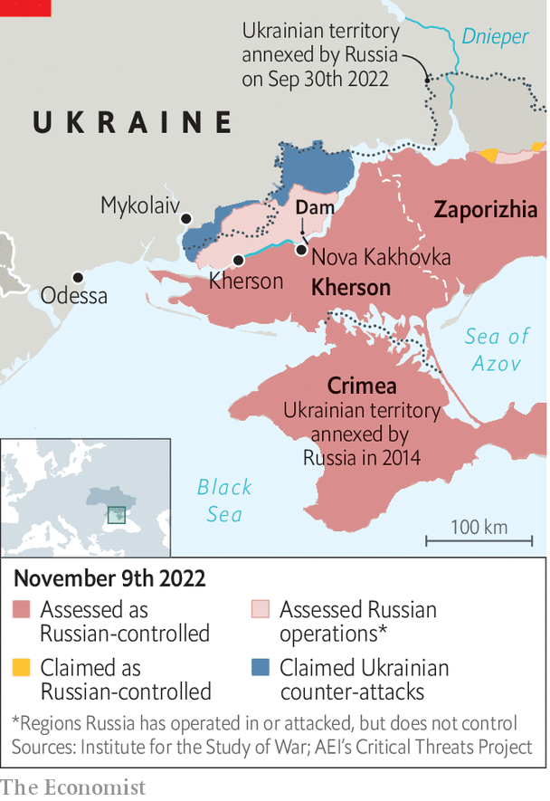

###### The flight from Kherson

# Russia says it is abandoning the Ukrainian city of Kherson 

##### But is it a trap? 

 

> Nov 9th 2022 

EIGHT MONTHS of brutal war have borne little fruit for Russia. It was beaten back from  in the spring. It was routed in  in September. Since the start of the war in February it has lost perhaps 100,000 men, killed and wounded. The only provincial capital it has managed to take is Kherson city, captured in the first week of war and illegally annexed in September. And now that, too, seems to be slipping from its grasp. 

On November 9th Sergei Shoigu, Russia’s defence minister, and , appointed as the commander of Russian forces in Ukraine weeks earlier, met Russian commanders and acknowledged that Russia’s position in Kherson had become untenable. The “most sensible option” in the circumstances, said General Surovikin, would be to establish a new defensive line on the eastern side of the Dnieper river. “Sergei Vladimirovich, I agree with your conclusions and suggestions,” replied a stony-faced Mr Shoigu. “For us, the lives of Russian servicemen are always a priority.” 

Russia’s position in Kherson has been deteriorating for months. Ukrainian forces launched a  in the province on August 29th, after weeks of precision attacks against the bridges needed to resupply Russian forces on the west bank of the Dnieper, where Kherson city lies. In early October Ukrainian troops made breakthroughs in the northern part of the front, eventually bringing the front line to within 30km of the city. By the end of the month Russian authorities said they had completed the evacuation of over 70,000 civilians to the east bank. 

Ukrainian officials are sceptical that Russia is really prepared to withdraw without a fight. Many of them fear that the announcement is simply a ruse, intended to lure their army into urban combat. Mykhailo Podolyak, an adviser to Volodymyr Zelensky, Ukraine’s president, said on November 9th, after the Russian declaration, that “We see no signs that Russia is leaving Kherson without a fight.” One source familiar with Russian operations said that, despite this understandable scepticism, there was increasing evidence that the withdrawal was for real.

 


Certainly, Ukraine will not rush into the city. But it is clear that the noose has been tightening. On the same day the head of Russia’s puppet regime in Kherson acknowledged that Kirill Stremousov, his deputy, had been killed “in a car crash”. Numerous pro-Russian officials have died in recent months, many of them assassinated by Ukrainian partisans and special forces. 

A withdrawal, if it really happens, would be humiliating both for Russia’s army, which is being steadily pushed back, and for Mr Putin, who declared Kherson to be an inalienable part of Russia just weeks ago. “Russia is here for ever,” declared Andrei Turchak, secretary of United Russia, the Kremlin’s ruling party, speaking in Kherson in May. “There will be no return to the past.” Ramzan Kadyrov, the leader of Chechnya and lately a critic of the Kremlin’s war strategy, praised General Surovikin for a wise decision that had saved lives. But others were less forgiving. 

On Telegram, a social-media forum popular among war commentators in Russia, “nationalist patriots” were furious. Yevgeny Prigozhin, an ex-convict who controls Wagner, a group of mercenaries, compared the situation in Kherson to the rout in Kharkiv: “Then too, there was no understanding of what was going on.” He cited one of his commanders as saying that Wagner would stay even if the army left. The Telegram channel “Operation Z”, which has a million subscribers, wrote: “Fuck, why were we lied to?” There is also mounting anger at Russia’s recent mobilisation of some 300,000 more men. The wives and mothers of new recruits are travelling to the Russia-Ukraine border to demand that their husbands and sons be withdrawn.

On state television, retired generals offered the theory that the retreat was temporary. In truth, any lingering Russian hopes to advance, once more, on Mykolaiv, and thence westward to Odessa, have receded into fantasy. The retreat has some advantages. It allows Russia’s army to narrow the front and establish more defensible lines, as it waits for the newly mobilised recruits to arrive—indeed one official suggests that the withdrawal from Kherson and a switch to the defensive might have been one of General Surovikin’s conditions for taking the top job. But it also brings parts of Crimea, which Russia annexed in 2014, within range of longer-range rocket artillery, notes Rob Lee of King’s College, potentially playing havoc with Russian railway stations, ammunition depots and other facilities there. 

The withdrawal itself is yet to come. A retreat under fire—a “retrograde under contact”, in military parlance—is one of the most challenging tasks that any army can undertake. It can go horribly wrong; Russian forces suffered heavy casualties as they escaped from Lyman a month ago. Western and Ukrainian officials said in October that around 20,000 Russian troops were deployed on the western side of the Dnieper. Many are probably still there. 

If Russia’s perimeter around Kherson city collapses, Ukraine will swiftly be able to bring its artillery forward, to within range of the bridges, pontoons and barges that represent the only escape route for Russian troops on the western side. These could then become death traps. Russia may anyway have to abandon or destroy large amounts of military equipment, since some bridges, damaged by months of relentless bombardment, cannot bear the weight of heavy vehicles. Some suspect that Russia may resort to human shields, mingling civilian and military traffic to deter Ukraine from striking. 

General Surovikin also hinted at another terrifying possibility. He warned Mr Shoigu that Ukraine’s armed forces had planned to create a flood zone below the Kakhovka hydroelectric power plant, which forms part of a 3km-long dam at Nova Kakhovka. In October Mr Zelensky, warned that Russia, in fact, had mined the dam. One aim of damaging or destroying it might be to cover the Russian retreat by bogging down Ukrainian troops.

That would be a very risky strategy. Michael Kofman of CNA, a think-tank, warns that the destruction of the dam would not only be “ecologically disastrous” but would also have a larger impact on eastern Kherson, which Russia seeks to retain, than on the western part of the province. It could also disrupt the supply of water to Crimea. “It would mean Russia essentially blowing its own foot off.” ■


