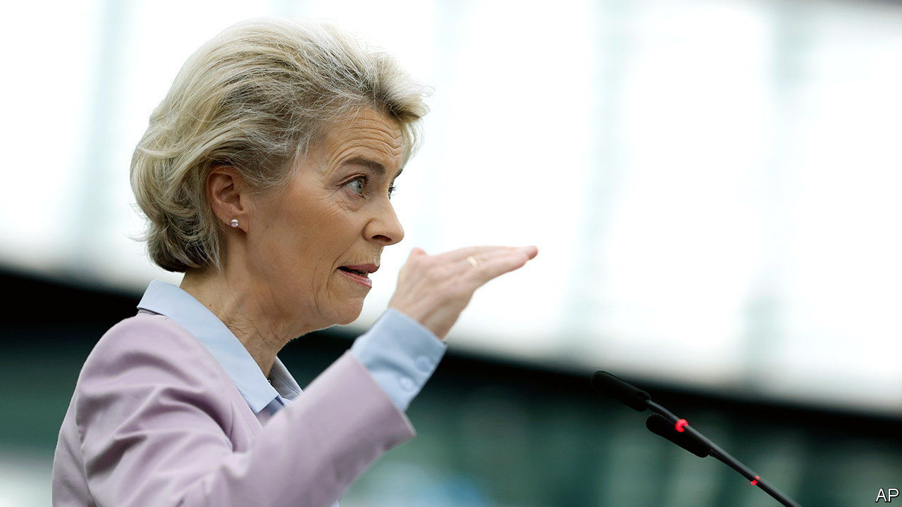
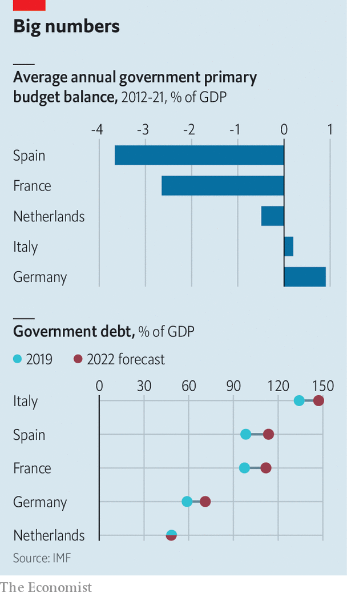

###### Hamiltonian rules

# The European Commission wants to be in charge of new fiscal rules 

##### Member states may worry 

 

> Nov 10th 2022 

A MUSICAL about Ursula von der Leyen is hard to imagine. Unlike Alexander Hamilton—America’s first secretary of the Treasury, who masterminded the fiscal federalisation of the United States and was posthumously rewarded with a hit musical—Mrs von der Leyen still has some battles to win. Her latest proposal to make the European Commission that she runs a more political arbiter of the bloc’s fiscal rules is a good example. 

 


The idea is simple enough. A group of 19 independent countries needs a few guardrails if they are to share a currency. Previous incarnations proved ineffective, and in part even misguided. There is widespread consensus that the increasingly complicated rules need an update. They were suspended at the start of the pandemic, but their impending reapplication in 2024, after debt in most countries has risen sharply (see chart), gives the current debate over their reform additional urgency.

The pandemic and the energy crisis that followed it have added two elements to the fiscal wiring of Europe. The first is that the European Central Bank (ECB) has made itself the lender of last resort to governments in all but name. It spent billions to backstop governments early in the pandemic, and then set up a  called TPI as a back-up, to prevent rising interest rates from causing havoc in bond markets. Some economists now fear that the backstop could encourage governments to spend too much. “The ECB’s new bond-buying programme makes it strictly necessary to have a credible fiscal framework,” argues Luis Garicano of Columbia University. The ECB itself seems to agree. The first condition for being eligible for the bank’s bond-buying is compliance with Europe’s fiscal rules. 

The second new element is the EU’s post-pandemic recovery fund of €807bn ($808bn), financed with common EU debt, hailed by some as Europe’s Hamiltonian moment. The commission is  of first negotiating member states’ national investment and reform plans, and then monitoring their implementation. 

The commission’s latest proposal for the new-look fiscal rules builds on this newly gained standing. Brussels would set out a path for net government expenditure that is reasonable and brings down debt levels over time. This part is a simplified version of the previous debt-reduction targets, which have become unrealistic for highly indebted countries. National governments would then send comprehensive plans back to Brussels on how to reach that path. If a plan involves bold investment or reform packages, the adjustment can be made less onerous. 

The package sounds familiar to connoisseurs of the recovery fund. The commission would now be put in charge of similar negotiations on euro-zone members’ fiscal plans, and so in effect would decide whether countries are eligible for the ECB’s backstop. Formally, the council that represents national governments would also have to approve the commission’s assessment. “But not even the Germans trust themselves to be tough when the time comes, let alone the group as a whole,” says Jeromin Zettelmeyer of Bruegel, a think-tank. In effect it would be the commission that decides whether to be tough or not. 

That is seen as a problem in Berlin. The commission is not a trustworthy enforcer of fiscal discipline, the argument goes. But Germany may find itself alone this time. “The Dutch are traditionally aligned with Berlin, but they are much more open to such a bilateral approach by the commission,” says Mujtaba Rahman of Eurasia Group, a consultancy. 

The new commission proposal hints at a compromise. Stronger national fiscal watchdogs and their European counterpart could add their assessment of the fiscal plans, giving the exercise a more devolved feel. But the whole set-up would still throw the commission into the role of fiscal decision-maker. Does it have the political legitimacy to do it? ■

