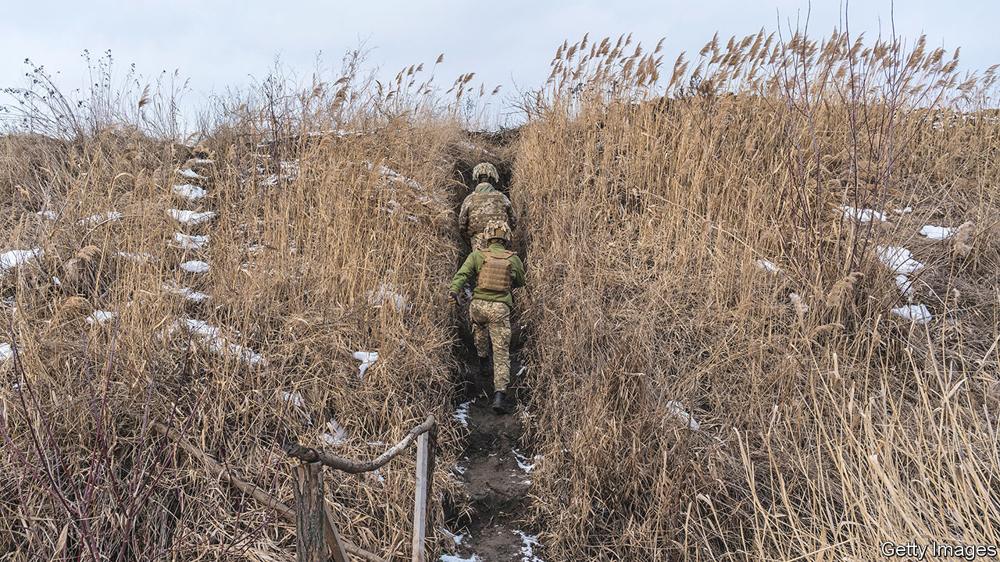

###### Mud wrestling

# The particular problems of fighting in the Ukrainian autumn 

##### Cold, germs and ubiquitous mud 

 

> Nov 10th 2022 

It’s mud season again in Ukraine. “Spring and autumn are the most difficult periods for warfare,” says reservist Colonel Oleh Zhdanov, a former operations officer on the Ukrainian general staff. “The main problem is the rain.” Farm tracks leading to the front lines are churned into slippery swamps, armoured vehicles founder, soldiers slip and fall and sometimes break bones. “As the temperature drops, the fighting slows down,” says Colonel Zhdanov. “When roads are impassable, the war usually becomes more positional.”

“The rain feels like needles on every part of your body; you are pouring water out of your boots,” says Andriy, a Ukrainian unit commander in the province of Luhansk. His poncho is his most treasured piece of kit. “I love it, I could write a book about it.” By day, it keeps the rain off; at night he stretches it into a canopy above his foxhole. Other soldierly essentials are a water-resistant sleeping bag, good thermal underwear (“I didn’t change my clothes for two weeks; I smell really bad”), and sanitary towels, which soldiers use as insoles to keep the damp out of their boots. 

Staying warm and dry is a matter of luck, says Andriy. Sometimes, digging in, he hits dry earth a metre below the surface; other times he has to spend the night with subterranean streams trickling into his sleeping bag. In the morning you can tell the unlucky ones, because they are almost comically covered in mud. 

It rained almost solidly through October and several soldiers were evacuated with flu and other ailments caused by the wet, cold conditions. For several days Andriy ran a fever and his kidneys ached. He struggled on, glugging flu-remedy drinks, but at last his commander insisted that he was evacuated. Doctors tell him he has an inflammation of his kidneys and should go to hospital; he hopes a few nights’ sleep in warm and dry conditions will clear it up so that he can return to his unit.

Andriy Zholob, call sign “Concrete”, commander of a medical brigade in the Kherson region in the south, says autumn is the worst time of year for sickness. Out of 2,000 soldiers in his sector, two or three a day are being evacuated from the front with fever, flu, tonsilitis and ear infections. Since the exigencies of war have put plenty of men in their 40s and 50s on the front line, he is seeing flare-ups of conditions like rheumatism and arthritis.

The mud makes evacuating the wounded a nightmare. Last week an ambulance slipped down a verge into the river (no one was hurt). “And mud [can transmit] infection,” says Mr Zholob. Tetanus cases have spiked. “If a wounded soldier has to wait four or five or six hours to be evacuated, little wounds can become big problems.”

The rain is bad, but the loss of leaf cover affects soldiers on the battlefield the worst. Andriy and his unit have been “on raid”, pushing the Russians farther back after the successful  in September, under almost constant shelling. “When it’s green you can hide,” he says. “Now with no leaves, it’s almost impossible. The Russians have a lot of drones. When you realise that they are looking at you right at that moment, I feel fear. If they see even only two people, they will begin shelling the area.”

Tactics change. “When the leaves fall it is possible to see the enemy [from farther away] and observe him more closely,” says Colonel Zhdanov. “Without leaf cover it is harder to move, there are fewer ambushes, battles tend to be conducted at longer distances, relying more on artillery.”

Despite the weather, Ukrainian morale remains high. Fighting in Luhansk, Andriy says he is “warmed” by the thought that the newly mobilised Russians on the other side have to endure the same conditions but with worse equipment. Ukrainian front-line troops are supplied daily with hot food. From intelligence intercepts, they know that the enemy, under pressure to maintain their positions, are rarely evacuated when ill. In the spring the Russians, , were not allowed to light fires and risk revealing their positions, or run the engines of their vehicles and waste precious diesel. Many got frostbite. 

Every season has its advantages and disadvantages. Andriy, the unit commander, notes that mud can even be helpful: “In autumn your weapon is so obviously dirty that you clean it every day.” It will get colder soon enough; freezing conditions make it harder for bacteria to thrive and easier for vehicles to manoeuvre. Says Colonel Zhdanov, “I always say that the one who prepares the targets better and equips the soldier better will have the advantage when the winter comes. When a soldier is in warm clothes, he will fight in the cold; when the ground is dry and hard he will feel comfortable. And then there will be a tendency to intensify hostilities.” ■


