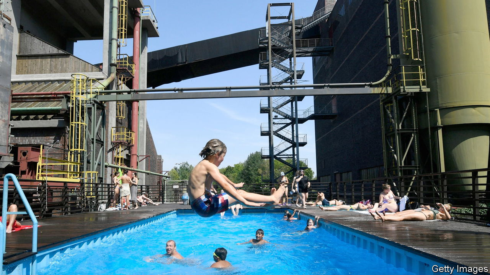
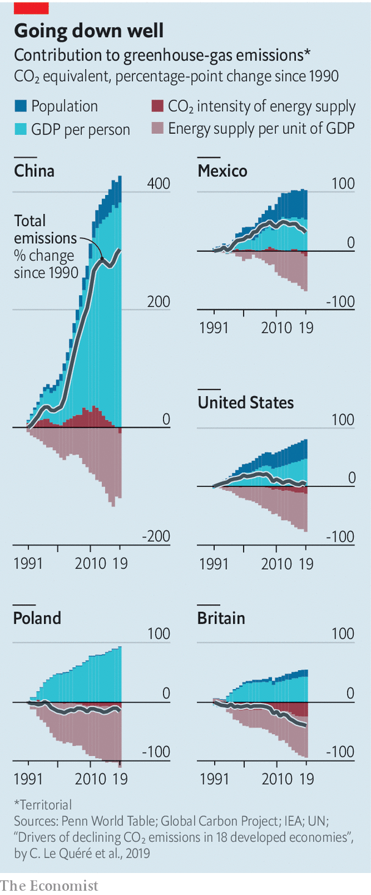

###### Unconscious decoupling

# Economic growth no longer means higher carbon emissions 

##### As politicians gather in Egypt, a reason for optimism 

 

> Nov 8th 2022 

If anywhere can claim to be the birthplace of the Industrial Revolution it is Coalbrookdale, a pretty village in England’s West Midlands. In 1709 Abraham Darby, a local merchant, leased a foundry and fed the furnace with coking coal, rather than charcoal made from wood. The use of the fossil fuel meant he could make pig iron much more cheaply, and cast it into pots, pans and cauldrons for cooking—the kind of low-cost manufactured goods that would, over the next three centuries, produce an unprecedented rise in living standards across the world.

Darby’s furnace was not just ground zero for the Industrial Revolution. It was also ground zero for global warming. Since the fateful smelting, economic output and greenhouse-gas emissions have risen in tandem. England’s furnaces were joined by coal-powered railways and steam-powered textile mills, all using tools cast from coke-fuelled foundries. Between the middle of the 19th century and the outbreak of the first world war, Britain’s national income per person more than doubled and its carbon emissions increased four-fold. When other countries industrialised, their emissions spiralled, too.

As politicians gather in Sharm el-Sheikh, an Egyptian holiday resort, to review progress on climate change at cop27, there is at least one cause for optimism: the historic link between rising prosperity and carbon emissions has been broken. Today Britain is a member of a large and growing group of rich and middle-income countries that has severed it. This decoupling has been achieved not through the large-scale deployment of renewable energy—or, indeed, by exporting emissions to poorer countries—but by a change in the relationship between economic growth and energy that is perhaps as significant as those first stirrings of the Industrial Revolution three centuries ago.

All told, some 33 countries have in recent years cut emissions while maintaining growth. Around three-fifths are European, meaning, as was the case during the Industrial Revolution, the old continent is leading the way. But the group also includes America, where emissions fell by 15% between 2007 and 2019 even as gdp per person rose by 23%, as well as others that have joined more recently. These include Australia, where emissions have fallen by 9% since peaking in 2012, and Israel, where they have fallen by 12% in the same period, even as both economies have grown.

 


It would be wrong, however, to characterise decoupling as a luxury reserved for the most affluent countries. Thanks to energy-efficiency improvements, emissions in eastern Europe have fallen since the collapse of the Soviet Union, at the same time as living standards have converged with western Europe. Argentina, Mexico and Uruguay have also joined the decouplers. In Mexico, for instance, emissions have fallen by 16% since their peak in 2012. Around the world, before the covid-19 pandemic distorted the numbers, more than 1bn people lived in countries with falling emissions and growing economies.

Territorial emissions, which reflect domestic production, began to fall much earlier. In Britain they peaked in the 1970s, before oil shocks and strikes decimated the country’s industry. But their decline merely reflected the fact that more manufacturing was taking place abroad: British clothes were being sewn in Dhaka instead of Derby, which led to no reduction in global emissions. The figures in this article mostly come from analysis of data produced by the Global Carbon Project, a greenhouse-gas-monitoring outfit. These include estimates of the emissions from imports, and so capture the vast majority of a country’s carbon footprint. In other words, Britain’s figures include emissions from imported t-shirts made in Bangladesh.

The more recent decline in emissions is therefore the real deal. Part of the explanation is that the countries to which manufacturing has been outsourced now emit less carbon themselves, notes Viktoras Kulionis of Pictet Asset Management. In all but a couple of dozen industrialising countries gdp growth produces fewer carbon emissions than used to be the case, a phenomenon which is known as “relative decoupling”. In 2008 China’s exported emissions peaked at around 1.5bn tonnes of carbon-dioxide equivalent, before falling to 1bn in 2019, owing to improved efficiency and a move from chemicals and metals exports to less carbon-intensive electronics ones. Emissions imported by the oecd group of mostly rich countries peaked in 2006, at 2bn tonnes of carbon-dioxide equivalent. They have since fallen by more than a third to 1.3bn.

But the shift mostly reflects a watershed change in how energy is used in the West. Decoupling can occur for two reasons: either because output becomes less energy-intensive, or because the energy used becomes greener. For the past decade or so, it has mostly happened because of the former. The energy intensity of gdp—the supply needed to produce a dollar of national income—has fallen faster than gdp has grown. This can be seen in America. The country is often considered a polluter . In fact, its territorial emissions peaked in 2005. Since then, the energy intensity of its gdp has fallen by nearly a quarter. So even though America’s gdp has risen by 29%, emissions have fallen by 15%. Similarly, four-fifths of the fall in German emissions since 1990 reflects lower energy intensity. Only the remaining fifth comes from the use of greener energy.

Falling energy intensity is the result of changes to the structure of rich-world economies. A visitor to Coalbrookdale in the 18th century compared its smoke, heat and fire to a vision of hell. Nowadays the old furnace lies cold; the last foundry, which made parts for Aga ovens, closed in 2017; and the site has become a tourist attraction. It is a symbol of Britain’s shift from an industrial economy to a service-based economy—a shift which has big implications for emissions. As Nick Eyre, a climate-policy expert at the University of Oxford, notes, an extra trip to the theatre requires much less energy than making additional pots and pans.

The move from manufacturing to services has happened across the rich world. Industry’s share of American gdp fell from 17% in 2007 to 14% by 2019. In Germany, a country known for its manufacturing prowess, its share fell by two percentage points in the same period. Even in Mexico, one of the poorer countries to have decoupled, its share dropped from 27% to 25%. 

The task now is to accelerate decoupling. One reason for optimism is that so far it has happened without colossal outlays or much political consensus. Many of the West’s high achievers have emissions-trading schemes, or other forms of carbon pricing, but even laggards have managed to reduce their carbon footprints. Increasing use of renewables in electricity generation, as well as electrifying the heating of homes and transport—whether through electric cars or encouraging public transport—has the potential to make a big difference. 

But perhaps the greatest reason for optimism is the evidence that poorer countries are industrialising in different ways from their predecessors. Data from the Global Carbon Project suggest that Egypt, the cop27 host, reached peak emissions in 2017. India and Vietnam, which are becoming a bigger source of exports as  from China, are considerably greener than their economic rival. In 2007, when China’s economy was roughly as big as India’s is today, it emitted around twice as much carbon dioxide. India and Vietnam are still powered by coal. The difference is they are making much more efficient use of it. ■


