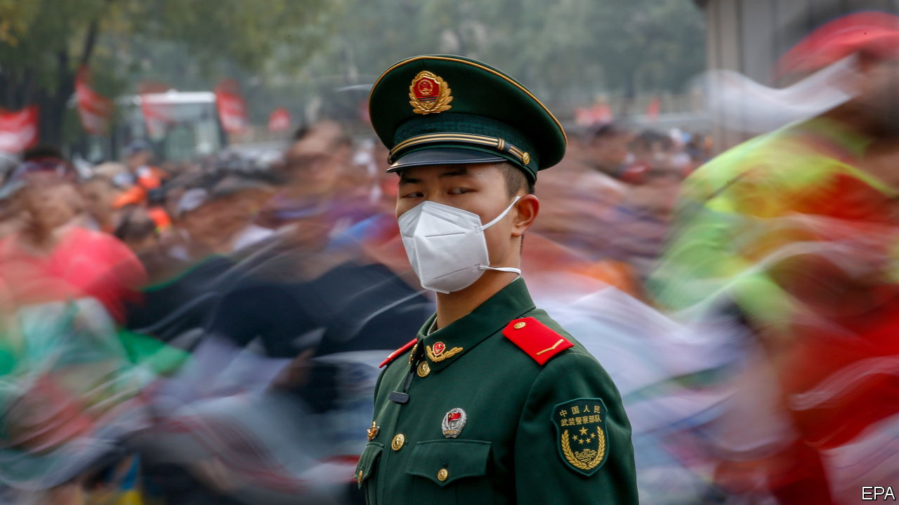

###### Another marathon

# Financial markets bet on an end to China’s “zero-covid” policy 

##### There are some signs change may be on the way 

 

> Nov 9th 2022 

Is China about to abandon its struggle with covid-19? Judging by recent moves in the markets, you might think so. Rumours that China had assembled a reopening committee inspired a big rally in the country’s shares,  and even the price of copper in the early days of this month. A social-media message that helped circulate the idea was subsequently dubbed the “trillion-dollar” tweet. 

If nothing else, the market movements were a reminder of the costs of China’s , which requires mass testing and frequent lockdowns to stamp out the disease. Few policies are so economically damaging that mere rumours of their repeal can create so much wealth so quickly. A reopening could lift the value of China’s shares by 20% or $2.6trn, according to Goldman Sachs, a bank. Because China is the only big economy still prone to lockdowns, it is the last opportunity for investors to profit from a reopening rally. These tend to happen early and fast, which is why investors risk jumping the gun.

Optimists point out China is taking modest steps to become more open. Its aviation regulator has more than doubled the international flights planned for the next few months, compared with a year ago. China may shorten the quarantine for incoming travellers, and abandon the “circuit-breaker” which suspends airlines that bring in infected passengers. International sports events are returning. Shanghai, eerily quiet during its lockdown in April and May, will hear the growl of racing cars when Formula One returns in April 2023.

In September China approved an inhalable vaccine that is now being used in 14 cities. At a private conference on November 4th, a former official at its Centre for Disease Control and Prevention said that “substantive changes” in the country’s approach were likely in the next six months, according to Reuters, a news agency.

But if China is preparing to exit, preparations will be lengthy. It will first want to suppress small but widespread outbreaks in more than 100 cities, including Guangzhou, the capital of Guangdong, a province with a gdp as big as South Korea’s. It will then want to keep a lid on infections through winter, so as not to overtax its hospitals. And it will presumably take no big decisions until new officials are installed at the National People’s Congress in March.

Before it can reopen with any confidence, China will need to stockpile antiviral drugs. It will also have to build more intensive-care units and, crucially, lift the vaccination rate among its elderly. 

The vaccination rate is a “leading indicator” of reopening, reckons Citigroup, another bank. The share of people aged 60 or above who have received a booster shot reached 66% earlier this year, before plateauing. Some wonder if China is waiting for more effective home-grown jabs before renewing its immunisation drive. 

It is also possible that Chinese officials do not want to prod the elderly to get another jab until they know reopening is on the way. The protection conferred by even the best shots wanes. So there are dangers in vaccinating people too soon as well as too little. As it happens, the percentage of boosted elderly increased to 68.5% in November. If it continues to climb, speculation about a reopening will intensify.

The economy could grow by 5.5-6% in the event of an orderly reopening, according to the Economist Intelligence Unit, our sister company. Grimmer scenarios are possible: a chaotic end to the “zero-covid” regime could cause the economy to shrink for a quarter, before a subsequent recovery. For this reason, whenever it begins, the pace of reopening is likely to be cautious.

Although many will feel relief as controls are relaxed, others will be worried. It will take a concerted propaganda effort to dispel the stigma the disease now carries, meaning consumer confidence may rise only slowly. On November 6th, vaccinated competitors took part in the Beijing marathon, the first for two years, running over 26 miles from Tiananmen Square to the “Bird’s Nest” Olympic stadium. The route to reopening could be just as arduous. ■


