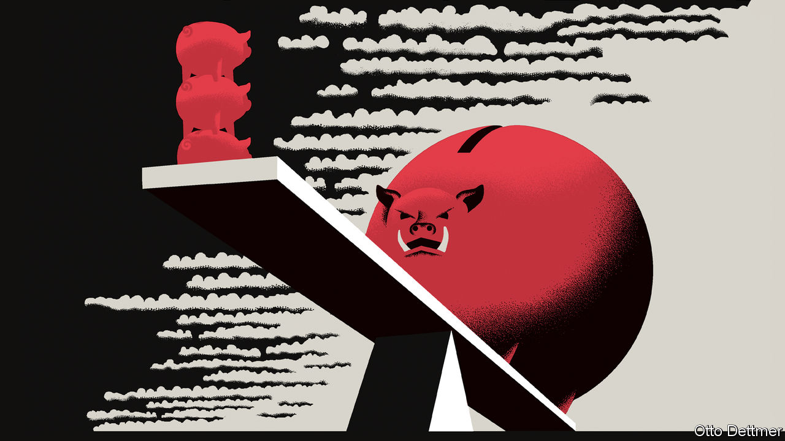

###### Free exchange

# Interest rates have risen sharply. But is monetary policy truly tight? 

##### Economists debate whether interest rates need to keep pace with inflation 

 

> Nov 10th 2022 

For a few months this year there was a rare moment of economic consensus. The rich world’s central banks, especially America’s Federal Reserve, had uncaged inflation. They had to correct the error by raising interest rates sharply and swiftly. 

But as 2022 draws to a close the uneasy peace between doves and hawks has broken down. Their latest disagreement about monetary policy is so big it is as if they are working with different sets of facts. While some economists warn that interest rates have now risen by more than is necessary to contain price growth, others say that monetary policy has not really tightened at all. 

Like fixing a dislocated shoulder, sorting an inflation problem is supposed to be painful yet simple. Every economist knows the maxim, dubbed the “Taylor principle” after John Taylor of Stanford University, which tells central bankers to raise interest rates by more than inflation has gone up. To disregard the rule is to allow inflation-adjusted borrowing costs to fall, administering a stimulus that makes the problem worse. To follow the principle, policymakers must raise real rates every time prices accelerate. If they do, sooner or later the economy will slow and order will be restored. The Taylor principle is necessary to stabilise inflation in state-of-the-art economic models. It is also common sense.

Yet today no major central bank is following the principle. Since the start of last year inflation has risen by five percentage points in America, eight points in Britain and ten points in the . Central banks’ interest-rate rises are rapid by historical standards. But they are nowhere close to keeping pace with this price growth. And that has led some economists to ring the alarm bell. “The Fed has not yet hit the brakes,” declared Jonathan Parker of the Massachusetts Institute of Technology after the latest bumper 0.75-percentage-point increase on November 2nd. 

The trouble is that although the Taylor principle makes sense in theory, there is disagreement about how to apply it in practice. A true measure of real interest rates is forward-looking. New borrowers and lenders need to know what inflation will be in the future, not what it was in the past. According to a survey by the New York Fed, consumers expect inflation of 5.4% over the next year. Mr Parker subtracts this from the Fed’s target interest-rate range of 3.75-4% to get a negative real interest rate of about -1.5%. That is below the prevailing rate before the covid-19 pandemic and “very, very not contractionary”, he says.

But why only look forward one year? Many loans are provided over a longer time frame. And here lies the doveish calculation. Greg Mankiw of Harvard University worries that the Fed may be overdoing things because the five-year real interest rate priced into financial markets has risen sharply since the start of last year, by 3.4 percentage points at the time of writing. The textbook version of the Taylor rule, a more expansive cousin of the Taylor principle, says that real interest rates should go up by half the increase in inflation. Look five years ahead in financial markets, and take a measure of underlying inflation—Mr Mankiw points to a three-point rise in annual wage growth—and real rates have roughly kept pace with inflation. In other words, the Fed’s tightening looks like too much, rather than too little.

The argument relies on what economists call “rational expectations”. The public’s view about what a central bank might do tomorrow is in theory just as important as today’s short-term interest rates. As a result, in modern economic models it does not matter much if policymakers fail to raise interest rates above inflation at a given point in time, notes Michael Woodford of Columbia University. Only the expectation of a systematic disregard for the Taylor principle “indefinitely into the future” would cause monetary mayhem. And the Fed’s policymakers are hardly showing this sort of disregard. The central bank is not done raising interest rates: markets expect them to rise above 5% next year. That could be enough to satisfy the Taylor principle by then.

A belief that expectations are rational is usually associated with a conservative, hawkish view of the world, in which people belong to the species . Today these arguments help doves who argue that central banks should calm down. The Fed boasts that it has turned the real interest rates that are priced into financial markets positive at almost all horizons. The worst case of a yield curve having slipped away from a central bank’s control is in Britain—but, ironically, the problem is that markets seem to expect more interest-rate increases than the Bank of England would like. At its latest meeting the central bank forecast that the path for rates envisaged by markets would result in a deep recession and bring inflation well below target. It is almost as if the Bank of England has too much inflation-fighting credibility.

Even if the Taylor principle is being met on a forward-looking basis, that is not the end of the story. The principle prescribes only the minimum tightening that is needed to bring inflation to heel. Were central banks only narrowly to clear the hurdle then inflation could take a long time to return to target. Another issue is that interest rates are supposed to rise still higher when an economy is overheating. America, where there are almost two job openings for every unemployed worker, . Failing to respond to it could prolong the inflationary episode.

From first principles

Perhaps the best argument for more rate rises, though, is the poor record of both economic models and financial markets at predicting inflation. Over the past year both have persistently underestimated its rise. In an uncertain environment, it makes sense to put more weight on data and less on forecasts—a point central bankers have begun to emphasise. Following the Taylor principle with respect to realised inflation might make policymakers slow to react to a change in the economic winds. But that is a price worth paying to be sure of bringing inflation under control. ■


 (Nov 3rd)


