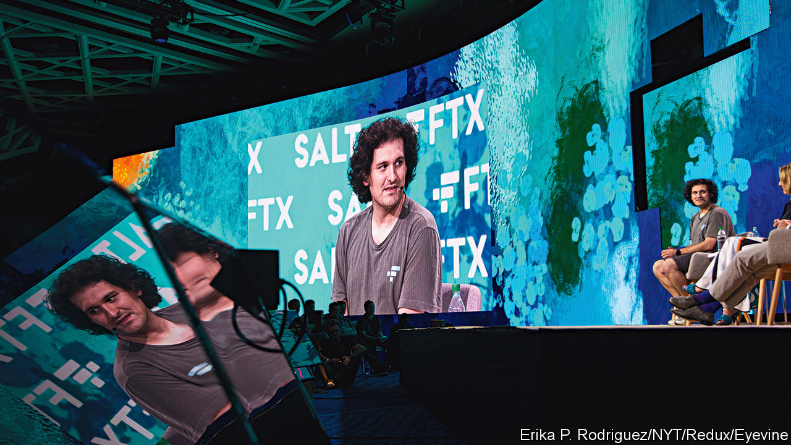
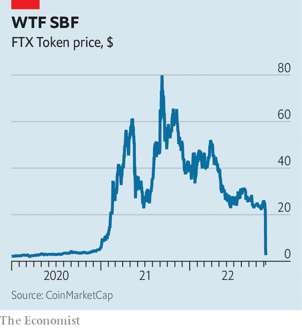

###### Cryptocurrencies

# The spectacular fall of FTX and Sam Bankman-Fried 

##### Another serious blow to crypto’s reputation 

 

> Nov 9th 2022 

Last week Sam Bankman-Fried was the most . The floppy-haired 30-year-old former billionaire, who goes by sbf, is the founder of ftx, then the industry’s third-largest exchange. When crypto prices collapsed earlier this year he swooped in with loans for Voyager and BlockFi, handing the lending ventures hundreds of millions of dollars, and snapped up assets from Three Arrows, a crypto hedge fund. Many saw a new John Pierpont Morgan, the banker who saved the American financial system in 1907. 

Mr Bankman-Fried also spent millions of dollars from his vast fortune, worth $26bn at its peak, supporting political campaigns on . He planned to give away much of the rest, having endorsed effective altruism, a movement that espouses charitable giving to safeguard humanity’s future. Politically engaged, seemingly altruistic, decidedly not a crypto bro: many thought sbf was the man who could save the industry from itself, a reputation he hardly discouraged.

 


Oh, how the mighty have fallen. After rumours ftx might be insufficiently liquid began to swirl, customers pulled $650m of assets from the exchange on November 7th, before it stopped meeting requests. The value of an ftx Token, a mechanism for sharing the firm’s profits, has fallen by 90% since November 4th (see chart). On November 8th Mr Bankman-Fried and Changpeng Zhao, the boss of Binance, the biggest crypto exchange, announced that Mr Zhao’s firm had signed a letter of intent to buy ftx. Then the next day Binance pulled out, after having taken a look at ftx’s books. Mr Bankman-Fried is reported to have told investors that ftx faces an $8bn shortfall and that it will, without more capital, go bankrupt. According to Bloomberg Wealth, he is now worth less than $1bn, a drop of 94%—the biggest single-day fall on record.

The carnage is spreading to other parts of the industry. Bitcoin has tumbled by 19% since November 8th, to $16,600 at the time of writing. The importance of ftx for the wider ecosystem is such that JPMorgan Chase, a bank, has warned crypto markets could face a “cascade” of deleveraging and company failures, and that there is a shrinking pool of strong institutions able to step in to rescue those in trouble. The reputational damage to the industry looks likely to be profound.

What on earth happened? Two stories circulated, both a touch Shakespearean. The first is one of rivalry and the second of hubris. Start with the rivalry between Mr Bankman-Fried and Mr Zhao. Mr Bankman-Fried owns three firms: ftx, a global exchange; ftx.us, an American exchange; and Alameda Research, a crypto-trading fund. In theory, these are separate entities. But the connection between Alameda and ftx has long been unclear. On November 2nd CoinDesk, a news website, reported that tokens issued by ftx made up two-fifths of Alameda’s assets, and were worth $5.8bn. That sum was almost double the market capitalisation of the tokens, and a slice was marked as collateral, raising concerns that Alameda had borrowed against them, possibly from ftx itself. Apparently in response, Mr Zhao tweeted he would liquidate Binance’s holdings of ftx tokens, then worth over half a billion dollars. 

That he later moved to snap up the firm led many to believe he had orchestrated the chaos—casting doubt on ftx in order to set off a fire sale. It seemed a plausible story. There is little love lost between Mr Bankman-Fried and the less-celebrated Mr Zhao. The Binance boss has long claimed his firm is headquartered “nowhere”. It is banned from providing some services in countries including Britain, owing to a lack of information about compliance with regulations. Mr Bankman-Fried has reportedly goaded Mr Zhao about this. 

But the apparent size of the hole in ftx’s balance-sheet indicates problems ran far deeper than a rival starting rumours. The details of what went wrong in the beanbag-strewn offices of ftx and Alameda are not yet clear. An exchange, which sits between buyer and seller and takes a spread, should not be an easy business to bankrupt. It is not typically exposed to runs, since it merely holds assets on behalf of investors. 

Problems can emerge, though, when such firms make loans, allowing customers to buy “on margin”, or lend out crypto tokens they hold on behalf of investors in exchange for collateral, like cash or other tokens. ftx seems to have allowed Alameda to borrow customers’ assets by posting ftx tokens (issued by the exchange itself) as collateral. As ftx tokens fell in value, the firm no longer had enough assets to cover the liabilities it owed to customers, causing a downward spiral. In coming up with its wealth estimates, Bloomberg assumes both Alameda and ftx are now worth just $1. Sequoia, a venture-capital firm, has told investors it has written down its stake in the exchange to zero. 

Reports on November 9th suggested that the Securities and Exchange Commission, America’s top financial regulator, had months ago launched a probe into ftx’s handling of funds, as well as the connections between Mr Bankman-Fried’s firms. America’s Justice Department is also reported to be investigating the firm. ftx has not yet commented on either story.

The fallout will have wider consequences. The crypto winter had previously claimed only the types of victims that would be expected, including a poorly designed stablecoin, a hedge fund and several platforms that made risky loans. That it has come for ftx, a well-regarded business, and Mr Bankman-Fried is an enormous blow. It has left other institutions scrambling to reassure customers. Coinbase, a large exchange, has sent out reassuring missives to the press. Its share price has nevertheless shed a fifth of its value in recent days, and is close to all-time lows. 

The collapse of ftx may be enough to reverse the embrace of crypto by institutions, ordinary folk and the occasional government. Institutional investors including Temasek, a Singaporean wealth fund; SoftBank, a Japanese tech-investing group; and Ontario Teachers’ Pension Plan, a Canadian fund, had all dipped their toes into the industry by buying stakes in ftx. Legislators will now eye crypto with even deeper suspicion. Whatever the precise cause of ftx’s implosion, the story is already a tragedy for the industry. ■


