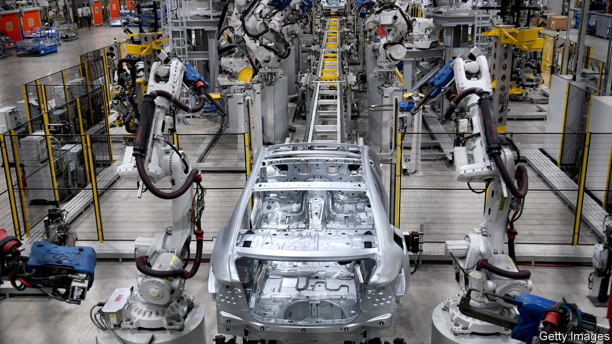
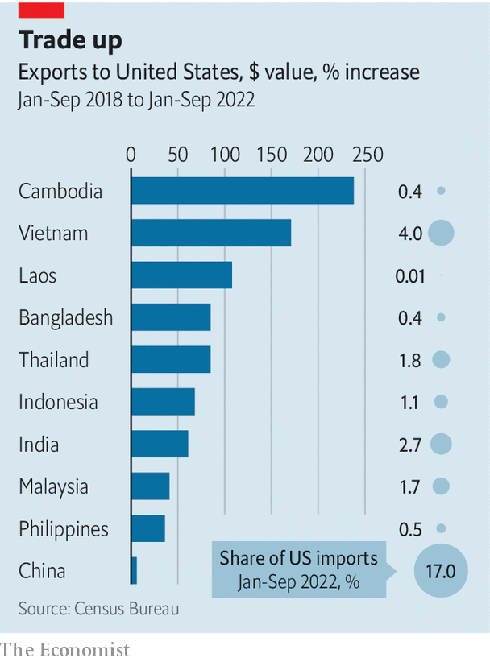

###### Fresh factories

# Who wins from the unravelling of Sino-American trade? 

##### A series of shocks are transforming international commerce 

 

> Nov 6th 2022 

From disease and downturn to the deterioration in Chinese-American relations, there has been no let-up to the blows battering the world’s trading system. The latest threat stems from the possibility of another global recession. Only two years after the world sank into a covid-induced slump, shipping bosses are again warning of grim prospects for international trade. 

Even beyond the ups and downs of the economic cycle, deeper shifts in global trade are taking place. Firms are reconsidering their production decisions, and governments are pushing the process along. Such shifts might have seemed outlandish in 2018 when Donald Trump, then America’s president, first slapped tariffs on imported Chinese goods. Since then, a pandemic has struck, and President Joe Biden has banned the export of advanced semiconductor technology to China and plans to provide subsidies worth hundreds of billions of dollars for . A rejigging of trade now feels inevitable rather than unimaginable—and the outline of its new geography is becoming clearer.

Global trade in goods staged an impressive bounceback after the covid-19 downturn in 2020. As a share of world gdp, its value last year rose to the highest level since 2014. But not all trade routes are flourishing. When Mr Trump took his protectionist turn, there was hope that economies in Africa and Latin America might attract some of the business that would have otherwise flowed to China. Instead, the biggest winners from changing trade patterns are to be found in Asia.

Global trade data emerge slowly. Figures on imports to big economies are therefore the best way to get an up-to-date picture of what is happening. According to American data released on November 3rd, the country’s imports have risen by a third since 2018. Gains, though, have been unevenly distributed. American imports of Chinese goods stand just 6% above four years ago, a hefty decline in China’s market share since President Trump launched his trade war. America’s imports from the eu have also grown in lacklustre fashion, up by just 12% since 2018. “Friendshoring” may be happening, but not on a grand scale. Imports from Canada and Mexico have risen by 39% and 34% respectively.

 


The great champions of the past four years are in Asia. Exports to America from Bangladesh and Thailand have jumped by more than 80% since 2018; exports from  are up by more than 170% (see chart). India and Indonesia have seen their exports grow by more than 60%. As a result, China’s share of American imports dropped by four percentage points between 2018 and 2022, from 21% to 17%. China used to account for nearly half of Asia’s exports to America; now it accounts for just over a third.

Nor is this simply an American trend. China is also importing more from Asia. Over the first nine months of this year, the share of China’s imports coming from America fell by two percentage points compared with the same period in 2018. The share coming from the eu declined by a similar amount. On the other hand, the Association of South-East Asian Nations (asean), a regional club of ten countries, saw its share of China’s imports grow by two percentage points. European trade figures are less up-to-date, but Asia’s rise is also visible in them. Although the share of eu imports arriving from China increased last year, so did those from South and South-East Asia. Neither China nor Europe saw a comparable rise in imports from other regions of the world.

Cultivating new sources of goods or components takes time and investment, so the shift in trade patterns now visible in the data mostly reflects choices firms made well before this year’s geopolitical ructions. Some redistribution of trade would have happened even in placid economic conditions. Rising labour costs in China, for instance, would have made it attractive to move low-value sorts of manufacturing—in textiles and apparel, say—to places like Bangladesh. 

However Mr Trump’s tariffs seem to have played an important role. According to recent analysis of industry data by Chad Bown of the Peterson Institute for International Economics, a think-tank, China’s share of America’s imports rose from 36% to 39% this year in goods not covered by tariffs. For goods subject to a 7.5% tariff, however, China’s share sank from 24% to 18%. And for those hit by a whopping 25% tariff, which covers lots of it equipment, China’s share of imports fell from 16% to 10%. Overall America is now much less dependent on Chinese goods, from furniture to semiconductors.

This change is more nuanced than it appears at first glance. It seems likely that many of the components used to make goods in India or Vietnam are themselves produced in China. Although the detailed supply-chain data needed to say for sure will not be published for several years, Chinese export figures are certainly suggestive. The two-percentage-point drop in the share of China’s total exports destined for America over the period from 2018 to 2022 is exactly matched by the increase in China’s exports to asean economies.

The story so far seems to be one in which Asia’s emerging economies increasingly intermediate trade between China and the rich world. Dreams that supply chains draped across Latin America and Africa would remake the world’s economic geography are still nothing more than dreams. But this direction of travel is an unalloyed boon for a rapidly growing arc of countries stretching from India to the Philippines. In time, as the consequences of recent geopolitical developments accumulate, an ever larger share of the value in Asian supply chains may concentrate outside of China rather than within it. ■


