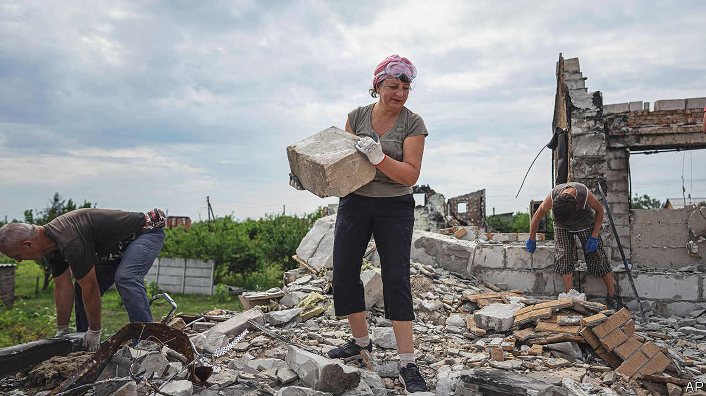
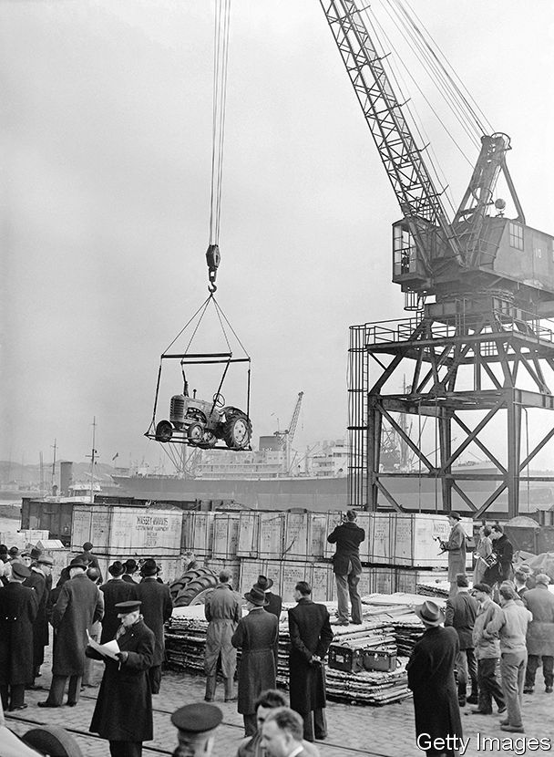
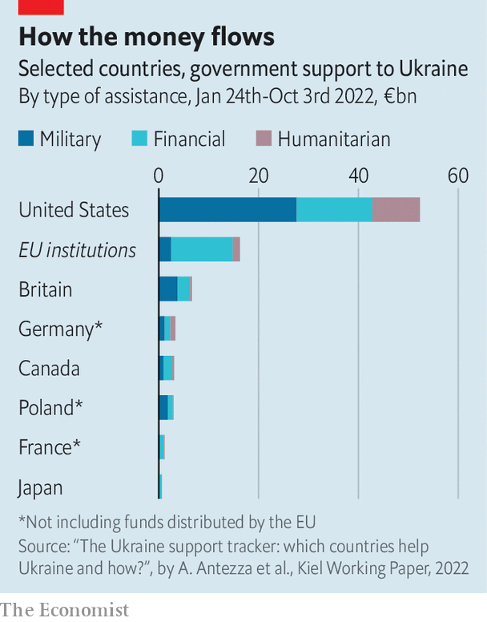
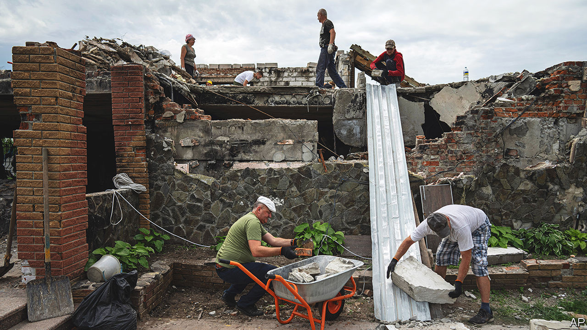

###### Rebuilding Ukraine

# Donors are already mulling a Marshall Plan for Ukraine 

##### The time to think about reconstruction is long before the fighting ends 

 

> Nov 8th 2022 

THE FIELD next to Grigoriy Tkachenko’s fish pond is littered with spent 220mm rockets. His carp are dead: the Russian soldiers who occupied his farm in March and April fished for them by tossing grenades into the water. Russian shells blew holes in the farm’s new office and its automated milking stall. Mr Tkachenko reckons his losses at roughly $1m, including 158 cows, about half his herd. “The Russians killed them and ate the parts that were easy to butcher,” he says. “They left the rest to rot.”

Yet by mid-October the farm, in Lukashivka, 120km north of Kyiv, was bustling again. In a vast concrete storage shed, forklifts stacked crates of potatoes while workers supervised machines that use lasers to sort the spuds by size. Most of Mr Tkachenko’s fields were free of mines, his wheat, corn and sunflower crops had been harvested, his grain elevator had been fixed and his remaining cows were chomping away in their pens. 

Ukraine, like Mr Tkachenko’s farm, is in a state of buzzing confusion. Ukrainians are scrambling to repair what Russia has broken and to keep the economy running. Steel plants pour white-hot metal to make rebar; restaurants serve food to the noise of air-raid sirens. Yet the destruction Vladimir Putin has wrought is immense. Entire cities are in ruins. Some 8m people, a fifth of the population, have fled the country. Ukraine’s government reckons GDP in 2022 will be 30% lower than in 2021. Counting only the damage done before June 1st, the World Bank estimated the costs of reconstruction at $349bn. Since then the bill has risen: for the past month Russian missiles have been  the power grid.

Recovering from all this, Ukraine’s allies think, will require aid comparable to the Marshall Plan, the huge American programme that kickstarted Europe’s economic recovery from the second world war. Indeed, in some ways rebuilding Ukraine seems harder. Unlike the Marshall Plan, which started years after the war ended, aid to Ukraine is flowing while the shells are still flying. That makes attracting private money almost impossible, for now: foreign investment into Ukraine is barely 1% of its level in 2021. With the war slashing tax revenues and half of the government’s budget devoted to the army, Ukraine needs $3.5-5bn in aid every month just to cover its budget deficit.

Another problem is complexity. The Marshall Plan’s money came from America. In Ukraine aid has come mainly from America, but also from the EU, individual European and Asian countries and an array of multilateral institutions—the World Bank, the IMF, the European Bank for Reconstruction and Development, the European Investment Bank and others. For the war’s first eight months pledges came sporadically. Only now are the main donors planning regular meetings to co-ordinate.

Sceptics of reconstruction aid to Ukraine note that such funds did little good in war-ravaged Afghanistan and Iraq, or in disaster-struck Haiti. Donors in those places failed to help create functional states, and much of their cash was stolen. This is a big worry for Ukraine, long one of Europe’s most corrupt countries.

But Ukraine is not like Afghanistan or Iraq. There, donors were trying to impose a completely new system of government, which many locals resisted. Ukraine is more like post-war Europe, where an injection of funds helped locals rebuild prosperous, industrialised societies that they already knew how to build, because they had built them before war wrecked them. Ukraine was a democratic and fairly sophisticated middle-income country before the war, and making efforts to tackle graft. It seems plausible that Ukrainians can recreate what they had before and, with help, improve on it.

History offers useful lessons. Although the Marshall Plan is now remembered as a success, things were complicated at the time, says Margaret MacMillan, a historian at Oxford. “There were real strains within [the Marshall Plan], real difficulties, moments when it might have collapsed,” she says. There was bitter disagreement within America’s government over how to structure the programme, and within Congress over whether to fund it at all. European governments and voters were suspicious of the conditions attached to the aid. Only the threat of communism persuaded all sides to overcome their qualms. And though the plan was a success in West Germany, its results in some other countries were mediocre. To understand why it is worth trying to help Ukrainians rebuild, it helps to consider how difficult the Marshall Plan actually was.

Fables of the reconstruction

In mid-1947, two years after the Nazi surrender, Europe’s economies were still in ruins. Germany, divided into American, British, French and Soviet zones, subsisted on American humanitarian aid. In the British zone rations had fallen to 1,050 calories per day. In the Soviet zone factories were being dismantled, or their products shipped east, as war reparations, while in the French one quotas of German goods were sent to France at cut-rate prices. Industrial production was capped for fear of reviving Germany’s military might, and commerce between the zones was restricted. Josef Stalin, the Soviet leader, blocked all attempts by America and Britain to liberalise trade unless they would agree to create a unified German government—which he planned to subvert and control, as he had throughout eastern Europe.

Germany’s economic misery was echoed across the continent. In France farmers declined to plant their fields because, with industry paralysed and foreign currency restricted, the francs they got from customers could not buy the imported machinery they needed. Italy’s unemployment rate was so high that one of its government’s chief aims was to encourage emigration. Britain, weighed down by debt from the wartime Lend-Lease programme, was on the verge of a currency crisis.

America’s response was hamstrung by division. A wartime plan for post-war Germany, devised by Henry Morgenthau, treasury secretary under Franklin Roosevelt, had aimed, absurdly, to deindustrialise the country. After Roosevelt died in 1945 Harry Truman, his successor, pushed out Morgenthau and turned to George Marshall, a former general. Marshall wanted to unify and liberalise German commerce, but hesitated at the implications. Stalin would reject the move, and fusing the three western zones could provoke him to war.

 


Marshall’s plan for a European Recovery Programme envisioned a huge injection of American aid. (The final sum would be equivalent to 5% of America’s GDP in 1948.) American dollars would solve Europe’s shortage of foreign exchange, allowing its industries to trade their way to prosperity. They would also be a prize to induce European governments to relax the restrictions paralysing their economies—a way for America to “knock heads together and impose an agreement,” as this newspaper advocated at the time.

But America and the Soviet Union were not yet formal enemies. Truman could not simply offer vast sums to Europeans—including Germans—while excluding his erstwhile Soviet allies. Many Europeans, especially the 15% or more who backed communist parties in France and Italy, would have seen this as a provocative American scheme to create an anti-Soviet alliance. The Soviets had a big army, and might have decided to grab all of Germany. 

Instead, Marshall invited the Soviets to join. They would no doubt have tried to sabotage the programme, but the hope was that the conditions placed on the grants (open trade integrating all of Europe, rather than quota-based trade oriented towards Moscow) would make them reject the plan. The gamble paid off: Stalin did just that, and told his new satellites in eastern Europe to stay out, too. Communist parties in western Europe were ordered to denounce the aid offer as capitalist imperialism in disguise—and were sidelined by governments eager for American money.

The plan had enemies in America, too. On the left Henry Wallace, running for president as a progressive, allowed Stalin to contribute notes to a campaign speech blasting the plan. On the right, isolationist Republicans grumbled at handing out more aid. (One congressman argued that Europeans were just “not working as hard or as vigorously as they should”; a senator denounced the plan as “financ[ing] socialism all over Europe”.) But Marshall and his allies sold it as a way to wean Europe off the aid that America was already providing—$13bn since the war’s end.

As the aid began to flow in 1948, European growth took off. Industrial output in Marshall Plan countries increased by more than 60% between 1947 and 1952; in West Germany it more than tripled, and annual GDP growth in some years hit double digits. Barry Eichengreen of the University of California at Berkeley estimated that in 1948-49 the Marshall Plan contributed between two and seven percentage points of growth in various countries.

Yet not all benefited equally. In West Germany, the American bodies that administered the plan had tremendous power and ensured that funds were spent on genuine investments. In France, however, much of the aid was used to back national-champion firms; in Italy it was often used to import commodities rather than industrial machinery. In Britain, where the plan boosted growth the least, it was used to pay off war debt. In Britain and France, says Albrecht Ritschl of the London School of Economics, “there is a consensus among historians that it was not very successful. There was a lot of capture.”

“Capture” is a term one hears often when aid officials are worried. It is what happens when money or programmes come under the control of gatekeepers who pursue their own interests rather than those of the public. Sometimes that means men with guns, as with the warlords who turned nation-building in Afghanistan into a corruption-ridden disaster. In other cases, as in the UN-led aid programme in Haiti after its earthquake in 2010, they may be the very contractors or consultants hired to carry out the reconstruction, who rake in high fees for useless work.

There are two stories about Ukrainian corruption. One is dismal, the other hopeful. “Ukraine doesn’t have that much petty corruption,” says Arup Banerji of the World Bank. “The biggest corruption challenges in Ukraine are much more state capture: high-level influencing of policies and directing of resources towards preferred parties.” A typical case emerged in mid-October: a property developer had allegedly offered to pay the mayor of Dnipro $22m for the right to determine which companies would build a new metro line in his city. (The developer denies the allegations.) But Ukraine has also been a breeding ground for political movements that fight graft. Since the  in 2014 anti-corruption reformers have made dramatic progress, albeit with many setbacks.

More money, more problems?

So long as the war continues, graft is not the chief concern. Much of the money flowing into Ukraine now goes on immediate priorities such as paying salaries and social benefits. Those are easy to verify because they can be traced to individuals, says Mr Banerji. Other aid is spent repairing the power grid and other infrastructure. Demand is so intense that few people think there is much skimming going on. 

 


Ukraine’s government expects this phase of foreign aid to last as long as the war does. Even here, the sums involved are considerable (see chart). In the first international donors’ conference, in Lugano in July, Ukraine presented an enormous national recovery plan, with hundreds of projects that had been suggested in a month-long consultation between the government, business and civil-society groups. At a second meeting in Berlin on October 25th, the ambitions were more sober. Oleksiy Chernyshov, then minister of development (he has since been appointed head of Naftogaz, the state gas company), outlined three stages of aid. The initial wartime phase might last from 18-36 months. About $38bn is needed to cover the budget deficit in 2023, says Oleksandr Hryban, deputy economy minister. 

A second phase, spread over the first two years after the end of hostilities, would need even more cash—perhaps $105bn for tasks such as rebuilding housing and transport. Only a few years after the end of fighting would the Marshall Plan-like phase begin, with another large, but as-yet unguessable, amount of aid going to transformative projects to “build back better”. That might include building a greener energy system and helping businesses meet European environmental and safety regulations, to help Ukraine with its ambition to join the EU.

It is this latter phase that most worries anti-corruption advocates. A tide of post-war reconstruction money risks making corruption worse, says Ivan Lakhtionov of Transparency International, an anti-corruption ngo. The war has created a tremendous sense of patriotism, but “everybody fears that after the war, things will be like they were before,” says Valerii Pekar of Nova Kraina, a civil-society coalition. He and Andrii Dligach, an entrepreneur, advocate greater inclusion of civil-society groups and business organisations in planning for economic recovery. The national consultation before the Lugano conference involved broad participation, but since then some civil-society groups say their access to government has shrunk.

The Ukrainian state’s past corruption problems mean some activists think a better solution would be to prevent aid money from flowing through the government at all. The Anti-Corruption Action Centre (Antac), Ukraine’s best-known anti-corruption NGO, argues that funds should go directly from donors to contractors. “The point is to remove the temptation,” says Olena Halushka, a board member at Antac. But Mr Banerji, at the World Bank, points out that when wary donors channel aid to NGOs rather than the government, they can end up undermining the state.

There are other ways to keep tabs on where the cash ends up. After the revolution in 2014 civil-society groups, programmers and government reformers developed Prozorro, a digital system for monitoring state procurement. It is now considered among the best open procurement systems in the world. Since 2016, all of the paperwork associated with every Ukrainian government contract has been available online. Thousands of investigative reporters and volunteer busybodies, known as Dozorro, comb through the database looking for anomalies that could lead to lawsuits or juicy articles.

 


Most areas of government contracting were removed from Prozorro when the war started, because the government was worried Russia might use it to gain intelligence. That degraded the system a bit, says Mr Lakhtionov: the algorithms it uses to search for tenders that look suspicious do not work as well when there are fewer to compare. But most contracting is gradually being put back online, says Nadiya Bigun, deputy minister of economics responsible for procurement. 

The government is working with a group of civil-society and business associations known as the RISE coalition to adapt Prozorro for international donors, such as the World Bank. “Ukraine is not Afghanistan, it’s not a failed state,” says Viktor Nestulia, who helped build Prozorro and now works with the RISE coalition. Civil servants have kept working doggedly, despite the war. The country has been seized by a mood of patriotic solidarity. Foreign donors, while recognising the peril of reconstruction, also see its promise. In September USAID, an American aid agency, published a guide for using aid to fight corruption that featured Ukraine as its case study. 

The Marshall Plan, at least, serves as a counter-example to recent history, by proving that huge aid projects, if well executed, can indeed help rebuild and strengthen countries. It is also a reminder that such programmes always have political stakes. In 1947 America was trying to win over Europeans in a struggle against communism. With the war in Ukraine, Ms MacMillan observes, Western countries have discovered that non-aligned countries in the global south do not share their views or trust their intentions. Aiding Ukraine’s recovery is a way to show that Western generosity is sincere, and that security and prosperity still go hand in hand, for Europe and Ukraine alike. ■


