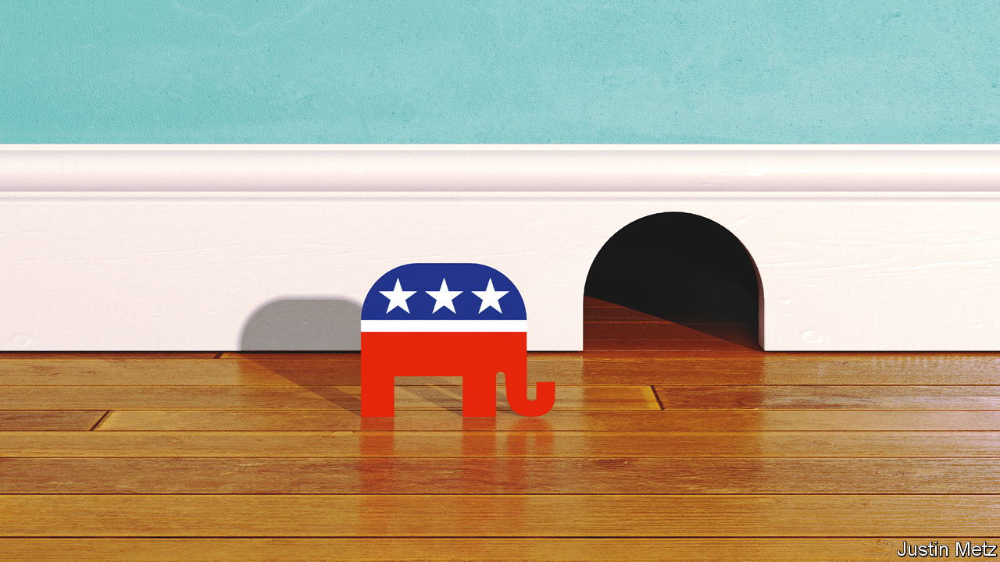

###### The Trump effect

# After the midterms, America and its democracy look stronger 

##### On top of his other flaws, the former president is a serial vote loser 

 

> Nov 10th 2022 


Shortly before the midterm elections, Donald Trump held a rally in Ohio. “Our country is becoming third-world,” he told voters. Later he hinted—is threatened a better word?—that he would soon announce he was running for president again. What could possibly go wrong for a party with such a figurehead? Or for one whose primary voters are so keen to relitigate the 2020 election that they chose a slate of candidates in key Senate seats chiefly for being the true keepers of the Trump flame? 

Quite a lot, it turns out. The most important result of the 2022 midterms, for America and for the West, is that Mr Trump and his way of doing politics came out of them . This will disappoint all those people, including the autocrats in Beijing and Moscow, who are looking for signs of American decline.

There are no blowout wins in American politics any more. When a party claims that America is theirs, based on how a few thousand votes break in a country of 330m, it is wise to raise an eyebrow and avoid overinterpreting the result. The president’s party nearly always loses seats in the midterms: there have been only three exceptions to this pattern since the civil war ended in 1865. Voters seem to like divided government, which has been the norm in Washington since the 1970s. They punish any party that holds majorities in both chambers of Congress and the presidency, as Barack Obama found in 2010, Mr Trump found in 2018 and therefore Joe Biden’s team must have expected this year. Neither party is currently capable of holding on to a commanding majority of the kind that once allowed them to pursue grand legislative programmes in Washington.

On the Democratic side there are many explanations for this. It is hard to boast about increased federal spending when many voters suspect that Democrats had a hand in raising inflation above 8%. The Democratic Party seems perennially befuddled about what exactly to propose on crime or immigration. Because they are fixated on the weirdness and the threats to democracy posed by many Republicans, Democrats tend to overlook how strange voters think they are. A poll commissioned by Third Way, a centrist Democratic think-tank, shortly before the election found that voters question whether the party’s candidates share basic American attitudes towards patriotism and hard work. When asked which party is more extreme, the average voter replies that Democrats are.

That ought to have been a gift to Republicans in a midterm year. Yet the party doesn’t have any better ideas on how to tackle America’s problems, and has quite a few for making them worse. Elected Republicans let the country down by trying to wriggle out of rejecting Mr Trump’s claims about the 2020 election. By doing so they also robbed their party of a chance to rethink and rebuild itself after its defeat, which is what parties normally do. Mr Trump is still nominally the chief Republican. He has an iron grip on the party’s berserker faction. Yet after this week’s vote, he looks more vulnerable than at any time since January 6th 2021, when many Americans thought this time he had gone too far. 

That presents an opportunity. Mr Trump can profit from breaking things. Many voters want a fighter, and refusing to concede and inciting a riot is proof of pugilism. After this week’s vote the suspicion that Mr Trump is, in fact, just a loser will be much harder for him to overcome. And that is what his record points to. In 2020 he was the first incumbent since Jimmy Carter to follow a president from the other party and then lose. In 2018 the Republicans lost 41 seats in the House under the Trump banner (Democrats may have lost only a handful this week). Even at his moment of greatest triumph, in 2016, he lost the popular vote and only narrowly beat a candidate who was trying to follow a two-term president from her own party, something which rarely happens. Now 2022 can be added to this less-than-stellar streak.

His handpicked candidates turned winnable Senate races into nail-biters in Arizona, Georgia, Nevada and Pennsylvania. Meanwhile in Florida, Governor , a probable rival, won by roughly 20 points. Two Republican candidates for governor closely associated with Trumpism—Doug Mastriano in Pennsylvania and Tim Michels in Wisconsin—both repeated the lost-cause story about 2020 and vowed to use their influence over election administration to make sure no Republican presidential candidate would lose again in their state. It was they who lost. In Michigan and Nevada Republican candidates who swore the 2020 election was stolen ran for secretary of state so that they might oversee the next one. They lost, too. In Colorado Lauren Boebert, who has flirted with the QAnon conspiracy, may lose the safest of seats. 

It turns out that common sense can still sometimes beat partisan reflexes after all. At the margin voters distinguish between good and bad candidates, which matters when the margins are thin. American democracy seems healthier and more secure as a result.

Where does this leave the country? Alas, for the next two years Congress is likely to become mired in theatrical showdowns over funding the government and pointless investigations into the business dealings of Hunter Biden, the president’s son. America’s real problems will go unanswered.

Given that sterile prospect, it is in America’s and the Republican Party’s interest to move on from Mr Trump and look forward. But perhaps surprisingly, given that he has just presided over a creditable midterm performance,  whether Mr Biden should be the Democratic nominee in 2024. His administration has, like any presidency, got plenty of things wrong. But by arming Ukraine and putting policies in place to drastically reduce carbon emissions, it has got two important things right. Now, also for the good of party and country, Mr Biden might rethink what he does next. 

Walking away from power is a noble American tradition that is almost as old as the republic. By following it, Mr Biden could deny Mr Trump the 2020 rematch he so clearly craves. Republicans in Congress might be a bit less obsessed with blocking anything that could look like a presidential win. And Democrats might make rebuilding democracy more than a self-serving talking point. With his achievements and his party’s relative success in these elections Mr Biden has an opportunity to depart on his own terms. He should use it. ■


