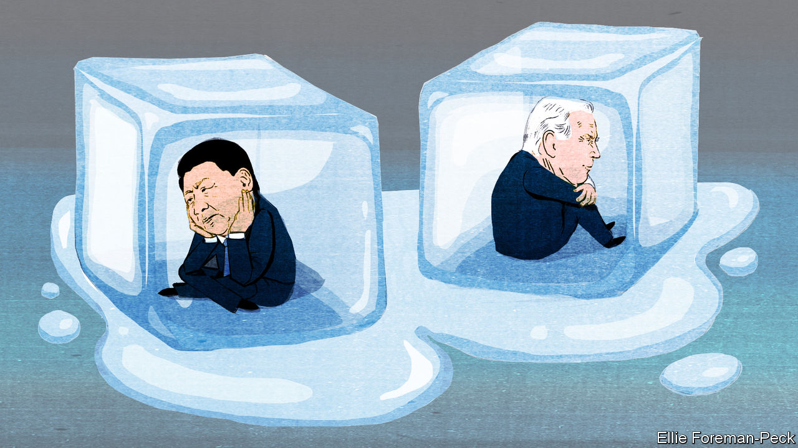

###### A troubling silence

# America and China must talk 

##### Refusing to speak is what children do when they are angry 

 

> Nov 10th 2022 

The laws of thermodynamics will soon be tested in Bali. The Indonesian island will host leaders from the G20 on November 15th and 16th. In its tropical heat, an icy conversation may take place: President Joe Biden may meet his Chinese counterpart, Xi Jinping, in person for the first time since taking office. Because America and China barely speak, this matters. Might blarney in Bali lead to a thaw between the superpowers?

Don’t count on it. Mr Biden’s team sees America as locked in competition with an over-aggressive China. Mr Xi is bent on reshaping the world order to make it more amenable to autocrats. He believes America is declining and seeking to block China’s rise. Crises between them loom on , with dark parallels to the cold war. Dialogue was often limited back then, too. But the lesson from that period is that rival powers must find ways to communicate—particularly when tensions are high. 

Mr Biden seems keen enough. His approach to China has been unceasingly tough. He has curbed Chinese access to advanced computing with a sweeping set of export controls, and pledged to defend Taiwan, the self-governing island which China claims. Now, though, White House officials want to “find a floor” in the relationship by focusing on areas of mutual concern such as climate change, food security and illicit drugs.

Republicans could make any progress difficult. If they regain control of the House of Representatives after the votes have been counted in the midterm elections, they will have more power to initiate investigations and to pass measures that might provoke China and put pressure on Mr Biden to remain tough. The probable new Speaker of the House, Kevin McCarthy, has suggested that he would visit Taiwan if he takes up the post. When Nancy Pelosi, the current Speaker, made such a trip earlier this year, China responded by holding massive military drills around the island and cutting off all high-level dialogue with America.

Domestic politics in China presents its own challenges. Mr Xi has consolidated power like no Chinese leader since Mao Zedong. That should give him leeway to work with Mr Biden. Instead he has stoked anti-American fear and loathing at home. Chinese officials demand concessions on Taiwan and on technology exports before they will even discuss climate change or controlling narcotics. Mr Xi is bracing for confrontation, telling leaders at last month’s Communist Party congress to prepare for “high winds, choppy waters and even dangerous storms”.

Mr Xi’s power and his , which keeps China closed off from the world, have limited channels of communication. Most Chinese officials have no influence on their boss, leaving America with few interlocutors. Indeed, Chinese diplomats seem to think their main task is to berate American officials. The men surrounding Mr Xi, chosen mostly for their loyalty, are unlikely to advocate a change in direction. Officials in Beijing sometimes flip this gloomy observation on its head, noting that no promise Mr Biden makes will necessarily bind his successor.

Things looked similarly bleak in the 1960s, when America faced down a Soviet attempt to place nuclear missiles in Cuba. Years passed before top leaders met. In 1967 President Lyndon Johnson and Alexei Kosygin, the Soviet premier, held friendly (if unproductive) talks. It would be years more before hostility subsided into detente. Simply talking will not make America and China friends, either. But it reduces the risk of miscalculation, which is no small thing when both powers are nuclear-armed economic giants. It also holds out hope that relations will one day be more stable, perhaps even constructive. ■

