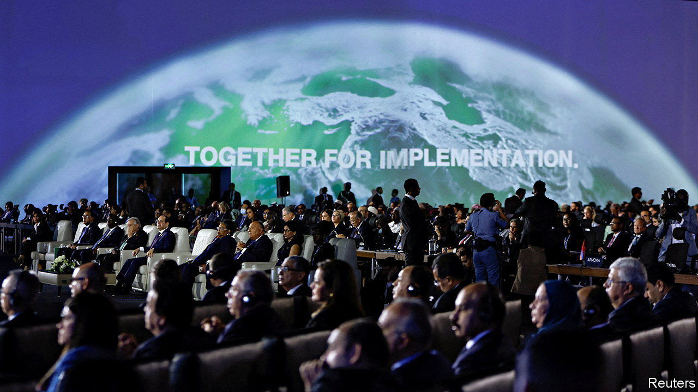
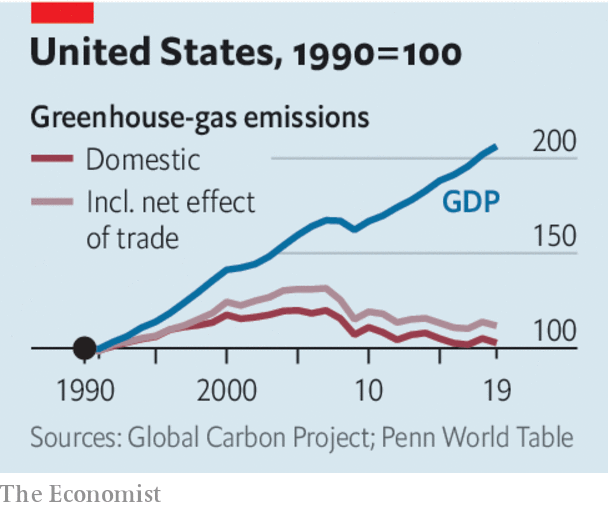

###### Debunking degrowth

# Economic growth no longer requires rising emissions 

##### Now this decoupling must accelerate 

 

> Nov 10th 2022 

Good news on the fight against climate change can be hard to find. Targets are , promises are broken and the planet gets hotter. But as worthies from across the world meet in Sharm el-Sheikh for the latest un conference to pledge to do more to tackle this enormous problem, there is at least one reason for optimism. A large and growing group of mostly rich countries has severed the link between economic growth and rising emissions of greenhouse gases.

For the three centuries or so since the fossil-fuel age began in earnest, living standards and emissions have risen hand in hand. Coal, then oil and natural gas, all brought prosperity while also raising global temperatures. This link has led some environmentalists and scientists to argue that only a programme of “degrowth”—reducing the pace of improvements in overall prosperity, or reversing them altogether—would avoid the worst effects of climate change.

 


Yet over the past decade a growing number of countries—33 by ’s count, home to over 1bn people—have managed to increase their gdp while . After a peak in 2007 America reduced its territorial emissions from 6.13bn tonnes of carbon-dioxide equivalent to 5.26bn before the pandemic. And that is not because Americans are simply importing their toys and electronics from dirtier places. Strikingly, consumption emissions, which include a measure of the carbon embedded in imports, have fallen by 15% over the same period.

Decoupling is largely a result of two big shifts. One is the changing structure of economies. As countries became richer they expanded their service sectors, which use less energy than manufacturing. In Britain, the birthplace of the Industrial Revolution, four-fifths of output is now generated by accountants, shop assistants and other service workers. Even in Germany, famed for its industrial prowess, manufacturing’s share of gdp is falling. That has reduced the energy intensity of growth.

Second, imports are getting greener. In the decade after the financial crisis, China’s export sector decarbonised faster than the rest of its economy. This has helped reduce the total carbon footprint of rich countries. Furthermore, manufacturing is shifting out of China, which is more polluting, per dollar of GDp, than India or Indonesia. 

This decoupling is unambiguously good news. But, with the link unbroken in many poorer countries, it has not been enough to reduce the pace of increase in global emissions. The task is therefore to speed up decoupling. That will not only demonstrate that tackling climate change and improving living standards can go together; it will also allow poorer parts of the world to use more of the remaining global carbon budget to get richer.

Hearteningly, there are reasons to think such an acceleration is possible. So far, decoupling has been achieved largely by reducing the energy needed per unit of output. But there are big gains to be had from making energy greener in the first place. Thanks to investment in renewables and greater electrification, such gains could soon be realised. That might even boost long-term growth: an economy that must scrimp and save to conserve energy is less dynamic than one in which power is green, abundant and cheap.

Some environmentalists may fret that celebrating such good news can have a perverse effect, by breeding complacency or making fighting climate change seem less urgent. In fact, the lack of a trade-off between improving living standards and tackling climate change should be a reason to go faster still. It means one less excuse for timidity in Sharm el-Sheikh. ■


