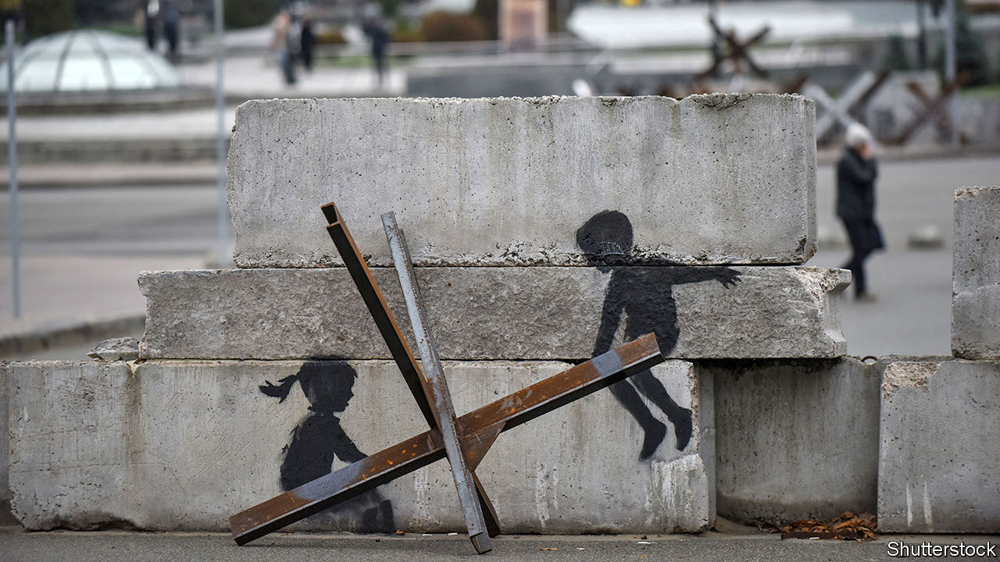

###### War in Ukraine

# Imagining peace in Ukraine 

##### How a stable and successful country could emerge from the trauma of Russia’s invasion 

 

> Nov 10th 2022 

IMAGINE A VICTORIOUS Ukraine in 2030. It is a democratic nation, preparing to join the European Union. Reconstruction is almost complete. The economy is growing fast; it is clean and diverse enough to keep corrupt oligarchs at bay. All this is underpinned by stout Ukrainian security. Defence against another invasion does not depend on the Kremlin’s goodwill, but on the sense that renewed Russian aggression would never succeed.

Today, as Russia’s tattered army appears to retreat from Kherson in the south, an end to the fighting still . But news that Ukraine and its backers are starting to outline their views of the future makes sense, because the coming months will determine what is possible at the decade’s end. It means thinking about how to rebuild post-war Ukraine, and the security guarantees needed to deter future invaders. 

In the past, Western leaders have wisely insisted that Ukraine should determine its own objectives. Ukrainians are dying in a conflict all about the right of sovereign countries to decide their own future. If peace is foisted on them, it is less likely to last. However, Ukraine’s Western backers have interests at stake, too. If the war escalates, they could be sucked in. If Russia ends up denying Ukraine victory, by creating a failing state on its western borders, Vladimir Putin or his successors would threaten the security of the entire Atlantic alliance.

Ukraine also has reasons to share its plans for the future with NATO. At present the West rations arms and money partly to steer the war, accelerating the supply of advanced weaponry if Ukraine appears to be struggling, but refusing aircraft and the longest-range munitions for fear that it will press on too far—whatever that means. Ukraine should be more of a partner and less of a supplicant. Another reason for Ukraine to work together with its allies is to bind them in, especially in America. Nothing can guarantee the support of the next president (Donald Trump is not a fan, for example). But a successful, settled plan for the war and its aftermath is the best available assurance of continued backing.

Such a plan must include a framework for reconstruction. The Ukrainian people need to restore their shattered lives. More than that, if Ukraine’s economy fails, so will its democracy. 

Donors at a meeting in Berlin in October tried to sketch out a plan for  and to estimate its costs. Patching the country up while the fighting continues, which could last another three years, will cost tens of billions of dollars, they reckoned. Initial reconstruction, lasting a further two years, might cost $100bn. A third phase—in effect, a Marshall Plan for Ukraine, probably costing even more—would seek to create an economy that is fit to join the EU.

Clearly, such plans require vast amounts of capital from private-sector investors. A few dozen governments and multilateral lenders will be involved in laying the groundwork to attract outside money. If their grants and loans are pilfered by oligarchs, the country will fail. Hence Ukraine and its backers must harness the national purpose forged in war to give anti-corruption groups the clout to police how the money is spent.

If Ukraine is to thrive, it also needs security. To be viable, Ukraine needs to keep its access to the Black Sea. Many people focus on how much land Ukraine recaptures; Mr Putin needs to suffer a decisive defeat so that his failure is unambiguous. Beyond that, though, Ukraine’s victory will rest as much on the health of its democracy as on the extent of its territory. 

When the fighting does stop, Russia will continue to re-arm rapidly. The government in Kyiv will therefore need Western security guarantees that are more robust than those that spectacularly failed to deter Mr Putin in 2014 and, again, earlier this year. NATO membership would be the gold standard, under which a Russian attack on Ukraine would count as aggression against the entire alliance. But America and many of its allies are unwilling to court direct conflict with Russia. And Turkey, which is still delaying membership for Sweden and Finland, may resist.

A more plausible alternative, put forward in September by a Ukrainian official and a former NATO secretary-general, is modelled on America’s relations with Israel. The Kyiv Security Compact foresees a web of legally and politically binding commitments between Ukraine and its allies. Some countries will pledge military, financial and intelligence support if Russia attacks; others will commit to sanctions. The plan also calls for investment in weapons transfers and in Ukraine’s defence industry to be sustained over decades.

Be under no illusion how hard this compact will be to bring about. One worry is the state of the Western arms industry, which was run down after the collapse of the Soviet Union. It may struggle to sustain the supply of weapons and ammunition to Ukraine while the fighting continues, let alone outpace Russia as it re-arms when the war is over. Work on bolstering weapons production should begin right away, by creating a pipeline of orders and rationalising procurement. 

The other worry is that the West . Polling of Republicans in America and voters in eastern Germany, and anti-war protests in Rome and Prague, suggest that support for Ukraine cannot be taken for granted. Governments everywhere have limited supplies of money and attention. America has other business, such as with China in the Pacific (see Leader). After decades of contracting out its security to the United States, Europe has barely begun to reckon with the extra responsibilities it must take on. 

The West needs to see that spending many billions of dollars in Ukraine is not an act of charity, but of self-preservation. In recent decades, Russia has started a war on its borders every few years. Mr Putin sees today’s conflict as a clash of civilisations between Russia and the West. Half-hearted Western support of Ukraine will not appease him; nor will it lead to the rebuilding of relations with Russia, as some Europeans hope. On the contrary, it will convince him that the West is decadent and vulnerable. If Mr Putin creates a failed state in Ukraine, NATO members will be the next targets of his aggression. Ukraine’s dream of victory would ensure lasting peace for its 43m inhabitants. It would also ensure peace for countless more people across Europe. ■


