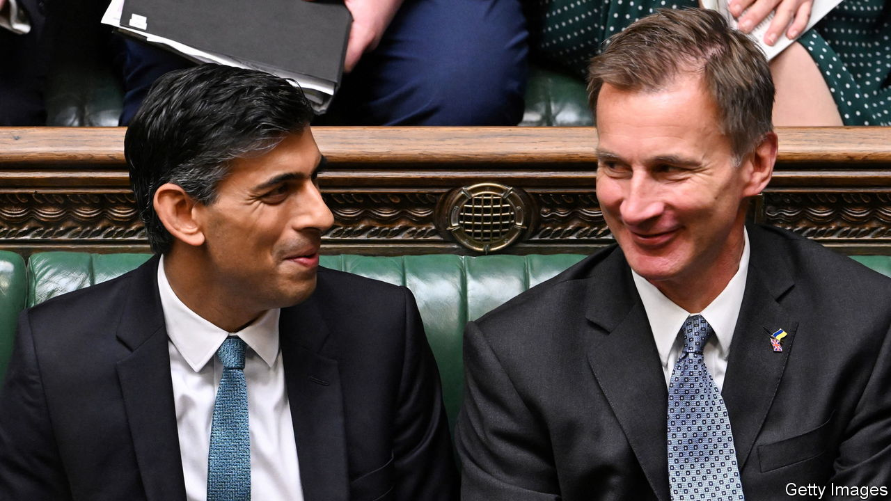

###### Britain’s economy

# The best ways to fix Britain’s budget 

##### Controlling pensions spending and taxing property are the right answers 

 

> Nov 10th 2022 

On November 17th Jeremy Hunt, Britain’s chancellor, will unveil the most austere tax-and-spending measures since 2010. The tightening could be worth nearly £55bn per year ($62bn, 2.5% of GDP)—or about a billion pounds for each day since Liz Truss’s disastrous government lost the confidence of financial markets by promising huge unfunded tax cuts. To regain credibility, Britain must now ensure that its debt-to-GDP ratio starts falling within five years.

Where the axe falls matters. Britain is fragile. After recent rises in energy prices, real wages are barely higher than they were in 2007. For years the economy’s  has been dismal, a problem made worse by Brexit, which is chipping away at . In the other G7 economies, public and private investment is forecast to add up to 22-26% of GDP in 2022; in Britain the figure is just 17%. 

Taxes as a share of GDP are at their highest in nearly four decades. But this is because an ageing population has pushed up spending and slowed growth, not because public services are lavish. In fact, after the sharp cuts of the 2010s, many are in a . The Conservatives have already pared back welfare spending in real terms; many poor households are acutely vulnerable to .

Mr Hunt needs quick fixes, in other words, but he has precious few available. Containing spending on public services, especially health care, requires thoughtful and deep-rooted reform that reduces costs and encourages innovation. It cannot be done in a hurry. Cuts to capital spending would harm long-term growth. And the higher taxes rise, the more important it is that the tax system is calibrated to minimise damage to the economy. Throttling spending and raising taxes across the board would be counterproductive. Instead, Mr Hunt should be highly selective about how he plugs the hole in the budget.

Take spending cuts as an example. Only one part of the welfare state grew substantially more generous during the 2010s: the state pension. It is protected by a “triple lock” formula, whereby it rises each year by the highest of average earnings growth, consumer-price inflation or the arbitrary figure of 2.5%. As a result, it has grown by 8% in real terms since 2010, even as working-age welfare shrank and wages stagnated. It is a near-universal benefit, so many retired households with substantial private income and wealth benefit from this generous uprating. 

On its current trajectory the state pension bill, as a share of GDP, will grow by 29% by the middle of the century. The triple lock was suspended in 2021, because of the pandemic. It should be permanently scrapped and replaced with a rule ensuring that spending on the state pension, as a share of GDP, does not grow. That would both free up money and give coddled pensioners a stake in promoting economic growth.

Replacing the triple lock will eventually save a huge amount of money but it will take time, especially because the poorest pensioners need to be protected during the energy crisis. Big tax rises are therefore inevitable. There are few good options, but one leaps out: taxing the priciest properties more heavily.

Property levies are among the most friendly to economic growth. Yet Britain’s main tax on homes is still based on relative property valuations from 1991 and is regressive. House prices in the London borough of Kensington and Chelsea are eight times the national average, but even the most expensive homes there incur annual “council tax” of just £2,700, less than double the national average. A higher inheritance-tax threshold for housing wealth—probably Britain’s stupidest tax policy—encourages the elderly to remain in family-sized homes in order to pass them on in their wills tax-free.

The present system is so broken that an annual tax of around 0.5% on current property values could replace all the government’s existing property levies while giving most people a tax cut, and still raise more money. The extra inheritance-tax exemption for property should also be scrapped, and loopholes in the inheritance and capital-gains tax systems ought to be closed.

Yet the fiscal hole is so large that even this would not be enough. Mr Hunt will also need to raise income, payroll or consumption taxes. He should choose income tax. It is fairer than national insurance—a payroll tax that does not apply to pensions—because taxes should reflect means, not age. And unlike VAT, a consumption tax, it will not boost near-term inflation. Freezing the amount workers can earn before tax (an exemption that, oddly, most benefits higher earners) is also wise.

Lamentably, the chances of Mr Hunt making the right choices are slim. Pensioners and owners of expensive houses tend to vote Tory. Thoughtless spending cuts are likely. So are tax gimmicks, such as restrictions on the amount workers can save for retirement with taxes deferred—a policy that raises money today at the cost of future revenues. Britain’s tax-and-spending system is full of such piecemeal distortions. If the welfare state is to work in the years ahead, the economy will need less short-sighted fiddling, more considered reform of age-related spending and a growth-friendly approach to tax. Little that Mr Hunt does will be popular. He could at least get the economics right. ■

