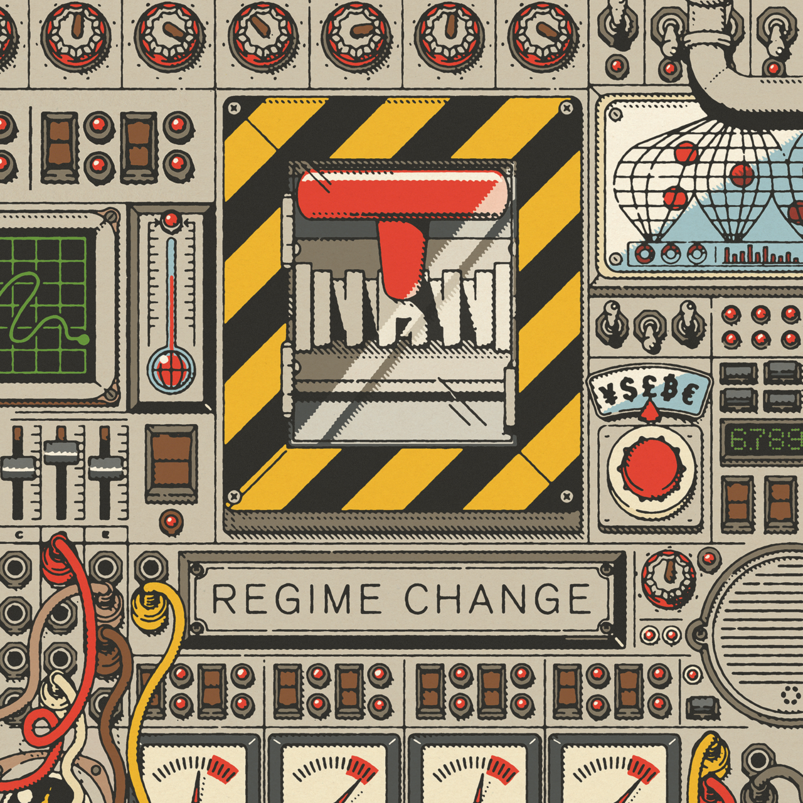
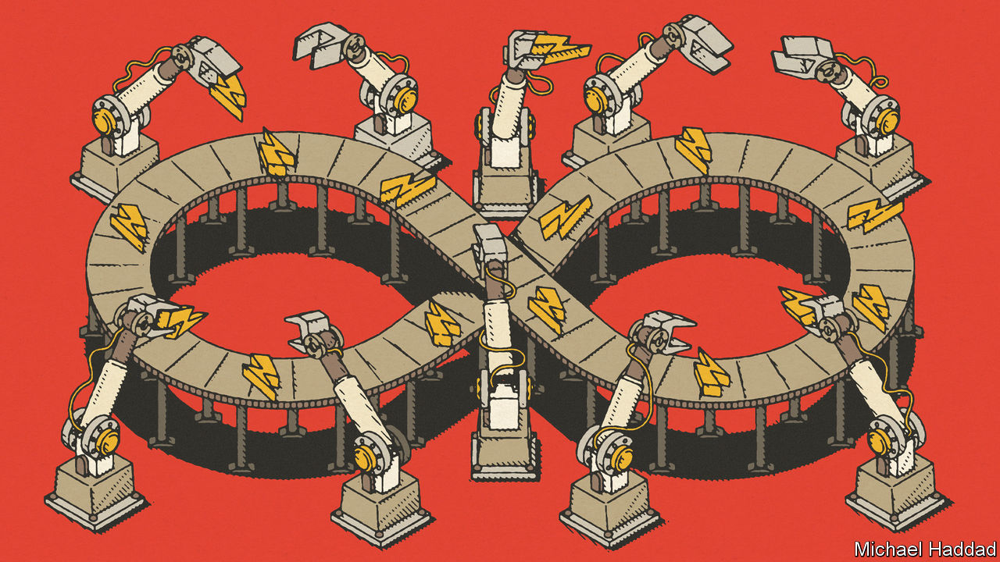
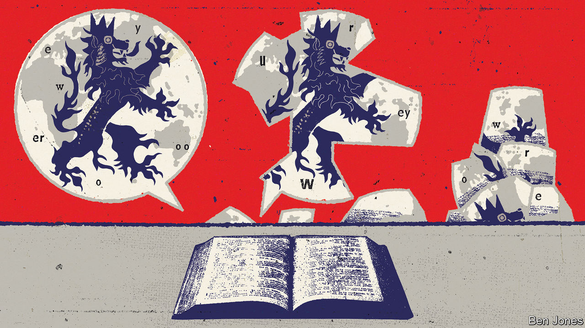

###### On environmental issues, the housing market, phrasebooks

# Letters to the editor 

##### A selection of correspondence 

 

> Nov 10th 2022 


Environmental issues

The suggestion that we can reach net-zero greenhouse-gas emissions by promoting energy-supply technologies is not in line with the findings of the latest reports from the Intergovernmental Panel on Climate Change (, October 8th). If we do not tackle energy demand we will see a huge surge in batteries, solar panels and electrolysers. To give an example, replacing all internal combustion vehicles with electric ones would lead to considerably expanded mining and resource-extraction activities, causing environmental harm and affecting vulnerable communities. Innovation tends to benefit developed countries more than poor ones. Moreover, a quarter of global emissions are caused by our food systems and use of land. Just dealing with energy supply would leave those emissions largely untouched and will not get us to net zero.

IPCC reports have emphasised that the transformation of systems is needed to tackle mitigation and adaptation challenges fairly and sustainably. Technological innovation and stronger policy instruments backed by political certainty have a role to play, as you say, but we also need to change people’s behaviour and the financial system, expand human-capacity development and enhance international co-operation.

Climate change is more than energy alone, and we cannot simply innovate our way out of it. 

Professor Heleen de Coninck

Contributor to the 2018 IPCC special report and the 2022 IPCC Sixth Assessment Report

Eindhoven University of Technology

 


You rightly noted India’s commitment to achieve net-zero emissions (“”, October 22nd). But generating green energy is only one part. Reducing wasteful consumption is equally important, and has not been dealt with seriously in India. Agriculture remains the largest emitter, using large amounts of energy for extracting groundwater for irrigation. The groundwater levels are plummeting and need ever-more energy to draw water up to the fields.

S.K. Kumar

Chairman

Indian Water Resources Society


 


I enjoyed your look “” (October 29th). A big question is whether to reuse or to repurpose batteries before recycling. All batteries lose their ability to hold a charge over time, as any mobile-phone user can attest. This can be a significant issue in a vehicle, where the energy a battery can retain reaches a point where it is disproportionality used on moving the mass of the battery rather than passengers or cargo. But that is not necessarily the end of its useful life.

Batteries can do more at this point. Most retired vehicle batteries retain a significant amount of their capacity, often around 80%, so they can be repurposed into static operations such as emergency power storage or similar. The Johan Cruyff Arena in Amsterdam does exactly this. Extending the useful life of any manufactured item significantly reduces its lifetime environmental impact.

Lee Griffin

Associate professor

WMG (Warwick Manufacturing Group)

University of Warwick

 


Unaffordable v affordable

Why is the word “scary” used regarding the prospect of falling house prices (“”, October 22nd)? The worst forecasts merely put a dent in the unbelievable increases of the past decade. In Australia it has been common for prices to double over five years. Yet the prospect of a decline of, say, 20% is viewed as the end of the world. Did anyone really expect this price surge to be sustainable? The lucky ones are those who cashed in. For the others a ridiculous gain will be reduced to a handsome one. 

David Greatorex


 


A quick curse in English

Regarding the “fading genre” of the language phrasebook (“”, October 29th), “English As She Is Spoke” is a Portuguese-English phrasebook written by Pedro Carolino, originally published in 1855. It is hilariously bad. Though he knew no English, Carolino was resourceful. He knew some French and translated from a French-English dictionary. 

The result is a phrasebook like no other. It contains such useful conversational points as “Where correspond the bells?” and “All trees have very deal bear”. It memorably includes the hedgehog and the wolf in a list of fish and shellfishes. The book enables the user to converse about civility (“It must never to laugh of the unhappies”), flirtation (“Listen’to, como hither”), and disaster at sea (“Never have you not done wreck?”). One could argue it even anticipates the Beatles (“Lace me do”). Mark Twain commented that “Nobody can add to the absurdity of this book, nobody can imitate it successfully, nobody can hope to produce its fellow; it is perfect.” 

Perhaps this old chestnut was an infamous fraud rather than a proper phrasebook. But as Carolino himself wrote: “If can’t to please at every one’s.” 

Bailey Howard


My husband is tight-lipped about his tours in Afghanistan and Iraq, and I’ve found the best way to understand his day-to-day experience is the addendums he makes to army-issued phrase books. It starts with learning pleasantries and chit-chat (“do you have children?”), as well as some basic military questions (“do you have weapons?”). Soon afterwards there are sections on profanities and sex, the sharing of cigarettes, and descriptions of being bored, carrying too much weight, and a dislike of the rain and mud. At one point he learns how to say, “I need to check on my lazy soldiers”. Towards the end of the book, different handwriting appears, describing idioms like “my moustache is annoying me”.

It all feels rather cosy, until every now and again one is brought up short by sections on bombs, and questions on “‘how many are wounded or killed?” As you said, phrasebooks can be very revealing.

Sian Davies


My “A Guide-book to Albanian” from 1983 includes the greeting “Dear Comrade”, and “Let’s drink this toast to your leader, Comrade Enver Hoxha and to our Marxist-Leninist Parties.” The parting salutation is “I hope to find you even better next time, even stronger, with even more advanced industry, with your agriculture still more modernised and mechanised.” These remain universal aspirations, not lost in translation.

Chris Wheal


Monty Python had a unique slant on phrasebooks, with a priceless sketch. John Cleese plays a Hungarian man trying to buy cigarettes. Reading from the book he says to the sales clerk, played by Terry Jones: “My hovercraft is full of eels.” 

Nigel Brachi


I am reminded me of a test a diplomatic colleague uses to determine whether an acquaintance can actually speak a language or has merely memorised a few phrases. He asks her kindly to say, “My fish has no feet.”

Eric Evans

Senior fellow

Mossavar-Rahmani Centre for Business and Government

Harvard Kennedy School


Oh, the pleasures of translation. In the early 1960s, Gordonstoun School’s standard German phrasebook included the essential “where is the carriage for my servant?” 

Chris Munro May


