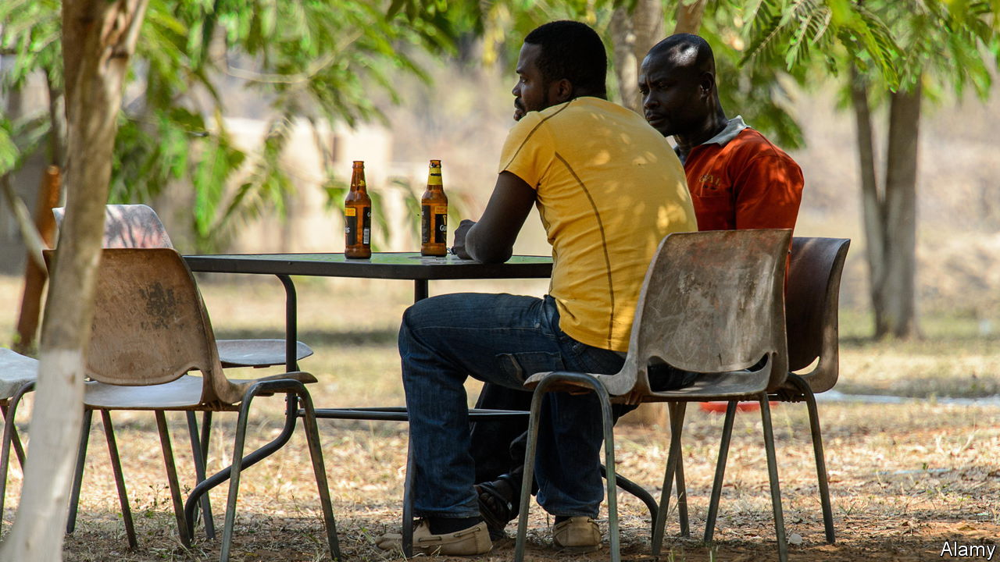

###### Of beer and banks

# A Ghanaian brewery shows how hard life is for small businesses 

##### Gaining access to finance is by far the biggest obstacle 

 

> Nov 10th 2022 

“Happy 34th birthday, Tom”, exclaims the label on the beer bottle. Underneath is a photo of the birthday boy, then an employee at the American embassy in Ghana, pulling a face that suggests he was not expecting any buttoned-up diplomats at his party. Clement Djameh, a wisecracking Ghanaian brewer, makes the bespoke labels and the amber liquid inside. It is refreshing, tangy, and so strong that a second glass risks turning the afternoon into a haze. The surprise ingredient is locally grown . Mr Djameh is desperate to expand to meet demand, but his plans are badly stalled. 

Those running businesses in sub-Saharan Africa, even in relatively prosperous countries such as Ghana, face a scarcely conceivable array of problems. Chief among them is . Alas, government and donor efforts to fix the problems often go awry.

Mr Djameh has many advantages for a would-be brewing kingpin. He studied beer-making in Munich and has worked for Ghana’s biggest brewers. Beer-glugging foreigners love his concoctions. His microbrewery was Ghana’s first. And his use of sorghum stemmed from his work on a multimillion-dollar government- and un-backed project to reduce poverty by encouraging Ghanaian farmers to grow the grain to supply brewers. Ghana’s beer barons have been sniffy about using sorghum. Mr Djameh’s business offers a way to make something of the project. 

To ramp up production from a mere 200 litres a batch in 2016, Mr Djameh began looking for about $400,000 to buy bigger brewing equipment and lots more kegs. He applied for an interest-free loan under a special scheme at a state bank and was approved, he says. But the bank then said it had no cash to lend. The cheap-loan scheme was later changed into one that charged 10% interest. That did not deter Mr Djameh, who was keen to reap economies of scale. “Breweries always make money,” he grins. However, he balked when the loan officer wanted a 10% kickback, he says, adding: “If you’re not prepared to pay [and] you don’t have a strong political connection, you will not get the money.”

Ghana’s government is now broke and in talks with the imf. The central bank has increased its main interest rate to 24.5%. Borrowing costs on commercial loans are higher still. Even a brewer would find them prohibitive. Mr Djameh’s latest plan is to find parched investors wanting to buy a share of the company. Yet one of the potential financiers who is interested may bring trouble. “He is a drug dealer,” chuckles Mr Djameh. “It’s not really the kind of money that you want to work with.” 

 In World Bank surveys a quarter of sub-Saharan African firms cited access to finance as their biggest obstacle. This is far higher than for other constraints.

After years trying to raise money to expand, Mr Djameh is still stuck brewing small batches. To make ends meet, he has long worked as a consultant to aid projects across Africa on how to grow sorghum and use it for brewing. Frustrated, he may focus on this work. That reveals a bitter irony: it is often not just easier, but more profitable, to work for an aid outfit promoting clever schemes to transform African economies than to build businesses that do so. ■

