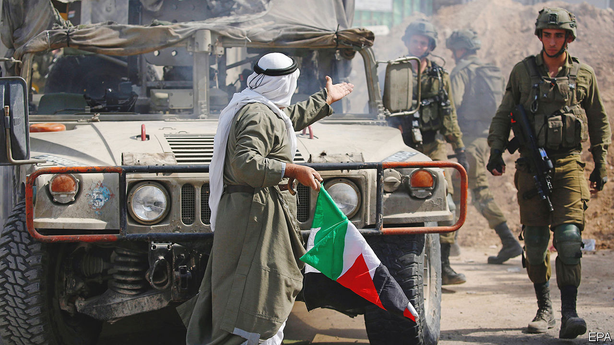

###### Welcome back to the occupation

# A Netanyahu government may raise the temperature in a boiling West Bank 

##### Far-right ministers will increase tensions in Jerusalem, too 

 

> Nov 10th 2022 

A week before Israelis went to the polls on November 1st, a team of Israeli soldiers carried out an unusual raid in the old city of . By day its casbah is a lively place, famed for its sweets. But in the pre-dawn hours of October 25th it was a war zone. Five Palestinians were killed and dozens injured. Another Palestinian was killed in a different episode that evening.

The target was a new armed Palestinian group called the Lions’ Den. It has claimed responsibility for a string of attacks on Israeli soldiers in the Israeli-occupied West Bank, which Palestinians see as the future core of an independent state. Israeli police say they also foiled a planned attack by the Lions in Tel Aviv in September. The raid, which followed weeks of restrictions on Nablus residents, felt reminiscent of the Palestinians’ bloody , or uprising, two decades ago. In recent years Israeli soldiers had rarely entered the old city, let alone fired off shoulder-fired missiles in the middle of town.

The West Bank is boiling. The United Nations says that this year is likely to be the deadliest for Palestinians there since 2005. Israelis say they had to respond to an upsurge of Palestinian militancy in March and April, when attacks occurred in four different cities in Israel. A government led by Binyamin Netanyahu, especially if it includes the far right, may raise tensions in the West Bank further.

, the outgoing prime minister, was hardly a dove. Though he endorsed the two-state solution at the UN General Assembly in September, he made no effort to end the conflict during his four months in office. In the first ten months of this year at least 109 Palestinians, including 28 children, have been killed by Israeli soldiers in the West Bank, a 40% increase on the tally for the whole of 2021.

Violence by Jewish settlers against Palestinians in the West Bank, much of it unpunished, has been rising too. The UN has recorded 577 attacks this year, up from 496 in 2021. Mohammed Shtayyeh, the Palestinian prime minister, describes the contrast between Israeli governments as the “difference between Pepsi and Coke”.

Still, a Netanyahu coalition with the far right could add fuel to the fire in several places. First is Jerusalem. Itamar Ben-Gvir, a co-leader of the far-right Religious Zionism bloc that hopes to team up in government with Mr Netanyahu’s Likud party, wants to be minister of public security, in charge of the police. Some far-right activists hope this will mean changes on the Temple Mount, Judaism’s holiest site, which is also sacred to Muslims and a symbol of Palestinian national identity.

Those activists may be disappointed. In the past Mr Netanyahu has been cautious about changing the status quo on the plateau, where Jews are forbidden to pray openly and face restrictions on when they may visit. Even if the rules do not change, though, a visit there by Mr Ben-Gvir, whom Palestinians revile, could touch off riots.

For their part, Palestinians have lost faith in the Palestinian Authority (PA), which governs parts of the West Bank under Israel’s eye. , its 86-year-old president, took office for a four-year term in 2005 and never left. A survey in September found that 74% of Palestinians want him to resign and 46% want to dissolve the PA altogether.

Younger ones, in particular, see little reason to trust their ageing leaders. Some members of the Lions’ Den come from families linked to Fatah, Mr Abbas’s party. Ibrahim al-Nabulsi, one of its founders who was killed in an Israeli raid in August, was the son of a PA intelligence officer.

During his previous 12-year stint as prime minister, Mr Netanyahu undermined the PA. He periodically withheld the tax revenues that Israel collects on its behalf, starving the authority of funds. He had no interest in peace negotiations; in 2020 he promoted a plan for Israel to annex chunks of the West Bank. If he weakens the feeble PA still more, the territory could slide towards anarchy.

Israel has imposed a blockade on Gaza, the other bit of a would-be Palestinian state, since 2007, when Hamas, a militant Islamist group, took control. Egypt, which borders Gaza, also keeps tight restrictions on it. Many Israeli security officials argue it is time to rethink the embargo, which has not dislodged Hamas from power but has brought misery to Gaza’s 2m people. 

Israel’s outgoing government did offer a few small gestures toward Gaza’s battered economy. It more than doubled the number of permits for Gazans to work in Israel, to 17,000. Mr Lapid had hoped to raise it to 20,000. That is a small fraction of the 100,000 Gazans who worked in Israel before Hamas took over. Still, it offered some relief to thousands of families. The median wage in Gaza is 33 shekels ($9) a day; Palestinian labourers in Israel can earn 266.

Successive Israeli governments have shown little interest in lifting the blockade of Gaza. Mr Netanyahu is likely to retain it—and is certain to clobber Hamas as fiercely as ever in any future conflict. Whatever the shape of the new Israeli government, it will bring little comfort to the Palestinians, whether in a blighted Gaza or a seething West Bank. ■

