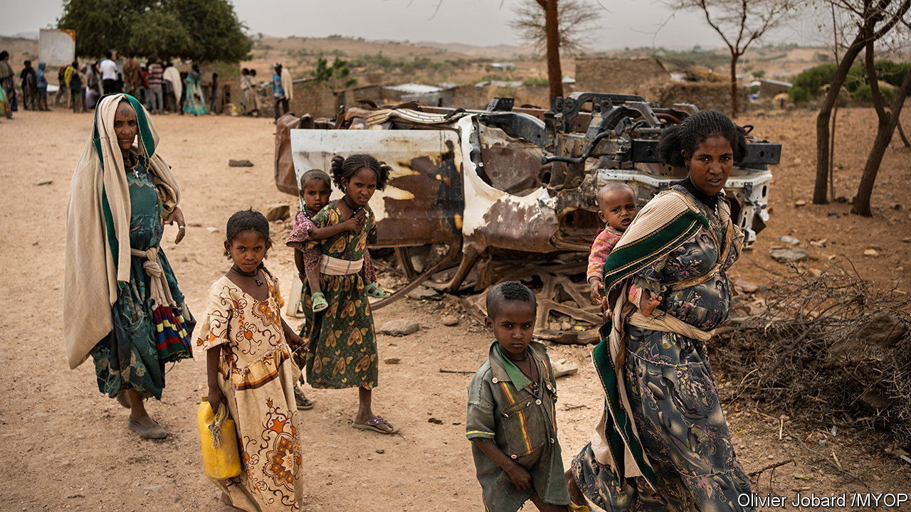
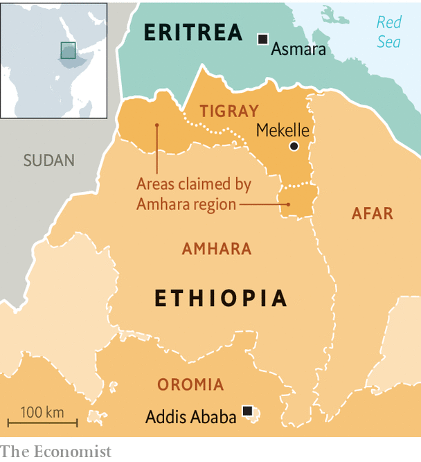

###### Stopping the killing

# A peace deal highlights the pointlessness of Ethiopia’s war 

##### Abiy Ahmed and Tigray’s leaders have little to show for two years of fighting 

 

> Nov 4th 2022 

Almost two years to the day since the , a pact to end Ethiopia’s civil war was signed on November 2nd. Hundreds of thousands of people may have died from bombs, bullets or war-induced hunger and disease. The pact underlines how needless  was. 

 


The two main parties—Ethiopia’s government and the Tigrayan People’s Liberation Front (TPLF)—seem to have gained almost nothing. Meanwhile, millions of inhabitants of Tigray, a region in the north, and many in the adjoining regions of Afar and Amhara (see map) have had their homes razed and their crops burned. Wide areas have been . Countless women have been raped. 

The peace deal called for an immediate halt to fighting between forces loyal to Abiy Ahmed, Ethiopia’s prime minister, and those supporting the TPLF. The parties also promised an unhindered flow of aid. That will offer relief to the 5m-6m civilians in Tigray who have been under blockade by government forces for most of the war. Hundreds of thousands are starving. António Guterres, the UN secretary-general, called the deal a “welcome first step” which ought to “bring some solace to…millions of Ethiopian civilians”. 

The agreement goes much further than a simple ceasefire. It sets a blueprint for future relations between Tigray and the federal government, whose “constitutional authority” over the region is to be restored. Federal troops are to enter Mekelle, the region’s capital, and Tigrayan forces are to be demobilised within 30 days. 

The government will lift its designation of the tplf as a terrorist group. An “inclusive interim” administration will govern the region until elections are held. In effect that will mean the dissolution of the TPLF-led regional government, elected in September 2020 in defiance of a federal government edict. It was this election that set the country on its path to war three months later when Abiy, furious at Tigray’s defiance of federal authority, massed troops on the region’s borders. This prompted a pre-emptive strike by the TPLF.

Many Tigrayans think the deal amounts to a surrender. They witnessed months of murders, rapes and forced starvation in their homeland the previous time federal troops occupied it. Disbelief is palpable among those who left. “Shock, indignation, denial, condemnation, the whole package,” says one living elsewhere in Ethiopia. “There’s a huge demand for the TPLF to publicly explain the deal.” Its leaders have tersely claimed they defended Ethiopia’s constitutional order.

Their reluctance to say more may be because they expect a backlash. For months the TPLF’s top brass had insisted that their forces held the upper hand in the fighting. TPLF leaders had also promised not to concede any of their “non-negotiable” demands, which included the withdrawal of Eritrean troops and the return of territories annexed by the neighbouring Amhara region. In the end Eritrea, whose troops fought alongside Ethiopian government forces, did not warrant a single mention in the agreement. The status of the “contested areas”, meanwhile, is to be resolved “in accordance with the constitution” (some think that could mean a referendum) at an indeterminate point in the future. 

That it gave up so much is probably a reflection of the TPLF’s weakness on the battlefield and the suffering of Tigrayan civilians under the blockade. But some still think it caved too soon. One former Ethiopian diplomat reckons it made “too many concessions”, possibly because it was under pressure from America. 

Speaking at a rally in southern Ethiopia on November 3rd, Abiy proclaimed “victory”, and crowed that “100%” of his side’s proposals had made it into the final agreement. One of his close advisers, an Orthodox Christian preacher who last year called the TPLF a “weed” to be wiped off the face of the earth, drew comparisons to the battle of Adwa, when Ethiopians from all corners defeated Italian invaders in 1896. 

Officials in the finance ministry hope that the deal will lead to the swift resumption of a much-needed IMF programme to save Ethiopia’s  and unlock further donor funds for reconstruction. Yet that will depend on the ceasefire holding and the successful implementation of the peace agreement. In theory, the African Union, which convened the talks, is to act as guarantor. But it lacks teeth. “We have to see what happens on the ground,” says Mikiale Teklu, a Tigrayan now living abroad. “But I don’t believe Abiy Ahmed.” 

Once more unto the next breach

Even if this deal marks an end to the war with Tigray, other conflicts still fester in Ethiopia. Abiy faces opposition from many in Amhara, for instance, who say they were not represented in the talks and worry that the government will eventually hand the disputed territories they occupy back to Tigray. Militias from Amhara are also at war with parts of Oromia, Abiy’s home region. And Oromia itself is racked by armed insurgency. There is little reason to think Abiy’s government is seriously considering talks with the rebels there.

Ethiopia’s recent history is another reason to be cautious. The war it fought against Eritrea, which erupted in 1998 and within two years had resulted in perhaps 100,000 deaths, was supposed to have ended with a “cessation of hostilities” in June 2000. A peace agreement was signed within six months. It has yet to be properly implemented more than two decades later. ■

