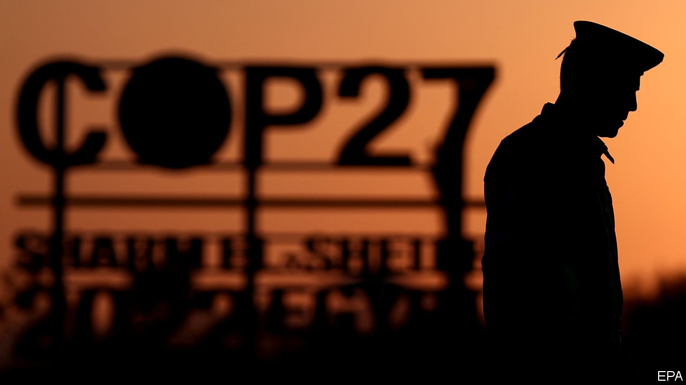

###### Good COP, bad cops

# Egypt, host of the UN climate summit, persecutes its own greens 

##### Locals are free to criticise any government except their own 

 

> Nov 9th 2022 

The climb up the holy mount seemed innocuous enough. On the side of the UN’s annual climate conference this week in Egypt’s Sinai peninsula, a few dozen religious leaders from India to Indiana planned to pray on its summit for forgiveness for the harm humanity has been inflicting on Mother Earth. Egypt’s local military governor gave the idea a cautious welcome, hoping it might boost tourism. But his masters in Cairo were taking no chances. The bus companies and hotels were told to cancel their reservations. Security men grabbed the local fixer, took his phone and sifted it for names to put on the state’s blacklist. “They want to control us,” says an organiser, who has moved the Earth-propitiating event to London instead.

As climate pundits and politicians fly into the Sinai resort of Sharm el-Sheikh from all over the world to attend , Egypt’s rulers are intent on cordoning off their own environment from the debate. They have sharply restricted permits for Egyptian NGOs, installed cameras in taxis to quieten Egypt’s talkative drivers, and swamped the floor of the supposedly UN-controlled zone with plain-clothes security men wearing lapel pins. And across the country they have  activists seeking to hold the authorities to account for wrecking Egypt’s environment.

Egyptians have a long history of protesting against environmental disasters. Prophets and peasants blamed the pharaoh for biblical famines and plagues. More recent campaigners lambasted the government of President Hosni Mubarak for approving an ammonia factory in their coastal town of Damietta—and won. And after the Arab uprising of 2011, when Mubarak was overthrown, thousands of Egyptians protested against the building of nuclear reactors, coal plants in residential areas and  through their neighbourhoods. After the country’s top general, Abdel-Fattah al-Sisi, seized power in 2013, he smothered environmental dissent and pursued whatever mega-projects he fancied. “The worse the environmental damage, the greater the silence,” says an Egyptian activist, who, like all his ilk, requests anonymity.

The greens certainly need to cry out. By 2030, according to official estimates, rising sea levels may cut agricultural output in the low-lying delta, Egypt’s breadbasket, by 30%. Farmers already report falling harvests as salty water seeps into their fields.

But environmental groups say they cannot conduct fieldwork or raise awareness. They face the same curbs as NGOs in other spheres. Protesters are absurdly labelled “terrorists” and jailed. Restrictive laws have tightened. The punishment for receiving foreign funds, which many green groups need to survive, has been amended to include sentences of death or jail for life. “There’s no activism any more,” laments an Egyptian environmentalist.

It is unclear how many of Egypt’s estimated 65,000 political prisoners are green activists, say human-rights groups. But their number includes several prominent environmentalists. Ahmed Amasha, who helped orchestrate the Damietta protests and set up the Arab Association for Environment and Sustainable Development to train activists, has spent four of the past five years in prison. His testicles have been electrocuted and his left ribs broken, says his family. “There’s no more respect for environmental rights than for any other in Sisi’s Egypt,” says Mohamed Amasha, the activist’s son, who lives in America.

With silence ensured, Mr Sisi’s bulldozers have speeded up the browning of green spaces in a country where 95% of the land is desert. Earlier this year he authorised the army to develop 37 islands, mostly in the Nile, that had previously been designated as conservation zones. Construction has already begun on Tawila island, off the Red Sea coast. The security forces have also begun clearing al-Warraq, a Nile island that was one of the largest green spaces remaining in Cairo, the capital.

Some Egyptian greens want the conference boycotted. “It’s just greenwashing,” says an exiled member of the Muslim Brotherhood, the banned Islamist group, whose government Mr Sisi overthrew in 2013. “No matter how many people are in Sisi jails, he’s showing that the whole world is there for him” in Sharm el-Sheikh. 

But others argue that holding COP27 in Egypt still has benefits. Under the umbrella of international organisations, some dissidents have slipped through the security cordon. On November 8th Sanaa Seif, the sister of , a prominent pro-democracy activist, held a press conference to highlight his plight, since he has been on hunger strike in prison. And Egyptian environmentalists still support Mr Sisi’s case that rich countries should pay for past pollution—to the benefit of such worthy supplicants as Egypt. ■

